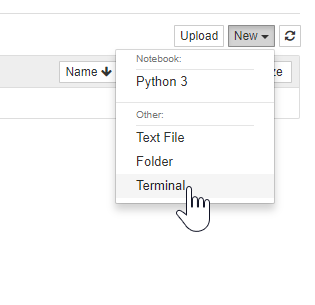

1. 准备环境

​       a. 本环境准备了5台服务器

​       i.  一台安装 Jupyter Hub，作为本地调试的环境，安装 Ubuntu 18.04。（可选）

​       ii.  一台没有 GPU 的作为 OpenPAI 的主节点，安装 Ubuntu 16.04 或以上版本。

​       iii. 三台有 GPU 的作为 OpenPAI 的计算节点，安装 Ubuntu 16.04 或以上版本。确保这些服务器能够正常使用 GPU 进行计算。

​       b.   假设服务器 IP 分配如下，以便后面参考。

| 主节点    | 10.0.0.36 |
| --------- | --------- |
| 计算节点1 | 10.0.0.32 |
| 计算节点2 | 10.0.0.33 |
| 计算节点3 | 10.0.0.34 |
| jupyter   | 10.0.0.35 |

2. 安装 Jupyter Hub（可选）

a.       确认服务器版本，如果不是 18.04，可使用以下命令升级：

do-release-upgrade

2. 检查 GPU 驱动。

​      a. 使用以下命令检查 GPU 是否能识别。如果没有输出，表示没有安装 Nvidia 驱动。如果有输出，表示已经安装了 NVIDIA 驱动，可跳过驱动部分。

lsmod | grep nvidia

2. 如果 GPU 驱动没有安装好，并确认此服务器有 GPU，参考以下步骤。安装过程比较复杂，可直接参考：https://medium.com/@zhanwenchen/install-cuda-and-cudnn-for-tensorflow-gpu-on-ubuntu-79306e4ac04e 

sudo add-apt-repository ppa:graphics-drivers

sudo apt update

sudo apt install nvidia-384

sudo reboot

 iii.    安装 CUDA

wget <https://developer.nvidia.com/compute/cuda/9.0/Prod/local_installers/cuda_9.0.176_384.81_linux-run>

chmod +x cuda_9.0.176_384.81_linux-run

./cuda_9.0.176_384.81_linux-run --extract=$HOME

sudo ./cuda-linux.9.0.176-22781540.run

 

sudo bash -c "echo /usr/local/cuda/lib64/ > /etc/ld.so.conf.d/cuda.conf"

sudo ldconfig

 \1.             运行 sudo vim /etc/environment，并在PATH变量后增加 :/usr/local/cuda/bin 。注意有冒号。然后重启服务器。

sudo reboot

 

安装 cuDNN。

1. 在 <https://developer.nvidia.com/rdp/cudnn-download> 注册，进入 CUDA 9.0，并下载以下两个包。

cuDNN Runtime Library for Ubuntu16.04 (Deb)

cuDNN Developer Library for Ubuntu16.04 (Deb)

​    2.  根据文件名，安装这两个包。（文件名可能有所不同）

sudo dpkg -i libcudnn7_7.4.2.24-1+cuda9.0_amd64.deb

sudo dpkg -i libcudnn7-dev_7.4.2.24-1+cuda9.0_amd64.deb

​     3.   配置路径

​          v.    最后，可安装如下命令来检查 nvidia 显卡运行情况。安装后，运行 nvidia-smi 即可。

sudo apt install nvidia-smi

​    c.        运行以下命令，注意，此命令会创建为 testadmin 的管理员账户。

sudo apt-get install python3 git curl python3-pip

curl <https://raw.githubusercontent.com/jupyterhub/the-littlest-jupyterhub/master/bootstrap/bootstrap.py> | sudo -E python3 - --admin testadmin

​       d.         安装完成后，访问其地址来设置管理员密码。

<http://10.0.0.35:8000>

​               i.            如果无法访问，可用下列命令来编辑services，在命令行后加上 --ip 0.0.0.0

sudo vi /etc/systemd/system/jupyterhub.service

​                    ii.            使用下列命令来重启服务

sudo systemctl daemon-reload

sudo service jupyterhub stop

sudo service jupyterhub start

​                e.        访问 control panel -> admin 来增加用户。

​                f.         在 terminal 中为所有用户安装所需要的依赖包

​        

​                   g.        注意要加上sudo -E，才能为所有用户安装。

sudo -E /opt/tljh/user/bin/python3 -m pip install tensorflow-gpu torch torchvision keras

​                     h.         如果需要启用HTTPS，可参考：https://tljh.jupyter.org/en/latest/howto/admin/https.html#howto-admin-https

​                      i.        使用下列命令可对Jupyter Hub进行修改

tljh-config

​                       j.         如要为所有用户上传数据，可参考：

<https://tljh.jupyter.org/en/latest/howto/content/share-data.html#howto-content-share-data>

​                       k.         如要查看日志，可参考：

<https://tljh.jupyter.org/en/latest/troubleshooting/logs.html>

​     3.     安装 OpenPAI

​         a.  在master服务器上安装docker，以便部署 OpenPAI 的部署容器。

sudo apt install docker.io

​          b.   启动部署容器（dev-box），此步骤会下载 docker 映像，具体时间取决于网速。（可参考：<https://github.com/Microsoft/pai/blob/master/docs/pai-management/doc/distributed-deploy.md>）将加亮部分替换为最新版本。

 

sudo docker run -it -e COLUMNS=$COLUMNS -e LINES=$LINES -e TERM=$TERM -v /var/run/docker.sock:/var/run/docker.sock -v /pathHadoop:/pathHadoop -v /pathConfiguration:/cluster-configuration --pid=host --privileged=true --net=host --name=dev-box openpai/dev-box:v0.14.0 /bin/bash

 

cd /pai

 

​       c.  创建配置文件 quick-start.yaml

cp deployment/quick-start/quick-start-example.yaml quick-start.yaml

vi quick-start.yaml

​        d.  参考下列内容进行配置，确保将主节点的 IP 放到第一个，并更新用户名密码。如需高级配置，请参考 OpenPAI 文档的定制部分。（https://github.com/Microsoft/pai/blob/pai-0.8.y/docs/pai-management/doc/cluster-bootup.md#customizeddeploy ）

\# (Required) Please fill in the IP address of the server you would like to deploy OpenPAI

machines:

  \- 10.0.0.36

  \- 10.0.0.32

  \- 10.0.0.33

  \- 10.0.0.34

 

\# (Required) Log-in info of all machines. System administrator should guarantee

\# that the username/password pair or username/key-filename is valid and has sudo privilege.

ssh-username: pai

ssh-password: pai-password

 

\# (Optional, default=None) the key file that ssh client uses, that has higher priority then password.

\#ssh-keyfile-path: <keyfile-path>

 

\# (Optional, default=22) Port number of ssh service on each machine.

\#ssh-port: 22

 

\# (Optional, default=DNS of the first machine) Cluster DNS.

\#dns: <ip-of-dns>

 

\# (Optional, default=10.254.0.0/16) IP range used by Kubernetes. Note that

\# this IP range should NOT conflict with the current network.

\#service-cluster-ip-range: <ip-range-for-k8s>

​    e.        根据 quick-start，生成 OpenPAI 配置。

python paictl.py config generate -i quick-start.yaml -o /cluster-configuration -f

​     f.         替换google_container，以免国内无法访问

vi /cluster-configuration/kubernetes-configuration.yaml

​     g.      替换其中的docker-registry为以下行

docker-registry: crproxy.trafficmanager.net:6000/google_containers

​     h.      运行以下命令启动 Kubernetes。

python paictl.py cluster k8s-bootup -p /cluster-configuration

​                i.    如果docker在此过程中退出，可执行以下步骤，重新进入dev-box后，再次执行上述命令。

sudo docker start dev-box

sudo docker exec -it dev-box /bin/bash

​                 ii.    如果上述步骤在安装过程中由于网络问题遇到错误，可执行下列清除命令后，再次运行。

./paictl.py cluster k8s-clean -p /cluster-configuration

  i.        启动 OpenPAI。安装过程会下载大量的 docker 映像，具体时间由cluster大小和网速决定。下列命令询问 cluster-id时，可直接回车跳过。

python paictl.py config push -p /cluster-configuration

python paictl.py service start

4. 检查安装

​         a.   安装完成后访问主页，查看是否正常。由于Kubernetes启动PODs有一定延时，如果第一次无法访问，可过几分钟再检查。默认用户名密码为 admin/admin-password，请及时修改。

<http://10.0.0.36>

​        2.         访问 OpenPAI 主页，参考如何提交训练任务。

<https://github.com/Microsoft/pai#train-models>

 