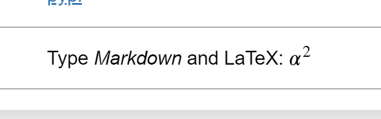

## 使用Python解决以下问题

1. 有两个排好序的数组，如[1,3,4,9…]和[2,4,8…]。写一个算法把这两个数组合并，合并后的数组仍然是排好序的，
如[1,2,3,4,4,8,9…]. 要求O(n)算法复杂度。

2. 有一个数组，[0,100]，共101个单元，存放着0~100一共101个整数。把0替换成从[1,100]中随机的一个并打乱数组顺序。
请用至少2种办法找出这个数字。

3.用代码实现上图