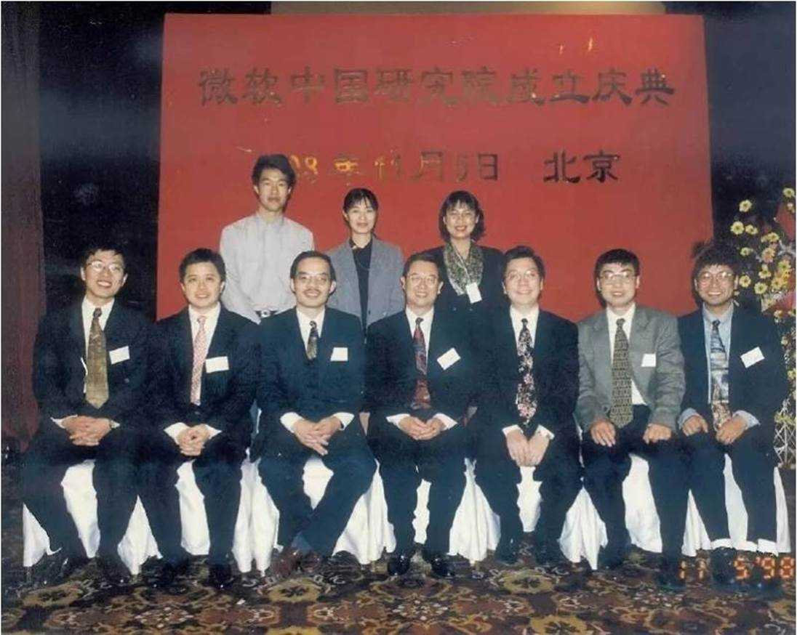
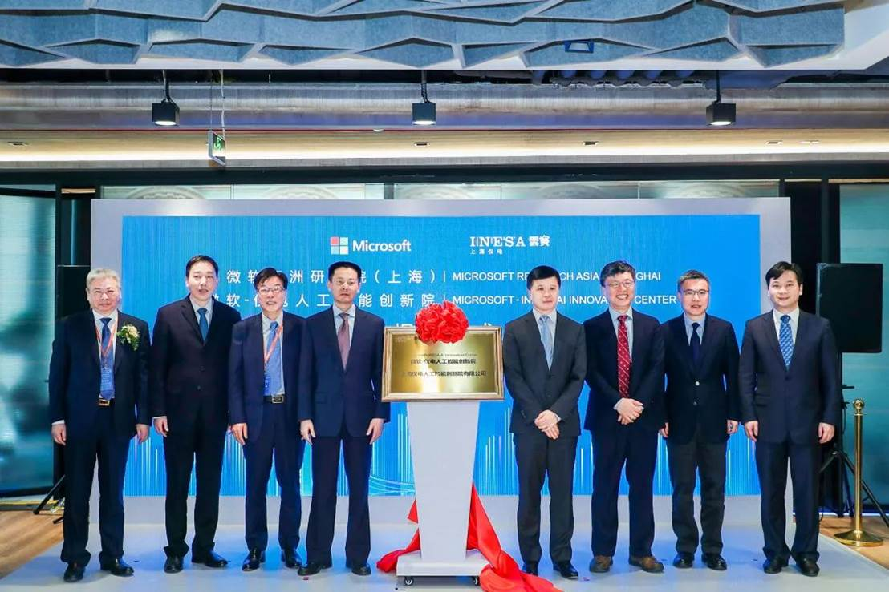
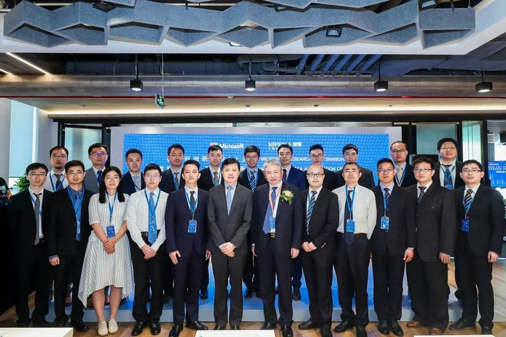
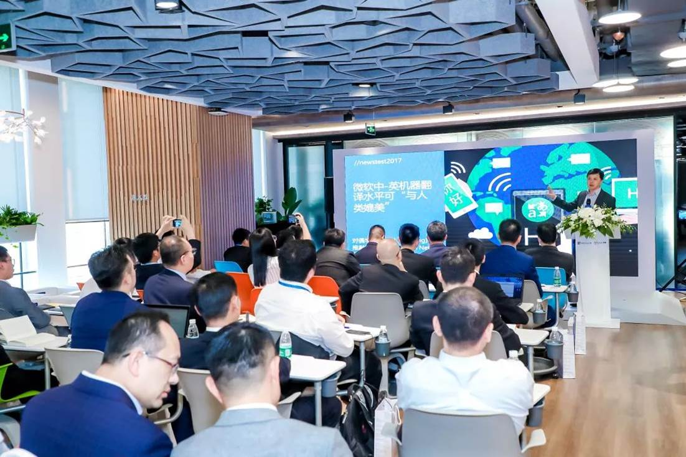
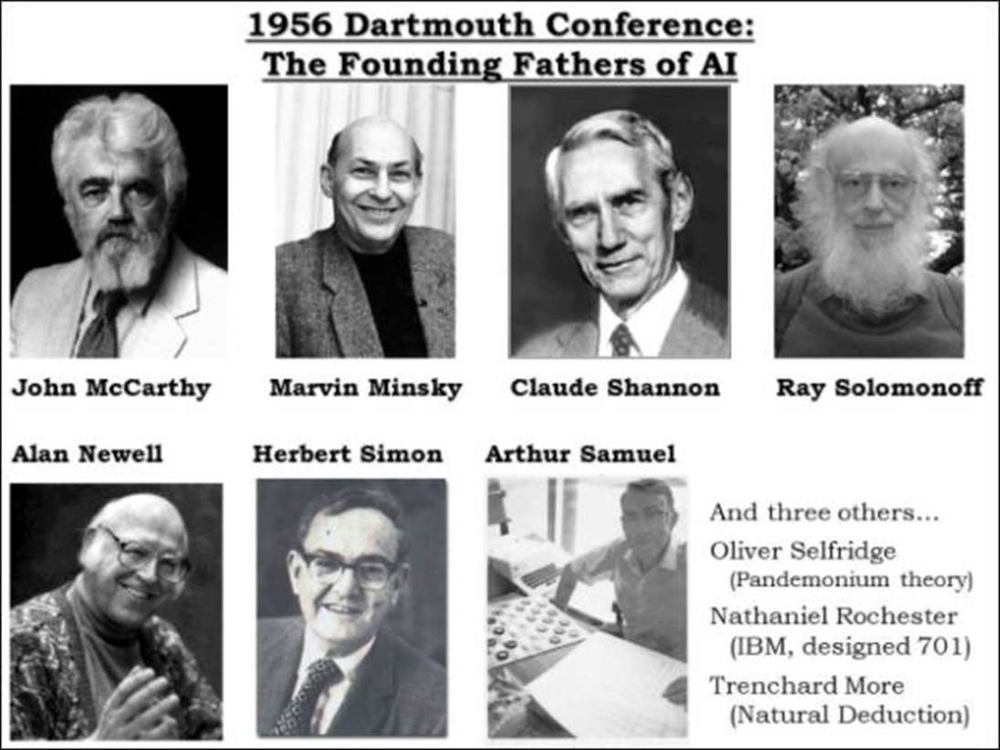
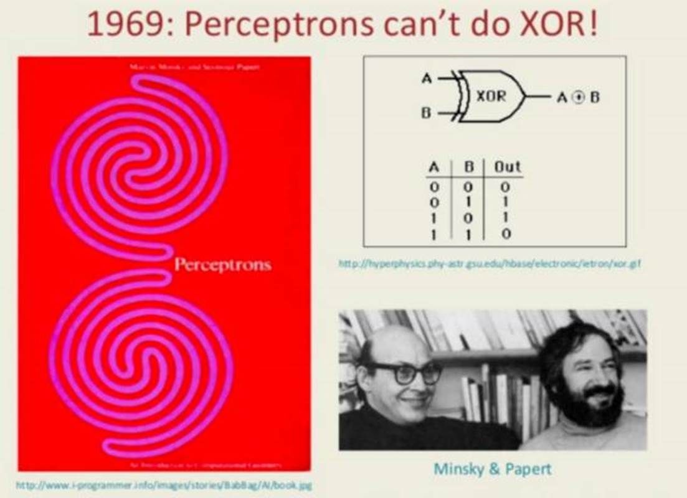
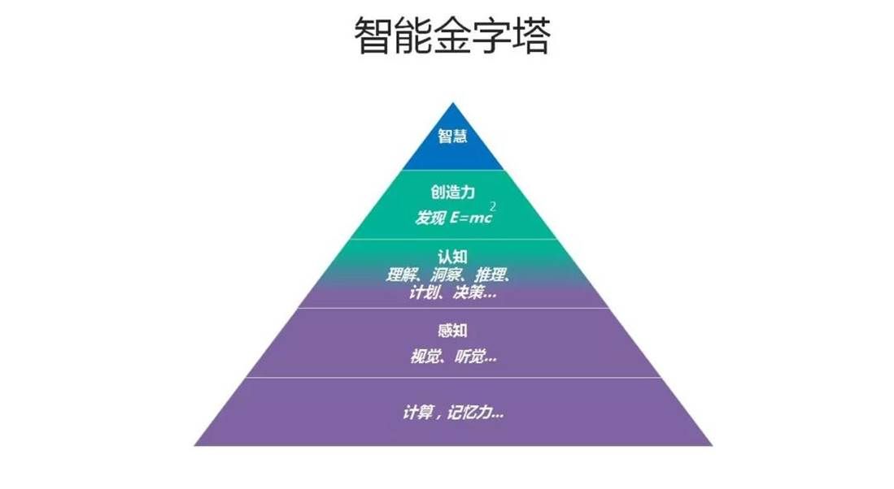
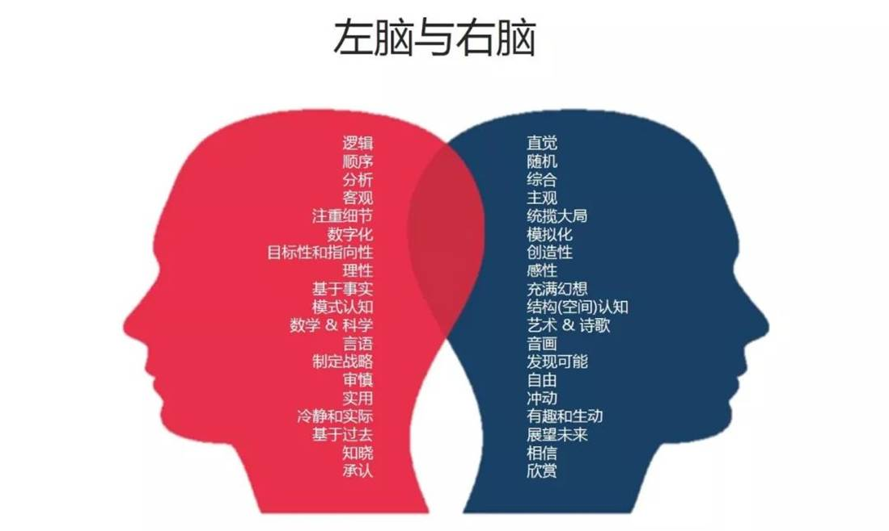

# 微软-仪电人工智能高阶人才培训学习心得之-洪小文老师第一讲宁庭勇

### 宁庭勇
2019年5月24日是个好日子，风和日丽阳光明媚。就在这个黄道吉日，我们微软-仪电人工智能创新院正式揭牌了。现场来了好多大领导，讲了好多话，不过这不是我今天要说的重点。我要讲的重点是出席嘉宾中我最想见到的两个人——沈向洋和洪小文。
知道他们，是很久以前的事情了。98年11月，我还在读大二，那个时候互联网还没有现在这么发达，但互联网和网页却已经开始有了。1998年11月5日（见下图），微软亚洲研究院（初创时称“微软中国研究院”）在北京成立。政府部门领导、合作伙伴、媒体济济一堂，在北京国际俱乐部饭店（现北京瑞吉酒店）共同见证了这一重要时刻。
 
今天看来真是神奇，一转眼快二十一年了，当年关注的几个大神之一，竟然要来给我讲课了。哈哈哈，竟然等了二十年！二十年后，在讲台上见到他们两个人（见下图），风采依然，只是向阳依然笑得那么灿烂，小文老师却没有笑，我估计他可能在思考，思考给我们这些学员的第一课到底应该讲些什么吧。

能作为第一期的学员（见下图）参与到上海的人工智能最后一公里落地的大潮中确实是我的荣幸。正如狄更斯在《双城记》中所说，“这是一个最好的时代，这是一个智慧的年代。”而我们正处于这个时代这个年代。

好了不废话，小文老师上讲台了！

解下领带的他一身轻松，马上恢复了学者的状态，侃侃而谈，可惜时间有点儿短，就一个半小时。老师的课核心的讲了AI的历史、人类智慧的层级两个主题。我总结了一下分为以下几个阶段：

## 1、混沌初开

如老师所说，真正AI这个字眼，要等到1956年，在达特茅斯（在波士顿附近的一个很偏僻的小镇上，也是常青藤的学校之一）举行的一个夏季会议上提出的。当时有五个人参加，MIT的John McCarthy和Marvin Minsky，CMU的Allen Newell和Herbert Simon以及IBM的Arthur Samuel，这五个人就是AI的开山鼻祖。这五个人除了Arthur Samuel以外，全部拿了图灵奖。其中，Herbert Simon 在中国也很有名，他同时拿了图灵奖和诺贝尔经济学奖。他和Allen Newell 两个人创立了卡耐基梅隆大学（CMU）。其实CMU计算机科学系就是这两个人为了做AI而成立的。小文老师自豪的介绍了John McCarthy是他的师祖，他的老师Raj Reddy是John的学生。John McCarthy是真正把人工智能取名叫做AI的人。
 
老师其实还讲了很多，从老师的这部分分享里，我也是深有感触：人类的技术发展历史，是需要有伟大的个人去推动的，这些人推动历史，并将接力棒传递给那些跟随他们的年轻人，前赴后继。
 
## 2、守得云开见月明

第一次AI寒冬是在1975年左右。1956年，在达特茅斯会议之后，包括很多国家政府，美国国家科学基金会、军方，大家满怀希望投了很多钱。但是到1975年以后发生了几件事情，让AI进入了寒冬。
 
第一件事是，因为AI只能解决Toy domain（摆弄玩具一样的简单任务）。那个时候做语音，只有10个词汇；下象棋，大概是20个词汇；做视觉的人，都不能辨认出一个椅子。第二件事情，1956年美国打越战，还有石油危机，所以经济也不是那么好；还有一个很有名的英国学者Lighthill，说AI就是在浪费钱，AI的研究经费也因此遭到大幅削减（编者注：在1973年出版的“人工智能：一般性的考察”的报告，俗称Lighthill报告中称“迄今该领域没有哪个部分做出的发现产生了像之前承诺的那样的重要影响”。英国政府随后停止了对三所大学Edinburgh, Sussex和Essex的AI研究资助）。
 
不过，到1990年中，AI又第二次遇冷，为什么会这样？因为第五代计划失败，Lisp Machines和Thinking ( Connection ) Machines都做不出来；而神经网络，虽然有意思，但并没有比其他一些统计的方法做得好，反而用的资源还更多，所以大家觉得也没什么希望了，于是AI又进入第二个冬天。
 
到目前为止，AI总共有八个人，Marvin Minsky (1969), John McCarthy (1971), Allen Newell (1975), Herb Simon (1975), Edward Feigenbaum (1994), Raj Reddy (1994), Leslie Valiant（2010）, Judea Pearl（2011）得了图灵奖，比例还是蛮高的。前四个人在1975年以前就得了图灵奖，1975年以后图灵奖就不颁给AI了。一直到1994年，几乎20年以后，我老板和Edward Feigenbaum又得了图灵奖。最近的Leslie Valiant，Judea Pearl也得了图灵奖，所以AI又解冻了。所以从得图灵奖，也能看得出AI研究的冷热。
 
当然，小文老师还讲了很多，我们从获得图灵奖的节奏就能看出AI的兴衰历史。从老师的这些故事当中，我的体会是：技术发展都是有起伏的，在遇到困难和迷惑的时候需要有信念需要坚持，我们要对人类的智慧有信心，对我们目前所处的历史时代有责任感，如果我们这一代人做不到，那我们就继续努力，把突破的可能性把我们的接力棒交给下一代人，希望之火不灭。
 
## 3、人类的智慧在哪里

智能金字塔，从下到上，越往上越高等。

第一层，计算和记忆。计算机的基本原理和理论在图灵时代就完成了。计算机里有两个最重要的因素：计算和记忆。在这两点上，计算机完胜我们人类。

第二层，感知，即能够听、能够看的能力。举个例子，假如北京附近有500个嫌疑人，你的工作就是站在巴士站或飞机场，看看有没有嫌疑人经过。对人类来说，要记住500个陌生人的脸是很辛苦的，但让计算机来做就非常合适。如今在视觉和语音识别上，计算机基本上也媲美人类了。

第三层，认知，包括理解、洞察、推理、决策等能力。假设你有一个想法，把它放到物理世界中执行，然后用一个传感器去接收它的数据，你就可以得到反馈并据此进行分析，再做出决策。现在每一家公司做产品都基本遵循这样的思路，这何尝不是“互联网思维”。AI可以在这个过程中帮助我们更好的做出决策，比如微软推出的Power BI，它的快速洞察功能让用户可以一键从数据中自动挖掘出各种有价值的信息进行分析，包括数据相关性、异常点、持续趋势和周期性等，这些均可通过可视化呈现出来。

第四层，创造力。创造力指的是用新的算法去解决未解的问题,或者更好地解决一个现有的问题。这毫无疑问是很高层级的智能，比如AI写诗，这对它来说毫不费劲。但任何一个了不起的AI背后，它的算法全部来自于编程的人类。所以人和机器比的不是算力，是算法。如果一个算法可以产生新的算法，那代表创造力是可以教的、可以系统化的，但创造力只有人类拥有。

第五层，智慧。从学理上看，智慧和意识、直觉、主观、睿智等有关。大部分生物是没有意识的，植物和大部分动物都没有意识，只有少数哺乳类动物才有意识。

心理学家和生物学家一直在讨论一个问题——人到底是什么？有一派理论认为，人和计算机很像，人脑就像计算机硬件，人的意识就像软件；另一派理论认为，人是Mind和Body。三十年前，大部分人相信人跟机器一样，而现在，大部分科学家认为Mind和Body是一体的。
今天人类和计算机的关系是，我们有好的想法和好的算法，通过编程用计算机来实现。计算机充其量是一个最好的左脑。而人类左脑和右脑的合作关系，其实就是如同“AI+HI”（人工智能+人类智能）。

当前的人工智能是“黑盒模式”，基于大数据的模式识别推理，可以解决“是什么”(what) 的问题，但还不能解决“为什么”(why) 的问题，不同黑盒系统之间的推理几乎是不可能的。所谓的预测事实上只是关联，它只知道A和B常常同时出现，但不知道什么是因什么是果。
人类认知多是白盒推理，能够进行因果分析和较高层次的推理，并且能在不同白盒系统之间进行认知和推理，回答“为什么” (why) 的问题，完成举一反三的迁移学习。所以今天的计算机是无法与人相比的。
 
其实我是最最想听到这个主题老师的分享的，竟然在我的认知发展到将近能听懂的时候，听到了小文老师的分享。听到老师讲到了认知心理学，倍感亲切。只可惜授课时间太短，老师的分享受到时间的限制，不能再深入了，真是可惜！
 
## 4、我们的责任和目标
小文老师最后给我们讲了微软和仪电合作成立的人工智能创新院的两大使命：

一是着力进行人工智能在各行业落地“最后一公里”的创新研发，让关键技术在可落地的应用场景中满足行业需求；二是提升人工智能人才普及，打造一个开放的生态系统，为行业的数字转型服务。
 
前面讲了那么多，个人感觉其实最终老师是想通过这些来勾起我们学习AI并将其落地的兴趣，建立我们参与生态建设和为行业转型服务的坚强决心。我想说，他从认知心理学的角度来说，做到了。最后，我还是用狄更斯《双城记》中的原话结束我的感想吧！
 
# 这是一个最好的时代，也是一个最坏的时代；

# 这是一个智慧的年代，这是一个愚蠢的年代；

# 这是一个信任的时期，这是一个怀疑的时期；

# 这是一个光明的季节，这是一个黑暗的季节；

# 这是希望之春，这是失望之冬；

# 人们面前应有尽有，人们面前一无所有；

# 人们正踏上天堂之路，人们正走向地狱之门。

## 关于微软-仪电人工智能创新院
微软-仪电人工智能创新院将由微软和仪电共同运营和管理，致力于为微软和仪电在人工智能方面的联合研究活动和项目提供支持，为当地企业提供基于微软技术的人工智能研发平台服务和培训服务。

## 关于培训
微软和仪电共同打造的微人工智能高阶人才培训第一期培训班由创新院运营，历时三个月，授课老师包括来自微软和上海仪电的多位专家，内容涵盖人工智能导论、数学基础、深度学习、应用实例等课程，以及关于强化学习、自然语言处理、计算机视觉等热门方向的专题研讨会，希望帮助学员掌握人工智能的理论与实践，培养具备前瞻视野和实践能力的创新型人才。

更多信息，请关注微信公众号

