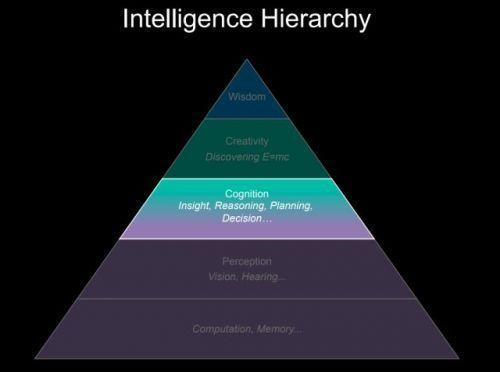
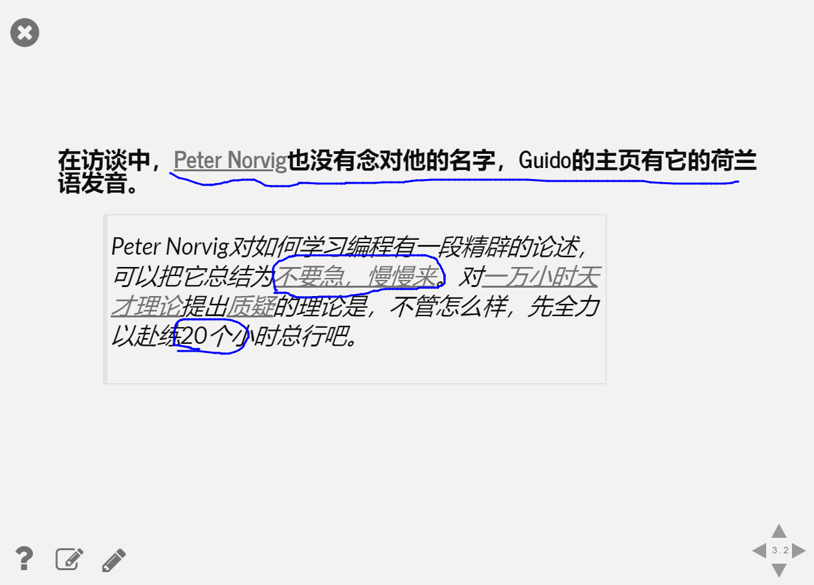
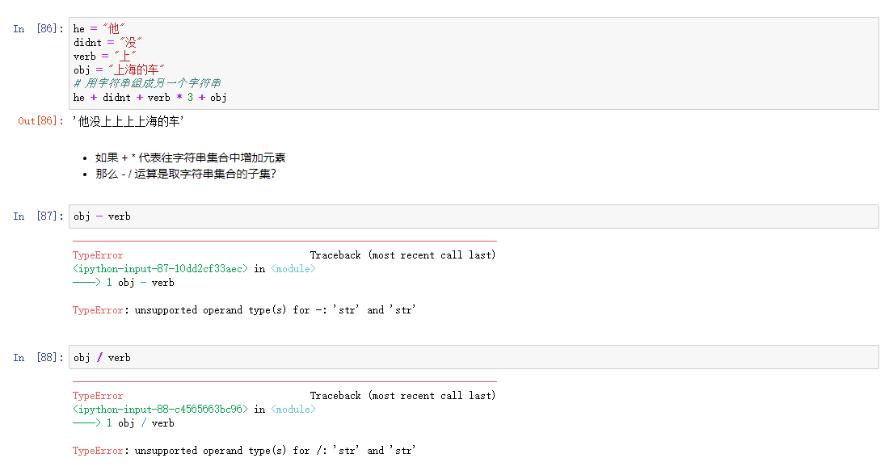
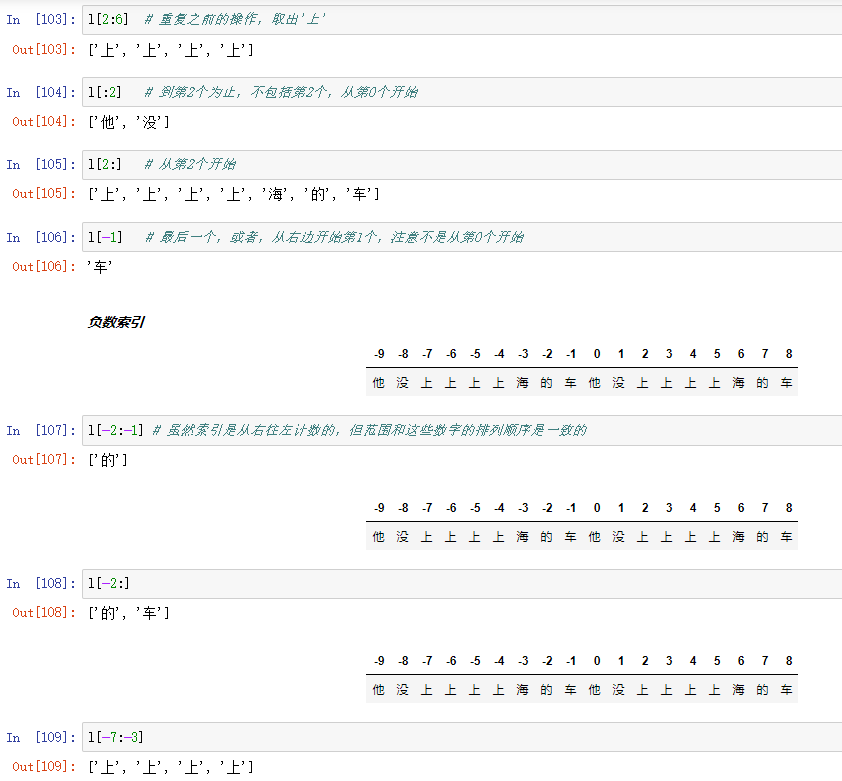
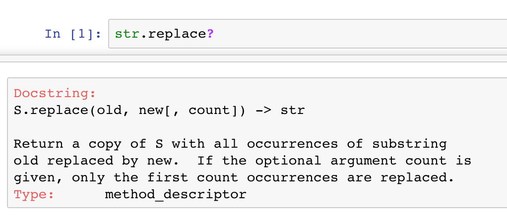
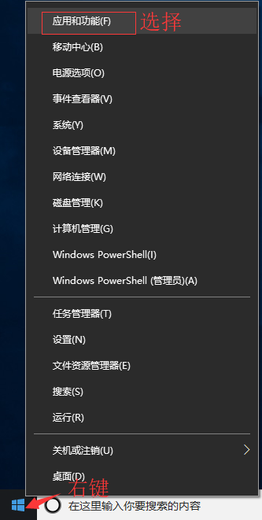
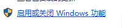
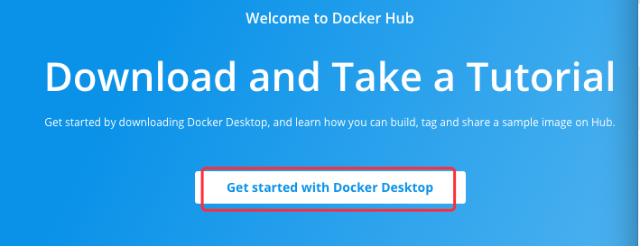
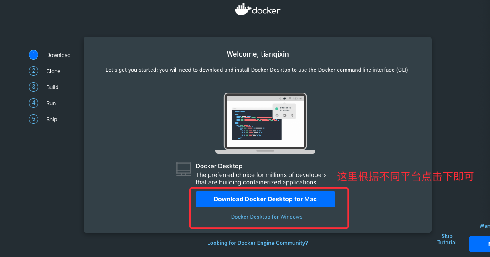

# 微软-仪电人工智能高阶人才培训学习心得之一：Python语言导论（1）
## 作者： 李少华（上海仪电人工智能创新院）

# 引言
2019年5月24日，一个普通又不普通日子。

对于绝大多数的上班族而言，这是一个极为普通的周五，意味着接下来的两天又可以好好休息了。

对于仪电人而言，这又是一个极不普通的周五。微软亚洲研究院（上海）和微软-仪电人工智能创新院在上海正式揭牌，预示着仪电已经成为产业新方向重要策源地，正为上海创新发展注入新动力。

对于首期学员班的三十多位同学而言，这更是一个极不普通的周五。不仅是为期三个月的高强度学习，更有机会和AI业界资深专家面对面沟通交流，快速提升自身能力。

# 入学第一课：洪院长知往鉴今话AI
不同于以往AI课程的导论，先是介绍AI的发展历史，随后再描绘一下AI的美好场景。  
导论课程一开始，洪院长就抛出了一个问题：1950年的时候有人就很担心造出一个比人类聪明的东西，人类怎么办？  
借着这个问题，洪院长带领我们从哲学高度深入思考AI的意义和人类的未来。

## AI已经好多年
AI其实并不是新概念，早在二战就已经被科学家们提出，只是中间起起伏伏，随着大数据等技术的发展，AI再次成为耀眼明星。  
1943年：第二次世界大战引发了新思维。沃尔特制造了有史以来的第一个机器人。图灵接着发明了图灵测试，为智能机器设置了标准：一种可以欺骗某人以为自己在和另一个人说话的电脑。  
1956年：一种“自上而下”的方法。“人工智能”一词是由一名年轻的计算机科学家约翰·麦卡锡(John McCarthy)，在达特茅斯大学举办的夏季会议上创造的。  
1997年：人与机器：20世纪的战斗。在1997年的标准国际象棋比赛中，超级计算机深蓝战胜了人类国际象棋冠军加里·卡斯帕罗夫。  
2011年，IBM的沃森(Watson)在美国智力竞赛节目《危险边缘》(Jeopardy)中，挑战了人类大脑。  
Alpha-GO的崛起，让人们不能再忽视AI的力量。

## 智能五层级
那AI的崛起是不是意味着人类终将被打败呢？为了回答这个问题，得先将智能分分类，分别阐述。
智能层级分为计算、感知、决策、创造力、智慧五层。



**最底层**的是计算和记忆，在这方面人类与计算机相比已经没有希望了，没有谁的计算能力可以超过计算机。  
**第二层**是感知，包括语音、视觉等等，目前从感知层面来看，计算机也已经基本上超过人的感知能力了。  
**第三层**是推理和决策。今天的AI最难的是分析和决策。1980年代专家就提出了“中文房间”这个测试，今天AI的系统，包括我们所谓的自动翻译，就是“中文房间”的这种方式在运行，这就是这种查表式。当然深度学习可以做很复杂的查表，但是还是查表，基本上没有了解。比如，翻译“我是笨蛋”，如果让人来翻译的话，他会说“你才是笨蛋”，他不会去翻译。但是如果让机器翻译的话，它就会傻傻的翻译说“我是笨蛋”。也就是说，在没有了解的情况下，这个系统是很机械式的。  
今天的AI都是黑盒，都无法解释。它能够解决What，但是不知道Why。我们可以用黑盒的方式搜集大数据进行计算机，但是遇到数据不够多的时候就要用白盒的，基本上要靠人。所以在决策层，目前是AI+HI（人工智能+人类智能）的状态，因为计算机还不会自我编程。  
**第四层**是创造力。其实，目前所谓的电脑创造力都是来源于已有的东西。“今天没有一个计算机说可以自己想出一个新的算法，或者自己去编程，所以计算机的创造力都来自于人。”   
**第五层**是智慧，但是目前都是弱人工智能，所谓的强人工智能或者通用人工智能，我们还不知道能否实现。
由此克制，AI的终极目标应该是成为人的守护天使，帮助人类更好地生活工作创造更多别样的价值。

## 人的智能和当前AI的智能有什么区别？ 
机器的智能是**以繁制繁**，这是机器的强项。深度学习，从广义上来讲，其实就是一种模式识别。机器的这种模式识别，不管是记十个电话号码，还是AlphaGo的下棋，都是一样的，就是死记硬背。  
而人的智能则是以简制繁，就是在复杂中找到规律，根据规律来解决问题。如果十个电话号码没有规律，别说十个，一个可能都不记得；但如果找到了规律就很容易了。  
我们人一直在讲智慧，最高境界其实就是**化繁为简**。“吾道一以贯之”，这不就是化繁为简吗，只要一个道理就可以破所有的功。人的智慧是这个，而不是以繁制繁。以繁制繁是一种智慧，但不是最高智慧。  
爱因斯坦当年几乎是从零数据提出了引力波，一百年后我们才勉勉强强测到。  
今天所谓的AI都是要大数据，至少目前还看不出AI能做到基于小数据或者零数据的预测。未来可能会有，但从应用的角度来看，短时间之内是很难做出很了不起的应用的，反而是大数据的应用会很快。

## 人的智能和AI的智能未来的发展方式是什么样子的呢？
事实上更贴切的是，**人类智能与人工智能的共进化**。  
在研究AI的时候，我们对于AI的了解也会改变。未来可预期吗？虽然很多人在那里讲，只能讲历史，未来事实上是不可预测的。而最大的原因是，未来是等着我们去探索和创造的。

## **小结**
> 洪院长AI导论课，并不是简单地描绘未来AI的美妙世界，也不像《未来简史》的作者认为将来所有的东西都是大数据和算法，而从人类智能与机器智能的对比出发，发现各自的优势和劣势，在实践中将**AI和HI融合**，这种务实的态度令人敬佩。

# 入学第二课：积跬步方能至千里
醍醐灌顶明方向，积跬步方能至千里。如果说洪小文院长的第一课让我们对于AI和人类发展有了一个更为明确的方向，那周六的周海涛Bartuer老师课程就是我们万里长征的第一步。

## 工欲善其事必先利其器 Docker + Python + Jupyter
Docker 帮助大家快速部署环境，省却了大量烦人的系统配置过程。  
Python 更是贴心地提供关于AI、DataScience、机器学习PyBrain，NumPy和PyMySQL的库和框架就是其中一个原因。Python多样性，Python体验允许你比R做更多的事情，例如你可以创建脚本来自动化内容，进入Web开发等等。  
Jupyter 则让我们省去配置IDE的过程，实现代码及时反馈，及时调整。Bartuer 老师更是直接用 Jupyter 作为教案编辑器，随时修改随时发布最新课件。

 
 
 
## 一万小时太久，只争20小时，Learning by Doing
10000小时，对于任何一个人都是无比奢侈的时间，20小时学python足以，当然不能只是简单的print(“hello world!”)。  
Bartuer 上课挂在嘴上的一句话就是 **“Learning by Doing”**，不要害怕出错，尝试中学习，错误中学习。他的教学也是如此，不像一般的老师只是教正确的是什么，而是经常看到各种各样的Error。通过对异常的分析，找出python语言的使用规律。

## Python语言不一般
> 点击获取 Python 官方教程 [Python官方教程](https://docs.python.org/zh-cn/3/tutorial/index.html)  
以下的代码都可以通过[微软AI课程](https://github.com/microsoft/ai-edu "微软AI课程")获取

- Python 中的变量赋值不需要类型声明。每个变量在使用前都必须赋值，变量赋值以后该变量才会被创建。

- 字符串能加能乘，无法减和除。


- 字符串切片技巧



## Jupyter 使用技巧
> 以下内容截取自来自互联网,更多内容参见[简书](https://www.jianshu.com/p/a85bc2a8fa56)

1. **多行输出**  
在Notebook的中开头cell中添加以下代码可以实现多行输出：
```python
from IPython.core.interactiveshell import InteractiveShell 
InteractiveShell.ast_node_interactivity = 'all' #默认为'last'
a = 1
b = 2
a
b
```  
2. **格式化自动美化代码**   
代码整齐很重要！
对于Python来说混乱的代码格式可能是致命的！
这里介绍安装code-pretty自动格式化插件，先执行命令开启：
```python
jupyter nbextension enable code_prettify/code_prettify
```
依照[官方说明](https://jupyter-contrib-nbextensions.readthedocs.io/en/latest/nbextensions/code_prettify/README_code_prettify.html)还需要执行另外一个命令安装必要的第三方功能模块：
```python
conda install yapf
```
然后就可以看到Notebook如下图出现一个小锤头工具。点击它就能把当前cell的代码自动格式化变整齐了，也可以使用快捷键Ctrl+L（苹果下也是ctrl不是Command）。  
  

3. **用?输出帮助提示**  
  
  

4. **运行或载入外部Python文件**  
使用%run代码可以直接外部的执行.py文件，比如在Notebook文件夹内有一个a.py文件。
```python
aa='haha'
print(aa)
```
那么可以用下面代码直接在Notebook内运行它(注意这里的./表示在同一文件夹下)。
```python
%run ./a
print('>>'+aa)
```


## Docker安装
> 以下内容截取自来自互联网,更多内容参见[菜鸟](https://www.runoob.com/docker/windows-docker-install.html6)

**win7、win8 系统**  
win7、win8 等需要利用 docker toolbox 来安装，国内可以使用阿里云的镜像来下载[下载地址](http://mirrors.aliyun.com/docker-toolbox/windows/docker-toolbox/)  
docker toolbox 是一个工具集，它主要包含以下一些内容：
- Docker CLI 客户端，用来运行docker引擎创建镜像和容器
- Docker Machine. 可以让你在windows的命令行中运行docker引擎命令
- Docker Compose. 用来运行docker-compose命令
- Kitematic. 这是Docker的GUI版本
- Docker QuickStart shell. 这是一个已经配置好Docker的命令行环境
- Oracle VM Virtualbox. 虚拟机  

下载完成之后直接点击安装，安装成功后，桌边会出现三个图标，入下图所示：


点击 Docker QuickStart 图标来启动 Docker Toolbox 终端。  
如果系统显示 User Account Control 窗口来运行 VirtualBox 修改你的电脑，选择 Yes。
  

  
**Win10 系统**   
现在 Docker 有专门的 Win10 专业版系统的安装包，需要开启Hyper-V。  
开启 Hyper-V

  

程序和功能


启用或关闭Windows功能



选中Hyper-V


1. 安装 Toolbox  
最新版 Toolbox 下载地址： https://www.docker.com/get-docker  
点击 Download Desktop and Take a Tutorial，并下载 Windows 的版本，如果你还没有登录，会要求注册登录：





2、运行安装文件  
双击下载的 Docker for Windows Installer 安装文件，一路 Next，点击 Finish 完成安装。


3. 安装完成  
安装完成后，Docker 会自动启动。通知栏上会出现个小鲸鱼的图标，这表示 Docker 正在运行。  
桌边也会出现三个图标，我们可以在命令行执行 docker version 来查看版本号，docker run hello-world 来载入测试镜像测试。  
如果没启动，你可以在 Windows 搜索 Docker 来启动：


启动后，也可以在通知栏上看到小鲸鱼图标：


## 课后讨论不可缺
课后不进行讨论消化就犹如把水泼到筛子里一样。忽视了课后总结，老师讲过的新课哪些地方懂了，哪些地方还不懂，哪些内容记住了，哪些内容还没有记住，都是模模糊糊的。在这种情况之下，往往今天学明天忘，不但枉费了大量宝贵的学习资源和学习时间，学习效果也不好。
我们的很多热心的同学，将课程涉及到各类技术相关文章纷纷发到微信群中，帮助大家加深学习印象。

## **小结**
> 虽然整个课程才刚刚启航，有着洪院长哲学层面的深思和Bartuer手把手一步一步的教学，还有同学们学习热情，首期培训班会越走越好。  
**大家加油！**

# 关于微软-仪电人工智能创新院
微软-仪电人工智能创新院将由微软和仪电共同运营和管理，致力于为微软和仪电在人工智能方面的联合研究活动和项目提供支持，为当地企业提供基于微软技术的人工智能研发平台服务和培训服务。

# 关于培训
微软和仪电共同打造的微人工智能高阶人才培训第一期培训班由创新院运营，历时三个月，授课老师包括来自微软和上海仪电的多位专家，内容涵盖人工智能导论、数学基础、深度学习、应用实例等课程，以及关于强化学习、自然语言处理、计算机视觉等热门方向的专题研讨会，希望帮助学员掌握人工智能的理论与实践，培养具备前瞻视野和实践能力的创新型人才。

更多信息，请关注微信公众号

