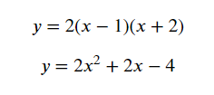
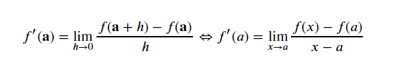

# 微软-仪电人工智能高阶人才培训学习心得之一：201课程-python语言导论(2)、数学基础(1)

## 作者：余晓虎（上海仪电人工智能创新院有限公司）

## NumPy

学习了基础的Python用法后，周老师为我们带来了强大的NumPy。

**为什么不使用List？**

- 慢
- 缺少数学操作

老师用实例向我们展示了用NumPy优于List。

```python
import numpy as np 
import timeit

def t_list():
    l = [1 for i in range(4*100000)]
    [0 for i in l]
    
def t_float32():
    np.ones(4*100000, np.float32).view(np.float32)[...] = 0

def t_int8():
    np.ones(4*100000, np.int8).view(np.int8)[...] = 0
    
print(timeit.timeit('t_list()', setup='from __main__ import t_list', number=1))
print(timeit.timeit('t_float32()', setup='from __main__ import t_float32', number=1))
print(timeit.timeit('t_int8()', setup='from __main__ import t_int8', number=1))
```
```python
output: 0.06334289998630993
        0.0010455000156071037
        0.0005443000118248165
```
可见，NumPy与List的运算时间不在一个量级。
NumPy有着更快的计算速度和丰富的函数包，还可以计算复杂的数学问题。

听完老师的阐述，我对NumPy越来越感兴趣，为什么会这么快？
这跟NumPy的底层设计有关，对于内存的高效率分配有关。有了强大的底层架构，使得NumPy计算非常快。现代计算机发展地越来越快，尤其是CPU，可是CPU的发展速度远远超越了内存和硬件设备的发展，使得计算机的运算能力被I/O拖累。老师提到，要想得到最高效的计算能力，必然要往更底层的语言去编程，甚至是汇编语言。

**优秀的开发者需要什么？**
开发，免不了查阅文档，我们需要快速查阅文档！老师推荐了三个具有本地索引的应用程序：

- [Dash](https://kapeli.com/dash)
- [Zeal](https://zealdocs.org)
- [velocity](http://velocity.silverlakesoftware.com/)


**正态分布，一个神奇的函数**
NumPy展现着它的强大，可以随机生成正态分布


**NumPy矩阵运算**
- 解方程组


- 用矩阵的形式表示为


- 目标是求向量x


```python
import numpy as np 
a = np.array([[2, 3], [5, 2]]) # 方程组系数矩阵
a.transpose()    
b = np.array([8, 9])
print(b.shape, a.shape)         # shape不是函数，是tuple
b.transpose()
# 矩阵求逆
from numpy.linalg import inv as inv
a_inv = inv(a)
np.round(a_inv @ a) # 逆矩阵和原矩阵乘来验证求逆, @代表矩阵乘
x = a_inv @ b
print(x)
```


## SciPy

SciPy要比NumPy大得多，包依赖关系也多，比NumPy要笨重些。

## 关于开发语言的一些感想

老师在课上侃侃而谈，关于开发，关于语言，如何利用结构化标准？如何利用可执行性？如何利用索引？我听得津津有味。对于如何认知世界，或许是我们这些AI培训学员需要重新思考和体会的。老师不停地强调，我们要试错，不停地尝试，每一次尝试就是一次宝贵的经验积累。愉快地接受挑战，他人的挑战，是检验自我最好的手段之一。

这个世界本就不完美，我们总是用自己希望的结果去要求这个世界，于是我们不停地努力去改变世界，感觉上我们的技术是更新了，可是我们面临的问题也同样升级了。我们开发出一种新的语言，解决了我们认为的难题，其实同时我们也创造了新问题。而这样的情况却在循环往复着。

控制欲望，履行好自己的职责，或许是我们最能做的，也是最应该做的。

## 图形绘制

> 图形可视化是非常强大的工具

老师给我们例举了[Hans Rosling](https://en.wikipedia.org/wiki/Hans_Rosling)的[例子](https://www.ted.com/talks/hans_rosling_shows_the_best_stats_you_ve_ever_seen)
Hans是一位瑞典的国际卫生学教授，他非常善于使用图表，在视频中，他充分地使用了图形、图表，形象生动地描述了世界各国人口和富裕程度的发展变化。

**Matplot**
在Python中使用Matplot包来进行绘图。折线图、散点图、直方图统统都可以绘制。


# 数学基础(1)

## 怀旧

与其说一节数学课，不如说是一次愉悦的怀旧之旅。数学，一门生活中无法离开的学科。阔别校园生活那么多年之后，看到那些个公式真是倍感亲切。
在学习中，一点都没有觉得枯燥，反而来了精神。当初解一元一次方程、二元一次方程组、线性函数等的情景依然历历在目。
课上，周老师向我们展现了他深厚的数学功底，有图为证。


通过变化坐标系完成的积分求解。天呐！我早就忘了。

### 愉快的怀旧

**简单的一元一次方程**


**带系数的方程**


**系数是分数的方程**


**线性方程**


**斜率**
- x轴上的截距


- y轴上的截距


**直线的斜率、截距形式**


**线形方程组**


**二次方程**




```python
x = np.array(range(-9, 9))
y = 2 * x **2 + 2 * x - 4
plt.plot(x, y, color="grey")  # 画二次曲线 （抛物线）
plt.xlabel('x')
plt.ylabel('y')
plt.grid()
plt.axhline()
plt.axvline()
plt.show()
```


**二次方程的求根公式**


**函数**


**函数的定义域**


**函数的值域**


**函数变化率**
对于函数 y = f(x) 定义变化率为：


代入函数曲线上的两点，可以计算 m：


**极限**


**微分和求导**
- 导函数的定义：


**导函数也可记为**




**求导规则**

- 基本规则


- 幂规则
> 极其常用的规则


例如：


- 幂规则的推导


- 乘法规则


例如：


- 商数规则


例如：


- 链式规则 


例如：


**积分**

对函数 f(x)=x 有：


正态分布函数


数学课，非但不枯燥，反而给我们展现了Python的新天地。无论是方程组，还是微积分，这些Python都能计算和表达。

**Python**
>不仅仅是一个编程语言

这几天学习的日子里，我不停的感受到冲击，Python太强大了，挑起了我无比的兴趣和动力。我想要学好它，了解它，使用它。未来开发过程中，将会是一个非常好用的开发平台而且高效。

>如果不强大，怎么会放进课程中呢？
>
>计算机被发明的初心——运算
## 有趣

课上，周老师给我们看了两段有趣的视频。
- FFT in circle

<video width="80%" controls src="http://bazhou.blob.core.windows.net/learning/mpp/504_What_is_a_Fourier_Series_Explained_by_drawing_circles_-_Smarter_Every_Day_205-ds0cmAV-Yek.mp4" />
- pi的秘密

<video width="80%" controls src="http://bazhou.blob.core.windows.net/learning/mpp/Why_is_pi_here_And_why_is_it_squared_A_geometric_answer_to_the_Basel_problem-d-o3eB9sfls.mp4"/>

*数学*，原来是这么有趣，或许说不应该是数学，而是这个世界。世界竟然是这么有趣，各种各样的规律等待我们去发现。未知的世界远远超出我们的想象。

“FFT in circle”这个视频中，描述了傅里叶变换公式可以画出任意曲线。随着频率的增加，使得正弦波逐渐向方波变化，随着多种频率的叠加，就能画出各式各样的曲线。最终主持人完成了一副画作。

“pi的秘密”这个视频中，讲述了pi并非是我们认知的圆周率。视频中运用了灯塔举例，将灯塔一字排开，光线由于衰减再相互叠加，他们的距离位置形成的公式又与pi有密不可分的联系。

两段视频给了我很大的启发，一条直线，它的实质到底是曲线？还是直线？当我们把一个圆无限地放大再放大，当放大到跟地球一样大的时候，随意截取一段弧长，这条线段是直线还是曲线？

**格局**

> 仪电AI人必须拥有的品质

人容易目光短浅，容易被眼前的现象所迷惑。数学函数中有定义域，物理中有限定条件，计算机被限制在0和1中，站在不同的立场，看到了事物的不同现象。一杯水，物理学家关注密度浮力，化学家关注氢氧离子，对于口渴的我来说关注冷热。在不同的场景，人会特定地去观察和注意自己所关心的方面，却不会将本质了解得完全和准确。

人类是渺小的，人类并不能掌控全世界，也不应抱有那样的幻想，世界本不需要我们人类去做些什么，只不过是我们想多了而已。


# 关于微软-仪电人工智能创新院

微软-仪电人工智能创新院将由微软和仪电共同运营和管理，致力于为微软和仪电在人工智能方面的联合研究活动和项目提供支持，为当地企业提供基于微软技术的人工智能研发平台服务和培训服务。

# 关于培训
微软和仪电共同打造的微人工智能高阶人才培训第一期培训班由创新院运营，历时三个月，授课老师包括来自微软和上海仪电的多位专家，内容涵盖人工智能导论、数学基础、深度学习、应用实例等课程，以及关于强化学习、自然语言处理、计算机视觉等热门方向的专题研讨会，希望帮助学员掌握人工智能的理论与实践，培养具备前瞻视野和实践能力的创新型人才。

更多信息，请关注微信公众号

