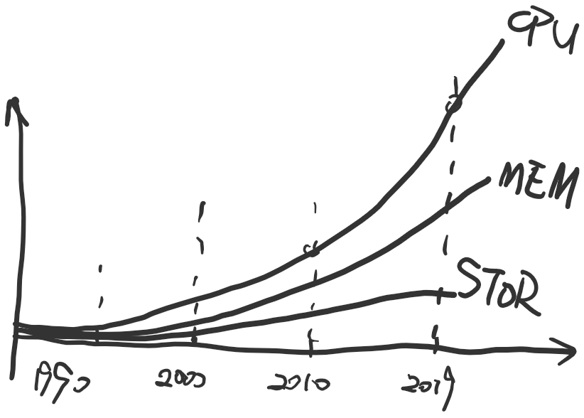

<<<<<<< HEAD
# 微软-仪电人工智能高阶人才培训学习心得之二：201课程-python导论、数学基础心得体会
=======
# 微软-仪电人工智能高阶人才培训(第二期）学习心得之二：python导论、数学基础心得体会
>>>>>>> f7fc280e14aaba0d0403c8f4b839477a9d691dc9
## 作者：杨大圣（上海仪电人工智能创新院有限公司）

近日来，深入学习python过程中，有几点体会，结合数学基础的学习一起总结出来，一共10个小tips，给AI小白们一点帮助，相关资料链接贴在了要点边上，直点或者在文后附上。

首先是工具的推荐，俗话说得好，“工欲善其事，必先利其器”，选好了工具就如同走了八千里，犹如神助攻。

#### 1.工具三剑客-Zeal 、Anaconda、Markdown

作为一名不是秃头就是走向秃头的程序猿，工作学习中除了从生理上科学护发，还要从根源上学会减轻可能使自己秃头的工作量~Bartuer老师课上推荐了三个AI学习中会使用到的工具软件：[Zeal](https://zealdocs.org/) 、[Anaconda](Home - Anaconda  https://www.anaconda.com/)、[Markdown](markdown_百度百科  https://baike.baidu.com/item/markdown/3245829?fr=aladdin) （全都是免费下载使用的，点击直达下载官网），其中注意选择和自己电脑适配的版本，新旧随意。当然，也有其他同类型的工具，在这里就不做推荐。

*三个必备工具* 

- **Zeal**比如要查询API文档的！就不要完全靠脑子记了，毕竟我们脑容量什么的，要留着做更有价值有意义的事情~每当碰到某个API想不起来的情况，还要打开网页去查询多麻烦(*╹▽╹*)，这时候请想起来Zeal-“**助力科研未来，打造创新体验**”，拥有一款如此好用的本地离线API文档大全，你还纠结什么呢~~~得益于Dash（mac端的用它←），Zeal的文档已经非常丰富，截止2019.6.17已经有194个API文档了，拉到官网最下面还可以看到支持的文档列表。

- 

  （这里必须友情补充一句:Zeal默认下载的文档是英文文档，可以锻炼英文文档的阅读能力，如果觉得英文不够友好可以进一步探索中文版本，有大佬已经给出），可以作为对于像我这种小白编程时的帮助文档使用，注意安装完成后要先下载各个语言的库才能使用，如有需要，这里贴出CSDN博客上的一个安装使用教程贴，配合服用更佳！内附官方地址:[点我即可](zeal工具的安装与使用（离线api文档浏览器） - 安善良民弱女子的博客 - CSDN博客 [https://blog.csdn.net/u011008029/article/details/65437537)。

- **Anaconda**是一个集合了用Python进行数据分析所需要的环境和库的傻瓜版安装包。jupyter lab、jupyter notebook、python各个版本和库里面都有。有了Anaconda再也不用求教大神解决编程环境问题了。各版本python轻松切换，装包导库一个apply完成~~

  

  某些小白开始慌了，下载页面全都是英文，也太不友好了吧~如果不送上一波福利，你们怎么会安安心心跟着学习呢，所以接下来对于anaconda的安装使用单人宝箱再次呈上：

  - 官网下载不了的话用这个[Anaconda | 镜像站使用帮助 | 清华大学开源软件镜像站 | Tsinghua Open Source Mirror  ]([https://mirrors.tuna.tsinghua.edu.cn/help/anaconda/](https://mirrors.tuna.tsinghua.edu.cn/help/anaconda/);
  - 有些老哥看起来开车很稳，实际上偷偷背地里搜“弯道超车指南”[Anaconda完全入门指南 - 简书]([https://www.jianshu.com/p/eaee1fadc1e9](https://www.jianshu.com/p/eaee1fadc1e9);
  - 买来家里电器就算配有说明书，我不相信大多数崽们会乖乖打开配合使用[Anaconda介绍、安装及使用教程 - 简书]([https://www.jianshu.com/p/62f155eb6ac5](https://www.jianshu.com/p/62f155eb6ac5).

- **Markdown**是现在自用的一个文字编辑格式，推荐使用现在用的软件是经大神推荐的Typora，原理是一样的，MD文件解决了排版问题，不管是博客还是微信公众号，使用MD格式都能非常方便地转化各种格式排版效果。并且解放程序员们，不断从键盘鼠标间切换的双手！୧(๑•̀◡•́๑)૭

  最为神奇的是什么？你现在看到的，帅气的排版布局，全部使用markdown文字编辑格式完成的。

  想象一下，一个完全理解你意思的助理接过你用完的工具，顺便递上你即将使用的工具，完全不输富文本的编辑样式，并且看起来就像完全知晓你心意一样。简直amazing~

  当然前提是，你打开的方式要对，按了`Ctrl+B`不能希望人家变成斜体，虽然很多朋友会跟我说，“markdown的学习成本太高啦！没有时间学习”之类的，然后就把我推荐的学习网站放到一边，等到看我噼里啪啦在键盘上`markdown`一顿秀操作以后又开始“柠檬树上柠檬果”装柠檬精。

  在这里诚心的告诉各位想要学习python包括其他编程语言或者开发技术的小伙伴，其实markdown语法并不难，一次学成终生受用，而且会根据你熟练程度的增加，越能感受到`大道至简`，从指尖向键盘传达再透过屏幕网线向外界传达的那种纯粹感，这也是我致力向许多科研大佬技术大牛们学习能够实现的境界。这里互勉，同样贴出工具帖和帮助使用说明：

  - [Typora官网]([https://www.typora.io/](https://www.typora.io/)；
  - [Typora中文版]([http://mydown.yesky.com/pcsoft/107253300.html](http://mydown.yesky.com/pcsoft/107253300.html)；
  - [Markdown编辑器Typora使用教程(1) - 简书]([https://www.jianshu.com/p/783d30c98f56](https://www.jianshu.com/p/783d30c98f56)；
  - 如果有的朋友要求较高，希望多些选择，可以再看看这几款，也是推荐较多的，我只是被老师安利用习惯了[3款Markdown编辑器 ]([https://yq.aliyun.com/articles/609905](https://yq.aliyun.com/articles/609905).

好了，工具的介绍就到这里，有任何需要或者疑问都欢迎留言进行交流，后面的更加重要，划水的小伙伴们打起精神来~

#### 2.推荐阅读-《沃兹传》

别笑！书治百病，这里Bartuer老师讲了一个关于乔布斯和合伙人沃兹改进电路板赚了5000美元但乔布斯只分给沃兹500美元的故事，并推荐了关于他合伙人的传记《沃兹传》。通过各种发布会的宣传，我们一向了解乔帮主多一些，在苹果神话的背后究竟隐藏着那些不为人知的秘诀和故事，相信许多人和我一样，心中还有太多未知。（*没有刻意给这本书打广告，如果坚持认为软广，请相关人员联系付我五毛广告费，/鞠躬，谢谢*）


下了课我回去下了一本，翻了翻发现沃兹传里的故事都鲜有知悉，甚至很少被人提及，但透过这本书可以让人感觉他才是苹果真正的灵魂。沃兹作为一个置身喧嚣之外的科技顽童，也跟作为商人的乔布斯很不一样，这大概是让沃兹能够看淡成功名利，沉下心专注于技术本身的原始驱动力。书里的沃兹有着相对简单容易实现的理想，比起乔布斯是个更真实的人。

而又让我同想起2018年热极一时的电影《头号玩家》里詹姆斯·哈利迪在虚拟游戏世界里创造了一个相对纯净的规则，回归了最初的追求。纪念博物馆里不断回放着他与合伙人的记忆，创作灵感，其实结合这本书来看也是这种形式，通过书让我们偏向于技术流的修行者们可以多了解一下科技大佬眼中可开拓的世界，目前豆瓣评分已达8.2.资源就不放了

[沃兹传 (豆瓣)]([https://book.douban.com/subject/21966356/](https://book.douban.com/subject/21966356/)，豆瓣贴一下，可以关注。

#### 3. 强大的库-Numpy、Pandas、Scipy、 Matplotlib库

天下武功，唯快不破。可我们知道Python为了兼容性和便利性牺牲了速度，那为什么还有这么多头铁的大佬们坚持用python，而python又仍然是大有可为的编程语言选择呢？

那就来了解一下，听说有包要比没包快~暗戳戳激动٩(๑>◡<๑)۶，每天早上我都吃两个包~此包非彼包，认真听课！/敲黑板

Numpy、Pandas、Scipy、Matplotlib库是python配备的库，有的用于行军打仗...抱歉口误，有的用于科学计算，有的用于整治data，还有的，只负责好看。你别笑，真的，我们一个一个来捋：

1. **Numpy**，之所以先介绍它，不是按字母顺序的，也不是柿子专挑软的捏。是因为它是科学计算的基础包，全名叫`Numerical Python`,一听就很高大上，它快速的数组处理能力，已经越过了python自带的数据结构，所以由它带着数据在算法之间传递，快准狠！让人放心，下图解释了用Numpy Array比Python List快很多的原因。


2. **Pandas**，下面我们在介绍一下老二哥，提供了大量数据结构和函数以供处理结构化数据，让它在数据分析时代打下了一片天下，不仅具有对上面numpy搞出来的高性能数组的计算功能，还有电子表格和关系型数据库处理数据的功能，还能提供复杂的索引功能，随便举个栗子来说都是洒洒水啦~比如：重塑、切片切块、聚合等...

所以我们引入Numpy和Pandas库后，改善Python做数学运算的速度慢的特点。加速冲啊！！！止步！停！

刹车一下，补充说明科学计算三老怪中还有一个非常重要的包没有说完：

3. **Scipy**，包的集合，专治各种标准域的问题，可以解决科学计算的问题，有很多现成的函数可以调用。
4. 对于**Matplotlib**，简单一句就是，可以画图。

为了便于记忆，换句话来说，Numpy和Pandas是用来**处理数据**的，Scipy里一大把封装好的函数针对**科学计算**问题，而需要**图形展示**要好看的时候就要Matplotlib了~

如果有跟我一样对Python不是太了解的小白，我真情实感的推荐你们看看这些，一人血书求务必点开看看，亏了你的话不要down他们：

- 推荐看**第二阶段Python进阶**和**第十阶段数据处理机器学习**，画重点啊！盆友们，还愣着干啥，记住啊，二十二十，两个阶段。[《自学Python做科学计算数据分析》](（Ref：[https://github.com/lijin-THU/notes-python）](https://github.com/lijin-THU/notes-python%EF%BC%89))

- 推荐看Numpy里的数组，以前我用C语言用的多，所以Python的数组用的不是很习惯，看了这个清楚很多。《Python meta-hacking》（Ref:https://jakevdp.github.io/blog/2014/05/09/why-python-is-slow/）

好了，包的故事我们就介绍到这里，也分享了python进行数学运算时的实际内部过程，这也是Python慢的主要原因。

但是要想学好python用在我们机器学习人工智能大领域中，光是熟练这些包的使用，也就是个拎包的，很难有长久发展。你记住了几个影视剧里拎包人物的脸？！

反思自己是不是要做AI大咖，成长之路要踩稳，还是跟着好好补一补数学基础知识的课吧~下面介绍一下矩阵Matrix，这可是重量级的，认真跟上哟！

#### 4.数学基础知识-矩阵运算

import...as则是将import A as B,给予A库一个B的别称，帮助记忆，举个栗子来说

`import AI学习者python小白人工智能未来大佬 as 读者你`，哪个好记？果断后者啊！所以你理解了**为什么需要学习AI了吧？**/一本正经脸

再来说一个，新手很容易混淆的东西，有的视频里的代码是`from...import`而有的则是`import`，两者有啥区别呢？其实在于`import`直接导入指定的库，而`from....import`则是从指定的库中导入指定的模块，举个栗子你就懂了：

你想追杨超越，普通操作可能是在线狙心，买了杨超越...的唱片和演出门票（*客观提醒，买人犯法，千刀万剐，千万别试*），土豪操作则是发现她是属于创造101组合出道的，连带着把101所有演出票都买了，当然也包括超越妹子的。操作都是一样的，谁蛇不蛇皮谁又敢说呢？

下面一段代码定天下，相信各位朋友，一眼乾坤，能看明白。看不明白多看看注释。

```python
##创建N维数矩阵
import numpy as np
m_empty = np.empty((3,4)) # 空矩阵（所有值都在0附近但不为0）
print(m_empty)

m_eye = np.eye(3) # 单位矩阵
print(m_eye)

m_zeros = np.zeros((2,3)) # 全零矩阵
print(m_zeros)

m_ones = np.ones((3,2)) # 全一矩阵
print(m_ones)
```

有一些奔着编程来的朋友说，少说一点数学知识，多点姿势教学，放放资源什么的，你们灵魂拷问一下自己，真的`Ctrl+D`收藏加星了以后就会回头看嘛？收藏夹里躺着的那些网页，网盘里落灰的那些资源，拜托你们清醒一点，跟着我一起梳理一下，几分钟时间，很快的。

#### 5.数学基础知识-傅里叶变换

Bartuer老师在说`Numpy Vs. Scipy`时提到了一个很有用的工具：就是“傅里叶变换”，还有种说法是“给一根杆子+一根杆子+一根杆子+......+一根杆子能画圆出任何函数“。不相信？有图有真相。

其实傅里叶级数的本质就是将一个周期的信号分解成无限多分开的（离散的）正弦波...~~不知道有没有人和我一样最初看的时候，觉得这个心电图走得很慢，(ಥ﹏ಥ)心里有点揪。我是废话不用在意我~~


而傅里叶变换能把是时序变成频率，变成频率就可以分开分析进行运算。

这是一篇很有意思的讲傅里叶变换的文章：https://www.cnblogs.com/h2zZhou/p/8405717.html

这几个的引用方法挂这了，有用自取。无用请多用。

`import numpy as np`

`import matplotlib.pyplot as plt`

`import seaborn`

#### 6.有意思的迭代：“上帝的指纹” MandelBrot 图形


一本正经说了这么多知识，连图都没放几张，根据人的文字恐惧症，我觉得务必要介绍些有意思的小姿势你们看看了，上面这张图Mandelbrot图-点集均出自公式:`Zn+1=(Zn)^2+C`，对于非线性迭代公式`Zn+1=(Zn)^2+C`，所有使得无限迭代后的结果能保持有限数值的复数C的集合，构成`Mandelbrot`（曼德勃罗）集，是人类有史以来做出的**最奇异最瑰丽的**几何图形，被称为“上帝的指纹”、“魔鬼聚合物”，所以，别说什么看不懂，有点怪异，夸好看就行啦，和我一起点个赞。


这个集是我在研究matplotlib的操作时看到的，非线性迭代十分有趣，不管把图案放大多少倍，仍然有更加复杂的局部，图案结构变幻无穷，既与整体不同又有某种神似，下面贴出来代码，以供你们研究。

`用matplotlib画一个Mandelbrot图形`

```python
import numpy as np
import matplotlib.pyplot as plt
def mandelbrot( h,w, maxit=20 ):
    """Returns an image of the Mandelbrot fractal of size (h,w)."""
    y,x = np.ogrid[ -1.4:1.4:h*1j, -2:0.8:w*1j ]
    c = x+y*1j
    z = c
    divtime = maxit + np.zeros(z.shape, dtype=int)

    for i in range(maxit):
        z = z**2 + c
        diverge = z*np.conj(z) > 2**2            # who is diverging
        div_now = diverge & (divtime==maxit)     # who is diverging now
        divtime[div_now] = i                     # note when
        z[diverge] = 2                           # avoid diverging too much

    return divtime
plt.imshow(mandelbrot(400,400))
plt.show()
```

------

上面确实是分割线，下面接着介绍：

#### 7.深度学习-摩尔定律-C10K

> 摩尔定律指每一美元所能买到的电脑性能，将每隔18-24个月翻一倍以上。这一定律揭示了信息技术进步的速度。PC的算力一直符合**摩尔定律呈指数级增长**。计算机很聪明：耳聪目明（计算能力）+过目不忘（记忆能力）。

Dan Kegel提出*C10K是个分水岭*

C10K问题的出现是随着互联网的普及，应用的用户群体几何倍增长，此时服务器性能问题C10K就出现了。最初的服务器是基于进程/线程模型。新到来一个TCP连接，就需要分配一个进程。假如有C10K，就需要创建1W个进程，可想而知单机是无法承受的。那么如何突破单机性能是高性能网络编程必须要面对的问题，进而这些局限和问题就统称为**C10K问题**。



神经网络以及NLP的理论模型上世纪40年代就有了，但发现以来一直不温不火，直到最近计算机的算力够强大、数据也够多了，NeuralNetwork 的前提条件都满足了才可以爆发了。了解了这些，知道一直在发展中的神经网络和机器学习其实不是什么新奇的知识，就更有必要掌握他们，以防有一天真的成为你的软肋。

这里 推荐小白看两篇关于**神经网络、机器学习**的解读。

- Ref：《神经网络深入浅出》https://www.cnblogs.com/subconscious/p/5058741.html
- Ref：《从机器学习谈起》https://www.cnblogs.com/subconscious/p/4107357.html

#### 8.人工智能-思维向量

Bartuer老师说向量是个很好的思维工具，一个思维向量就是一个想法的向量化形式，用以表示该想法与其他想法之间的关联。

思维向量网络的训练目标是**生成一个想法的上下文**。就像词汇由语法相连接一样，不同想法之间是由思维链条、逻辑路径连接起来的。

因此，让一种算法学习如何表示任意想法与其他想法之间关联的训练过程可以称为**人工常识构建**。神经网络可以依据一个给定的想法预测紧接着有可能会出现的想法，就像循环神经网络预测字符和词语一样。会话即搜索。

我搜集了一下以下是几种目前用于**思维向量化**的方法：

Doc2vec：(Ref：https://deeplearning4j.org/doc2vec.html)，段落向量和语句向量基本上同一个意思。它不一定会考虑词的顺序，一般用于在有标签的词的组合之间建立关联（比如用于情感分析）

Seq2seq：(Ref:https://arxiv.org/pdf/1409.3215.pdf)双语翻译

Skip-thought向量(Ref:https://arxiv.org/abs/1506.06726)

#### 9.推荐阅读：SMARTEREVERYDAY


干这一行，除了刷微博看看明星生活，也要多追点真正技术博客，这里给大家介绍一个数学怪咖，前NASA的员工，现在是YouTube网红写的科普博客，也经常发一些Vlog将一些难懂的知识生动的演示给我们看。

很多用德语写，数学已经超越了语言，相信看懂并不难，如果真的难看不懂恕我骗你。这里他就用Mathematica 画的曲线一步步迭代去接近、拟合，非常有意思。[点我即看]([http://www.smartereveryday.com](http://www.smartereveryday.com)。

------

#### 10.回顾数学知识-对数、指数

`f（x）=e^x `

该函数的神奇之处：**斜率等于截距以至于求导等于本身**

`10^100`大数是这个世界的极限，名字叫做**googol**，是美国数学家**Edwards Kasner**定义的，他九岁外甥**Milton Sirotta**给起的名字。所以说，我们，要想成名，就要有一个数学家舅舅。后来变成Google最初的名称。

古戈尔数学没有什么特别的意义或应用。Kasner创造这个词是为了勾画出一个不可想象的大数和无穷大之间的区别，它唯一的用途是有时被用于数学教学上。

围棋的可能性有没有10^100大？

19*19=361个交叉点 361！> 100! > 10^100

故事1：国际象棋放米

> 在古代有个国王,有钱又有权使他有点膨胀。某天，一位老人带着发明的国际象棋来朝见。国王一看确实不错，就对老人说：“你给了我无穷的乐趣。为了奖赏你，可以从我这儿得到你所要的任何东西”。
>
> 老人的要求是：请在棋盘上的第一个格子上放1粒麦子，第二个格子上放2粒，第三个格子上放4粒，第四个格子上放8粒……即每一个次序在后的格子中放的麦粒都必须是前一个格子麦粒数目的倍数，直到最后一个格子放满为止。国王一看，这么简单，哈哈哈我富可敌国怕这个。然而，国王最终发现，按照与老人的约定，全库房麦子竟然连棋盘一小半格子数目都不够。

故事2：体育场下雨

> 非线性而是指数型，97%的雨都是在最后的一分钟下的。

好了，十个tips介绍完了，我们这期的心得体会就到这里，请继续关注我们，跟着学习AI~


# 关于微软-仪电人工智能创新院

微软-仪电人工智能创新院将由微软和仪电共同运营和管理，致力于为微软和仪电在人工智能方面的联合研究活动和项目提供支持，为当地企业提供基于微软技术的人工智能研发平台服务和培训服务。

# 关于人工智能高阶人才培训班

微软和仪电共同打造的人工智能高阶人才培训班由创新院运营，第一期历时三个月，授课老师包括来自微软和仪电的多位专家，内容涵盖人工智能导论、数学基础、深度学习、应用实例等课程，以及关于强化学习、自然语言处理、计算机视觉等热门方向的专题研讨会，希望帮助学员掌握人工智能的理论与实践，培养具备前瞻视野和实践能力的创新型人才。

更多信息，请关注微信公众号

