# 微软-仪电人工智能高阶人才培训学习心得之一：201课程-Python实用库

## Numpy

### vectorization： 加快运算速度

```python
import numpy as np
import timeit

def t_list():
    l = [1 for i in range(4*100000)]
    [0 for i in l]

def t_float32():
    np.ones(4*100000, np.float32).view(np.float32)[...] = 0

def t_int8():
    np.ones(4*100000, np.int8).view(np.int8)[...] = 0

print(timeit.timeit('t_list()', setup='from __main__ import t_list', number=1))
print(timeit.timeit('t_float32()', setup='from __main__ import t_float32', number=1))
print(timeit.timeit('t_int8()', setup='from __main__ import t_int8', number=1))
```

    0.03129678196273744
    0.000512473052367568
    0.00016390997916460037

* 一个NumPy数组基本上是由元数据（维数、形状、数据类型等）和实际数据构成。数据存储在一个均匀连续的内存块中，该内存在系统内存（随机存取存储器，或RAM）的一个特定地址处，被称为数据缓冲区。这是和list等纯Python结构的主要区别，list的元素在系统内存中是分散存储的。这是使NumPy数组如此高效的决定性因素。
  
   为什么这会如此重要？主要原因是：
  
  1. 低级语言比如C，可以很高效的实现数组计算（NumPy的很大一部分实际上是用C编写）。例如，知道了内存块地址和数据类型，数组计算只是简单遍历其中所有的元素。但在Python中使用list实现，会有很大的开销。
  
  2. 内存访问模式中的空间位置访问会产生显著地性能提高，尤其要感谢CPU缓存。事实上，缓存将字节块从RAM加载到CPU寄存器。然后相邻元素就能高效地被加载了（顺序位置，或引用位置）。
  
  3. 数据元素连续地存储在内存中，所以NumPy可以利用现代CPU的矢量化指令，像英特尔的SSE和AVX，AMD的XOP等。例如，为了作为CPU指令实现的矢量化算术计算，可以加载在128,256或512位寄存器中的多个连续的浮点数。
     
     此外，说一下这样一个事实：NumPy可以通过Intel Math Kernel Library (MKL)与高度优化的线性代数库相连，比如BLAS和LAPACK。NumPy中一些特定的矩阵计算也可能是多线程，充分利用了现代多核处理器的优势。
     
     总之，将数据存储在一个连续的内存块中，根据内存访问模式，CPU缓存和矢量化指令，可以确保以最佳方式使用现代CPU的体系结构。

### Numpy 使用技巧

- 视图、浅拷贝、深拷贝

```python
a = np.zeros(1000)
c = a.view()
print(a is c)
print(c.base is a)
print(a[0])
c[0] = 1
print(a[0])
```

    False
    True
    0.0
    1.0

```python
a = np.zeros(1000)
c = a
print(a is c)
print(c.base is a)
print((a==c).all())
c[0] = 1
print(a[0])
print(c[0])
```

    True
    False
    True
    1.0
    1.0

```python
a = np.zeros(1000)
c = a.copy()
print(a is c)
print(c.base is a)
print((a==c).all())
c[0] = 1
print(a[0])
print(c[0])
```

    False
    False
    True
    0.0
    1.0

* 就地操作与拷贝

```python
def func1():
    a = np.ones((10000,10000))
    a*=2

def func2():
    a = np.ones((10000,10000))
    a = a*2

print(timeit.timeit('func1()', setup='from __main__ import func1', number=10))
print(timeit.timeit('func2()', setup='from __main__ import func2', number=10))
```

    3.7502966469619423
    6.378192031988874

* numpy广播机制

```python
a = np.array([1.0,2.0,3.0])
b = 2.0
a * b
```

    array([2., 4., 6.])

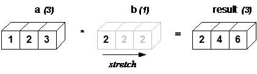

```python
a = np.array([[ 0.0, 0.0, 0.0],[10.0,10.0,10.0],[20.0,20.0,20.0],[30.0,30.0,30.0]])
b = np.array([1.0,2.0,3.0])
a + b
```

    array([[ 1.,  2.,  3.],
           [11., 12., 13.],
           [21., 22., 23.],
           [31., 32., 33.]])

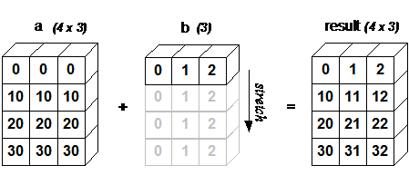

## Matplot

```python
import matplotlib.pyplot as plt  
year = [1950, 1970, 1990, 2010]      # 世界人口数据
pop = [2.519, 3.692, 5.263, 6.972] 
plt.plot(year, pop)
plt.xlabel("year")                # 不能使用Unicode, "年"
plt.ylabel("population")          # 坐标轴标注
plt.title("world population")     # 标题
plt.show()
```

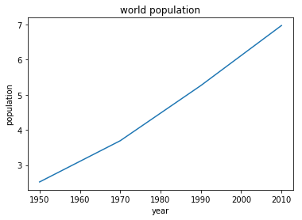

### matplot 显示中文

* 中文乱码原因： 缺少中文字体
* 解决方法：下载中文字体，修改matplot配置文件
1. 查看matplotlib的配置文件地址

```python
import matplotlib
matplotlib.matplotlib_fname() #将会获得matplotlib包所在文件夹
```

    '/home/inesa/liuge/water/watervenv/lib/python3.5/site-packages/matplotlib/mpl-data/matplotlibrc'

2. 下载微软雅黑字体：
   
    https://github.com/chenqing/ng-mini/blob/master/font/msyh.ttf
   
   ```python
   放入home/inesa/liuge/water/watervenv/lib/python3.5/site-packages/matplotlib/mpl-data/fonts/ttf中
   ```

3. 修改matplotlib配置文件：
   
   ```python
   vim /home/inesa/liuge/water/watervenv/lib/python3.5/site-packages/matplotlib/mpl-data/matplotlibrc
   ```

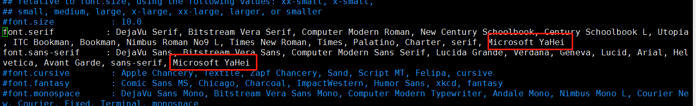

4 画图时配置字体

```python
import matplotlib.pyplot as plt
plt.rcParams['font.sans-serif']=['Microsoft YaHei'] #用来正常显示中文标签

year = [1950, 1970, 1990, 2010]      # 世界人口数据
pop = [2.519, 3.692, 5.263, 6.972] 
plt.plot(year, pop)
plt.xlabel("年")                # 不能使用Unicode, "年"
plt.ylabel("人口")          # 坐标轴标注
plt.title("world population")     # 标题
plt.show()
```

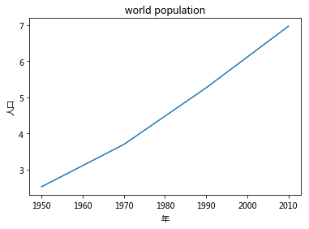

## Pandas

### 基本操作

```python
import ssl
ssl._create_default_https_context = ssl._create_unverified_context

import pandas as pd

electricity_consuming = pd.read_csv('https://www.cia.gov/library/publications/the-world-factbook/rankorder/rawdata_2233.txt', 
                                    delimiter='\s{2,}', engine='python', header=None,
                                    names=['erank', 'country', 'etotal'], thousands=',')
```

```python
electricity_consuming.head()
#electricity_consuming.tail()
```

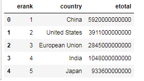

    electricity_consuming.describe()

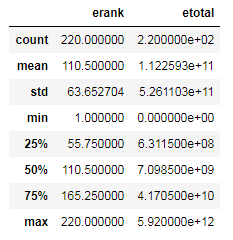

```python
electricity_consuming.columns
```

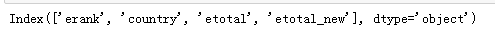

```python
electricity_consuming.dtypes
```

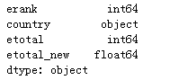

### apply 函数

```python
electricity_consuming['etotal_new'] = electricity_consuming.etotal.apply(lambda x: x/10000)
electricity_consuming.head()
```

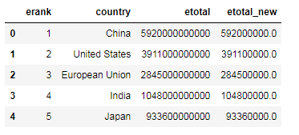

### groupby

```python
electricity_consuming.groupby('country').sum().head(5)
```

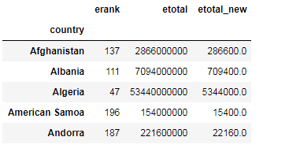

# 关于培训

微软和仪电共同打造的微人工智能高阶人才培训第一期培训班由创新院运营，历时三个月，授课老师包括来自微软和上海仪电的多位专家，内容涵盖人工智能导论、数学基础、深度学习、应用实例等课程，以及关于强化学习、自然语言处理、计算机视觉等热门方向的专题研讨会，希望帮助学员掌握人工智能的理论与实践，培养具备前瞻视野和实践能力的创新型人才。

更多信息，请关注微信公众号

