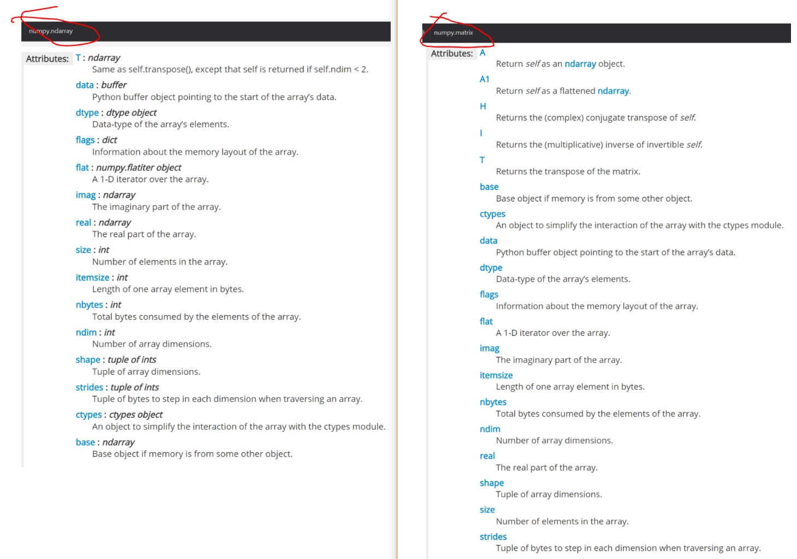

# Lesson 3 心得体会：线性代数和概率统计


这个周末是我们人工智能培训班的第三次基础课程，也是最后一次基础课程，这次课程结束以后，我们的基础知识学习就要结束了。在这次的课程中，Barture老师带着我们回顾了一下曾经在大学学习过的线性代数和概率统计的基础知识。仿佛回到了当初的大学课堂，可是学习心态已经全然不同了。除此以外，我们还有一个特别的大作业----生命游戏。这个大作业也使我收获良多。

我本次的心得体会也主要是包括这三方面的内容：线性代数，概率统计和生命游戏。

## 线性代数

线性代数这部分barture老师主要讲解了向量和矩阵这两个基本的数学概念，以及相关的向量计算和矩阵计算。这些纯数学的内容都是大学曾经学习过的内容，看到了就全部回忆起来了，所以在课前我对这节课其实没什么期待值，但是Barture老师的讲解却让这节课鲜活起来了。

### 向量和矩阵在物理世界的含义

大学的时候学习向量和矩阵只知道它们是一种数学中使用的计算形式，却没有仔细想过，我们为什么要发明出向量和矩阵这种计算形式，我们为什么要计算向量的标量，计算矩阵的乘积，它们在物理世界里到底有什么实际的含义?今天这节课带我重新认识了线性代数这个学科。

### 向量

我们把向量想象成一个几何空间里的带方向有长度的箭头，长度代表它的大小，角度代表它的方向。不同的向量具有不同的大小和方向。

- 我们为什么要计算向量对应的标量？因为标量可以标识该向量的大小。
- 向量的点积可以标识两个向量在物理世界的相关性。它表示一个向量在另一个向量上的投影。从内积数值上我们可以看出两个向量的在方向上的接近程度。当内积值为正值时，两个向量大致指向相同的方向（方向夹角小于90度）；当内积值为负值时，两个向量大致指向相反的方向（方向角大于90度）；当内积值为0时，两个向量互相垂直.
- 向量a 和向量b的外积生成了一个新的向量，它垂直于a 和 b展成的平面。

### 矩阵

矩阵是有着明显的现实意义的，在现实世界中，任何有二维或者二维以上数据维度的物体或者运动都可以用矩阵表示。

在几何空间中，向量刻画对象，矩阵刻画对象的运动，用矩阵与向量的乘法施加运动，得到运动后的对象。所以矩阵的本质是运动的描述。 就类似在一个多元方程组求解的过程，我们定义了运动的轨迹（矩阵），知道了运动的结果（变换后的向量），求解最初的向量。

所以矩阵的乘法就是在一种运动的基础上施加了另一种运动，其本质还是一种运动。

### 线性代数计算在python中的实现

numpy中自带了很多函数可以用来做向量和矩阵的运算，几乎提供了所有的矩阵和向量运算方法。几个常用的举例如下：

- solve 解方程组
- norm 求标量
- @ 求积
- inv 求逆
- eig 求解特征向量和特征值

### 一个小的知识点，np.array 和np.matrix的区别

```
import numpy as np

#我们首先分别定义两个矩阵

A = np.array([[1,2],[3,4]])

B = np.matrix([[1,2],[3,4]])

#求逆,inv都没问题

print(np.linalg.inv(A))

print(np.linalg.inv(B))

#再来个求逆,发现A.I是不支持的，而B.I就没有问题

#print(A.I)

print(B.I)
```

### 为什么呢？

直观看起来显然是因为np.matrix()的返回值.I这个属性，而np.array()的返回值却没有，我们来对比一下它们的返回值 np.array()的返回值是一个ndarray对象 np.matrix()的返回值是一个matrix对象

我们来对比一下matrix和ndarray这两个对象，可以发现他们的属性确实有很多相同和不同的地方



再看下它们各自的介绍：

- ndarray: An array object represents a multidimensional, homogeneous array of fixed-size items. An associated data-type object describes the format of each element in the array (its byte-order, how many bytes it occupies in memory, whether it is an integer, a floating point number, or something else, etc.) Arrays should be constructed using array, zeros or empty (refer to the See Also section below). The parameters given here refer to a low-level method (ndarray(…)) for instantiating an array.
- matrix: It is no longer recommended to use this class, even for linear algebra. Instead use regular arrays. The class may be removed in the future. Returns a matrix from an array-like object, or from a string of data. A matrix is a specialized 2-D array that retains its 2-D nature through operations. It has certain special operators, such as * (matrix multiplication) and ** (matrix power).

**可以发现matrix是一开始设计用来表示2维矩阵的，目前这个class已经不被推荐使用了，有可能会在后期删除它。所以还是万事都用ndarray吧。所以.I这个用法能忘还是早点忘了好。**

### 概率统计

这一部分的数据统计分析主要是利用pandas模块来自动对数据的特征进行提取,做一些简单的统计和分析，除此以外老师还给了一些启发性的小题目供我们思考。

### pandas的统计应用

利用pandas可以把原始的样本数据定义成为一个DataFrame，而Dataframe类提供了很多方法来计算出样本的一些特点，便于获得统计结果，记录一下用过的方法：

- describe() 其实这一个方法很多时候都全部够用了，哈哈哈
- dtypes
- plot() 感觉这个方法很赞，直接用数据画图
- head()
- groupby
- crosstable()
- pivot_table
- apply()
- count()

除此以外，这部分课程我印象最深刻的是一个小学入学考试的题目：

**把13颗糖分给3个小朋友，有多少种分法？**

我一开始看到这个题目，就在想可能有的小朋友一个也没拿到，有的只拿了一个，有的有若干个，好复杂，我要分情况考虑再加起来。正在我奋笔疾书各个加法乘法的时候，老师公布了一个半分钟出答案的方法：

我一开始看到这个题目，就在想可能有的小朋友一个也没拿到，有的只拿了一个，有的有若干个，好复杂，我要分情况考虑再加起来。正在我奋笔疾书各个加法乘法的时候，老师公布了一个半分钟出答案的方法：
$$
\begin{equation} C^{2}_{15} \end{equation}
$$
大概意思是说想象这里有13颗糖，每两颗糖中间都有个空格，加上左右两头，一共有15个空格。这个时候，你想把这13颗糖分成3堆，你就需要拿两个棍子，任意插在这15个空格里面，即可完成这次分配。所以才是这样的答案。

### 深思

我突然想起来这样的方法是我在中学时期用过的方法，然而，时至今日，我的中学知识已经被研究生毕业的我忘记，然后被小学生吊打了。

然后我又想我为什么会把这样的方法遗忘？在概率统计学科中，这么多年过去了，我还记得条件概率，全概率公式，我还记得随机事件，独立事件等一些同样都没有用过的一些知识，为什么这样一种算法被我遗忘了？可能是因为这个算法是与我的思维惯性相悖的。当我拿到这个问题的时候，我的第一反应就把这个问题复杂化了，我在想到底具体该怎么分，有好多种情况，我陷在了一个复杂化的思维惯性里面，没有跳出来看到这个问题的真正面目。

这让我想起了《三体》世界中，人类穷尽所有想象也不会想到太阳系会被如何毁灭，宇宙的高级文明向太阳系发送了一个“小纸条”----二向箔。三维空间由长宽高三个维度组成，而二向箔与三维宇宙接触的瞬间，会使空间中的一个维度无限蜷缩，从而迫使三维宇宙及其中的所有物质向二维宇宙坍塌，并在二维空间中“融化”为只存在长和宽而被剥夺了高度概念的绝对平面。这就是传说中的降维打击。

#### 当我们的思考维度不对的时候，再多的努力也往往是低效甚至无效的。所以当你陷入死胡同的时候，不妨抽身出来，换个维度想想看。


## 生命游戏

这次的课程有一个大作业，就是著名的康威生命游戏的python实现。

- [游戏规则English version long](http://bazhou.blob.core.windows.net/learning/mpp/game_of_life_en.pdf)
- [游戏规则汉语版本（短）](http://bazhou.blob.core.windows.net/learning/mpp/game_of_life_cn.pdf)
- 用Python实现游戏规则
  - 在1000x1000共一百万个单元里模拟
  - 边界为0
  - 不需要画图，只需要完成进化矩阵的运算即可
- 尽量短的代码
- 尽量高效


#### 自己的尝试

一开始看到这个题目的时候，我尝试不看启发解，不看任何资料，自己思考一下如何解决这个问题。我没有写代码，我梳理了这个游戏的逻辑，发现核心的计算是两个步骤：

- 计算每个单元的邻居数
- 应用规则：根据邻居数判定下一步的数值为0或者1

我首先写了一个非常ugly的for循环来计算每个单元的邻居数，写完for循环以后，我发现我做了大量的循环计算，觉得问题应该不需要这么复杂，但是我一筹莫展，没什么优化的方向，于是我看了老师的启发解。启发解如下：

```
import random as random

import timeit

# 产生一个百万0，1数组，0代表空（死），1代表生

Z = [[random.choice([0,1]) for x in range(1000)] for y in range(1000)]

# 计算八个邻居数目

def neighbours(Z):

    s = len(Z), len(Z[0])

    # 一个初始全为0的邻居数量矩阵

    N = [[0,]*(s[0]) for i in range(s[1])]

    for x in range(1, s[0]-1):                                  # 注意边界

       for y in range(1, s[1]-1):

           N[x][y] = (Z[x-1][y-1] + Z[x][y-1] + Z[x+1][y-1] +  # 邻居数量=周围8个格子生命统计

                       Z[x-1][y]               + Z[x+1][y]   +

                      Z[x-1][y+1] + Z[x][y+1] + Z[x+1][y+1])

    return N

# 根据周围邻居总数应用规则

def evolve(Z):

    s = len(Z), len(Z[0])

    N = neighbours(Z)

    for x in range(1, s[0]-1):

        for y in range(1, s[1]-1):

            if Z[x][y] == 1 and (N[x][y] < 2 or N[x][y] > 3): # 灭亡规则

                Z[x][y] = 0

            elif Z[x][y] == 0 and N[x][y] == 3:               # 繁衍规则

                Z[x][y] = 1

    return Z

print(timeit.timeit(lambda: evolve(Z), number=3))         # 对百万人口作三代进化，统计运算效率
```


#### 对启发解的学习和优化尝试

首先，这虽然是一个启发解，但是代码比我的代码风格简洁很多，我的计算邻居数的for循环写的还是比较凌乱的，以后写代码还是要注意一下代码风格的问题。

其次，我一开始就没想过要用list，既然学了numpy，一开始就选用了矩阵这种数据结构。

然后，我发现计算邻居数这个计算过程和我的算法也不一样。我在考虑计算某一个单元的邻居数时，我考虑把一个单元所在的上下左右邻居一起组成一个3*3的小矩阵，调用一个sum()函数来求和，然后减去单元本身自己的值，作为最终的邻居数。类似下面这样的:

```
import random as random

import timeit

import numpy as np

# 产生一个百万0，1数组，0代表空（死），1代表生

#Z = [[random.choice([0,1]) for x in range(1000)] for y in range(1000)]

Z = np.random.randint(2, size=(1000,1000),dtype=np.int8)

# 计算八个邻居数目

#启发解

def neighbours(Z):

    s = len(Z), len(Z[0])

    # 一个初始全为0的邻居数量矩阵

    N = np.zeros(Z.shape, dtype=np.int8)

    for x in range(1, s[0]-1):                                  # 注意边界

        for y in range(1, s[1]-1):

           N[x][y] = (Z[x-1][y-1] + Z[x][y-1] + Z[x+1][y-1] +  # 邻居数量=周围8个格子生命统计

                       Z[x-1][y]               + Z[x+1][y]   +

                       Z[x-1][y+1] + Z[x][y+1] + Z[x+1][y+1])

   return N

#我的解

def my_neighbours(Z):

    s = len(Z), len(Z[0])

  N = np.zeros(Z.shape, dtype=np.int8)

   for x in range(1, s[0]-1):

        for y in range(1, s[1]-1):

           N[x][y] = Z[x-1:x+2,y-1:y+2].sum()-Z[x][y]

    return N
    
print(timeit.timeit(lambda: neighbours(Z), number=3))

print(timeit.timeit(lambda: my_neighbours(Z), number=3))
```

我发现我这样写比启发解更慢了，而且在启发解原有的算法基础上，把list换为矩阵以后，启发解的耗时也增加了。看来for循环和list还是更配一些。对于矩阵来说，for循环这种操作实在是太慢了。

#### 第二次优化尝试

在老师上课讲解这个问题的过程中，我突然意识到启发解是有两个for循环的，我在想计算的计数器是否会耗费时间呢，如果我把两个for循环合并在一起是否能够减少耗时？ 我尝试了一下把启发解的两个for循环合并写在一起，发现耗时竟然增加了，真是令人意外。

我在课堂上向Barture老师询问了这个问题，Barture老师实验了一下，也得了令人意外的答案，不过他还是给出了一个相对合理的解释：

- 原有的两个for循环，是在一段时间内集中的读取内存中的Z，去对N进行写入，在另一段时间内集中的对N读取，去写入Z
- 如果合并两个for循环，则是在一段时间内，对N和Z同时读取和写入，这是否会减慢内存的读写速率？

#### 最终的最优解

```
import timeit

import numpy as np

Znp = np.random.randint(2, size=(1000,1000), dtype=np.int8)

def no_loop_int_view_reduce_rule_no_mask(Z):

    N = np.zeros(Z.shape, dtype=np.int8)

    N[1:-1,1:-1] += (Z[ :-2, :-2] + Z[ :-2,1:-1] + Z[ :-2,2:] +

                     Z[1:-1, :-2]                + Z[1:-1,2:] +

                     Z[2:  , :-2] + Z[2:  ,1:-1] + Z[2:  ,2:])

    Z[...] = 0

    Z[1:-1,1:-1][(((N == 2)[1:-1,1:-1])&(Z[1:-1,1:-1] == 1))|(N == 3)[1:-1,1:-1]] = 1
    
print(timeit.timeit(lambda: no_loop_int_view_reduce_rule_no_mask(Znp), number=3))
```

### 分析

最优解的优化步骤记录下来，给以后的自己一个方向：

1. dtype： 从默认的int32到int8还是有一个很大的提升的
2. 利用矩阵自己的特点去掉for循环，极大的降低了运算的复杂度，当然这本质上还是依赖于numpy对矩阵运算底层实现的性能优化
3. 尽可能的减少读写操作（针对赋值这一步）

#### 收获

在这个大作业的学习过程中，对numpy的矩阵计算能力和应用场景有了直观的认识，也学到了很多代码优化方面的知识，这些对于日后的学习和工作都是大有裨益的。非常感谢Barture老师精心准备了这个作业，并详尽的介绍了各种优化的可能，尽力的去启发我们思考。

## 总结

课程心得写到这里，发现自己完完整整的重新梳理了一下第三次课程的所学到的内容，这个梳理的过程自己也收获很多，所以写心得其实于自己而言也是很好的一件事情。多总结，多收获。

最后非常感谢Barture老师这一个多月的教导，Barture老师知识面之广令人欣羡，从Barture老师身上也学到了很多学习应有的态度和方法。也非常感谢我们的校长和助教团队，非常辛勤的为我们这个小班级作出的贡献！

再次感谢所有人！

# 关于微软-仪电人工智能创新院

微软-仪电人工智能创新院将由微软和仪电共同运营和管理，致力于为微软和仪电在人工智能方面的联合研究活动和项目提供支持，为当地企业提供基于微软技术的人工智能研发平台服务和培训服务。

# 关于培训

微软和仪电共同打造的微人工智能高阶人才培训第一期培训班由创新院运营，历时三个月，授课老师包括来自微软和上海仪电的多位专家，内容涵盖人工智能导论、数学基础、深度学习、应用实例等课程，以及关于强化学习、自然语言处理、计算机视觉等热门方向的专题研讨会，希望帮助学员掌握人工智能的理论与实践，培养具备前瞻视野和实践能力的创新型人才。

更多信息，请关注微信公众号

