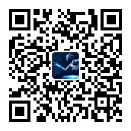

# 微软-仪电人工智能高阶人才培训学习心得之一：301课程-AI道德与伦理、深度学习(1)定制化
## 作者：吴肄哲（上海仪电人工智能创新院有限公司）

不知不觉中整个培训已经走过了三分之一的进程，完整的培训已经过了一个环节。我们的培训课程也来到了3开头的章节。对于前三分之一课程的数学础课程和python编程开发还是我比较熟悉的部分，接下来整个课程也进入了一个我完全不熟悉的领域，正式涉及到人工智能领域的知识。  
##### 1. AI道德与伦理
课程首先由郑老师讲解的AI道德与伦理，涉及到的内容以前经常在网络的讨论或者电视电影环节中看到听说过，但是都是以很娱乐的心态去看待的同时也是感觉很遥远未来的的事情，现在切身处地的再次讨论这些话题另有一番感受。  

  老师举的智能无人驾驶车辆在非常情况的判断处理问题，从业界的最新应用来说已经都在产品阶段，可能马上普通的市民也能使用上这些服务，但是底层除了技术意外需要人类给人工智能的指导和原则真的很需要我们仔细考虑一下。  

  课程的下一个内容是真实体验，播放了一段前一段时间广受好评的大导演斯皮尔伯格的《人工智能》。
  影片剧情发生在21世纪中期，由于气候变暖，冰川融化，地球上很多城市被淹没在汪洋之中，此时人类的科技已经达到了相当高的水平，人工智能机器人被发明出来服务人类。主角大卫是一个智能机器人，拥有和人类一样的外形，由于莫妮卡的孩子患重病终日在医院的治疗仪内，莫妮卡非常思念儿子，于是收养了大卫作为替代，大卫因为有了妈妈非常高兴，并且拥有了自己的机器人玩具泰迪熊，然而后来患病的儿子被治好，回家的儿子和大卫经常发生矛盾，莫妮卡的丈夫亨利不想再收养机器人大卫，莫妮卡虽然很舍不得大卫，但由于大卫是机器人，在丈夫的劝说下最终将大卫抛弃在森林里。  

  最万事通博士告诉大卫，蓝仙女在世界的尽头，雄狮落泪的地方曼哈顿，曼哈顿机器人禁区，是一个机器人去了就回不来的地方，但大卫还是决定毅然前行。驾驶飞行器经过重重困难，大卫、乔和泰迪熊最终到达曼哈顿。到达曼哈顿后，大卫发现了许多和自己一样的机器人，它不肯相信眼前看到的，大卫人为自己是独一无二的，妈妈只属于它自己，大卫驾驶飞船驶向海里决定结束自己，然而却在海底看到的蓝仙女，这时乔被人类飞船带走，大卫看着蓝仙女许愿把它变成人类，直到休眠。     

  随着时间的流逝，2000多年过去了，地球被冰覆盖，人类灭绝，外星飞船降落地球，外星人发现了冰下的大卫和它的泰迪熊，并将它们救起，读取了大卫的思想，看到了大卫不快乐的一生和它苦苦追寻的梦想。外星人告诉大卫你是独一无二的，我们很希望你能够快乐。      

  外星人告诉大卫可以将它的妈妈复活，必须需要她的残骸，并且复活后只能存在一天，晚上睡着后就会死亡，大卫认为它的妈妈是特别的，是不会死的。外星人成功复活了莫妮卡，大卫终于见到了她，和莫妮卡度过了愉快的一天，这一天大卫等了两千多年，渐渐的天黑了，莫妮卡睡着了，在大卫心里，莫妮卡仅仅是睡着而已，大卫也躺下闭上了眼睛睡着了，泰迪熊看到大卫睡着了也躺下下来，这是大卫一生中最快乐的一天。

人类不应该担心人工智能将把世界改变成什么样子，而是应该考虑应该把人工智能引向何方。
##### 2.深度学习定制化
本次课程第二部分宋老师给我讲解的深度学习部分，这也是我第一次接触到如何结合人工智能完成出一个可用的应用。首先我们是学习使用微软的认知服务来培训一个自己的人工智能模型来识别出一个图片中的熊的类型，首先让我惊讶的是微软目前的技术能力居然能在短短的时间内大约两三分钟左右使用十几张图片就能培训出一个完全可以投入到实际应用中的智能模型。     

课程的第二部分讲解了一个更复杂的应用，这一次使用了微软的另外一个非常先进的服务Language Understanding Intelligent Service (LUIS),大家平时接触最多的是现在的各种人工智能客服的基础核心技术都是使用了类似Luis服务。宋老师课堂上一步步带着我们使用微软认知服务的语音识别部分加上底层的Luis服务建立了一个模拟的智能家庭中的通过语音来控制灯的应用，即使对不是很熟悉的我们基本上也用不上半个小时就完成了这个应用       

课程的第三部分是在两个课程的基础上做一个延展，提供了更高级的功能，我们已经不仅仅可以识别图片中的熊的类别同时还能在图中把熊标志出来。
  
第二个延展的实验是不仅仅可以控制一个灯，而是可以管理控制更多的灯，同时还能基于灯所在位置譬如客厅、卧室，一次性管理位置所在的所有的灯。
  
###### 经过本次课程我首先看到了人工智能已经切切实实的能实现出来让人类更好生活的产品，让我坚信自己未来要进入的这个领域是能够提升人类生活的质量和服务于更多需要帮助的人群，另外更重要的是如何把我们正确的思想观、价值观带到人工智能的里面

# 关于培训
微软和仪电共同打造的微人工智能高阶人才培训第一期培训班由创新院运营，历时三个月，授课老师包括来自微软和上海仪电的多位专家，内容涵盖人工智能导论、数学基础、深度学习、应用实例等课程，以及关于强化学习、自然语言处理、计算机视觉等热门方向的专题研讨会，希望帮助学员掌握人工智能的理论与实践，培养具备前瞻视野和实践能力的创新型人才。  

更多信息，请关注微信公众号

