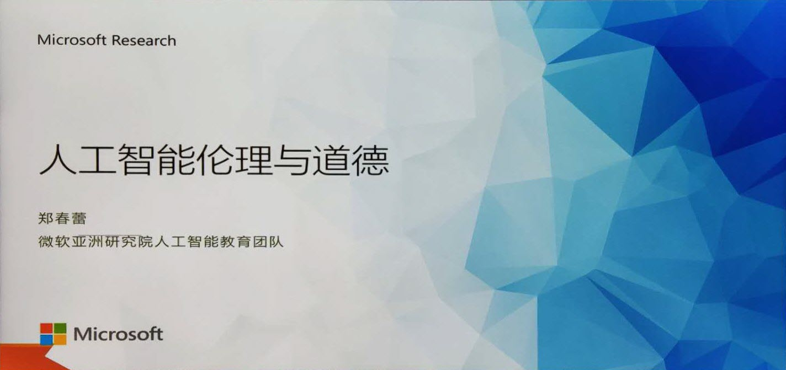
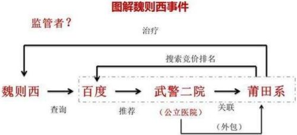
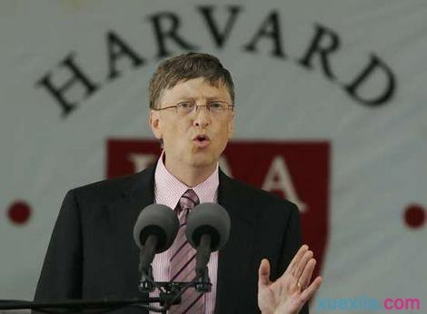
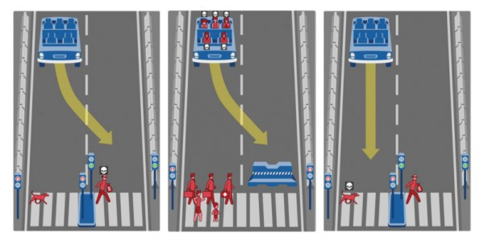
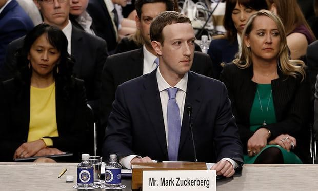
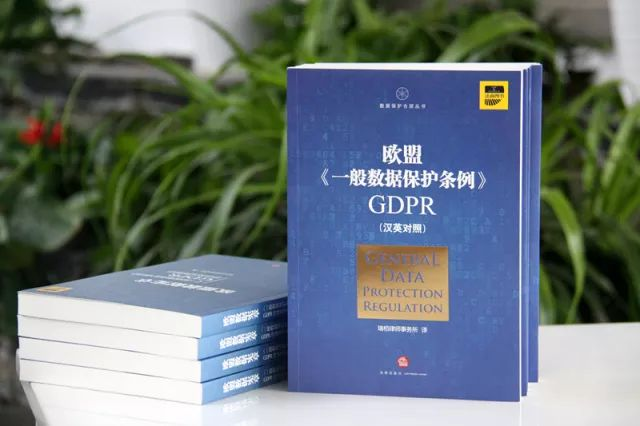

# 微软-仪电人工智能高阶人才培训学习心得之四：301课程-《人工智能伦理与道德》《微软认知服务》
## 作者：杨建民（上海仪电人工智能创新院有限公司）

自从5月24日参加人工智能高阶培训以来，洪小文院长给我们阐述了《人工智能导论》，周老师精彩的《Python语言导论》和《数学基础》，学员们渐进佳境。今天微软亚洲研究院人工智能教育团队郑老师给我们带来了《人工智能伦理与道德》和《微软认知服务》。

## 人工智能伦理与道德 

### 伦理与道德 
>什么是伦理道德-西方
>ethics、ethos、mores
>- 叔本华唯意志主义伦理：意志主义主张意志、情感、本能冲动高于理性，意志创造世界万物。
>- 詹姆斯实用主义伦理：知识与道德观念都是适应生活环境的“经验”;道德真理只是人的思维、行动方式中“方便”的方法,道德的本质是应付环境的工具;只应根据个人具体的境遇去解决道德问题;道德源于人的自然本性,是人的生理或心理的本能;道德选择的唯一根据是“个人今天的利益”;幸福只在于成功。
>- 海德格尔存在主义伦理：存在主义哲学从揭示人的本真的存在(生存)出发来揭示一切存在物的存在结构和意义，以及人与自然界、社会的关系。存在主义伦理学是存在主义哲学在伦理学上的表现。
>
>伦理道德的概念-中国古代
>- 三纲五常
>- 伦即人伦，理：条理与道理

**人际之间符合某种标准的行为准则**

### 案例：魏则西事件

>一个21岁的年轻人、西安电子科技大学大学计算机系学生魏则西因患有罕见的滑膜肉瘤晚期 ，他从百度上了解到 ，武警北京总队第二医院有一种号称与美国斯坦福大学合作的肿瘤生物免疫疗法，在对生的极度渴望下，借钱完成了治疗后，发现不仅没有效，反而发生了肺部转移 。最终，魏则西去世了。
>

**你认为人性最大的“恶”是什么？**

### 比尔盖茨哈佛演讲
>在这个新技能加快开展的年代，咱们怎样最终应对这种不平等，以及咱们怎样来处理这个问题。
>
>假如咱们能够找到这样一种办法，既能够帮到贫民，又可认为商人带来利润，为政治家带来选票，那么咱们就找到了一种削减国际性不平等的可持续的开展道路。这个任务是无限的。它不或许被彻底完结，可是任何自觉地处理这个问题的测验，都将会改动这个国际。
>

**格局有多大 舞台就有多大**

### 案例：影片《人工智能》
>《人工智能》是斯皮尔伯格的一部巨制，描绘了一个令人深思伦理道德场景：当人工智能有了情感，人类应该如何对待？”人可以让机器人对人付出百分百的爱，可是人对机器人的爱不应该负责任吗？“这部片子避开了赋予机器人智慧、情感的技术难题不谈，如果机器人拥有和人类相当的心智，那“他”可以被视作人吗？“他”在何种程度上能够被视为人呢？“他”能够拥有作为人的权利和义务吗？
>

**一生都在寻找爱的机器人**

### 人工智能带来的9个主要问题
>- unemployment（失业）
>- 不平等（我们如何分配机器创造的财富）
>- humanity（人际关系）（机器如何影响我们的行为和互动）人工智能机器人在模拟人类对话和人际关系方面变得越来越好
>- artificial stupidity
>- racist robots（算法歧视）
>- 安全：
>- Evil genies：
>- Singularity：那个人类不再是地球上最聪明的存在的时刻。
>- Robot rights：

**人工智能崛起引发担忧，我们应该如何应对？**

### 无人驾驶的伦理困境：先救谁？
>一个伦理困境：当车祸无法避免时应如何取舍，是优先保护马路上的儿童、还是宁愿撞人也要保护车内人员呢？
>
>- 美国一项调查显示，受访者普遍认为无人驾驶汽车不应为拯救一名路人而牺牲车内人员。但当问卷中被拯救的路人数量增多，愿意牺牲车内人员以拯救路人的受访者比例随之升高。
>- 当被拯救的路人数量增至１０人，受访者普遍赞同应优先拯救路人；但与此同时，这些受访者表示自己更加不愿意购买无人驾驶汽车。

**若方向盘在您手上，如何抉择？**

### AI时代的隐私保护：FACEBOOK数据泄密，五千万用户数据遭滥用
>事件始末（2018年） 
>- 3月中旬，《纽约时报》等媒体揭露称一家服务特朗普竞选团队的数据分析公司CambridgeAnalytica获得了Facebook数千万用户的数据，并进行违规滥用。
>- 3月19日，消息称Facebook已经聘请外部公司对相关数据公司进行调查。
>- 3月22日凌晨，Facebook创始人马克·扎克伯格发表声明，承认平台曾犯下的错误，随后相关国家和机构开启调查。
>- 4月5日，Facebook首席技术官博客文章称，Facebook上约有8700万用户受影响，随后剑桥分析驳斥称受影响用户不超3000万。
>- 4月6日，欧盟声称Facebook确认270万欧洲人的数据被不当共享。
>
>
>根据告密者克里斯托夫·维利的指控，CambridgeAnalytica在2016年美国总统大选前获得了5000万名Facebook用户的数据。这些数据最初由亚历山大·科根通过一款名为“thisis your digital life”的心理测试应用程序收集。通过这款应用，CambridgeAnalytica不仅从接受科根性格测试的用户处收集信息，还获得了他们好友的资料，涉及数千万用户的数据。能参与科根研究的Facebook用户必须拥有约185名好友，因此覆盖的Facebook用户总数达到5000万人

**马云曰：尊重数据，尊重安全，尊重隐私.....**
### GDPR:史上最严的个人数据保护条例
>欧盟的 《通用数据保护条例》（General Data Protection Regulation，GDPR）
>!
>
>- 《通用数据保护条例》使所有能直接或间接识别的种族、健康状况、政治倾向、性取向等敏感信息，在未经当事人授权的情况下，企业不得使用。该条例的适用范围包括任何为欧盟地区公民及住民提供服务的企业，只要存在收集、持有或处理欧盟国家公民及住民的数据，即便公司不在欧盟地区，也要受该条例的约束。违者最高将以 2000 万欧元或企业全球年营业额的 4% 作为罚金。
>- 《通用数据保护条例》是在欧盟法律对所有欧盟个人关于资料保护和隐私的规范，涉及到欧洲境外的个人资料出口。该条例主要目标为取回公民以及住民对个人资料的控制权，以及为国际商务而简化在欧盟内的统一规范。
>- 该法案取代了 1995 年的《数据保护指令》，在 2016 年 4 月 27 日通过，经过两年的缓冲期，2018 年 5 月 25 日开始强制执行。
>- Facebook、Twitter、苹果 等在内的一些线上服务开始更新隐私条款，并以推送通知、邮件等形式要求用户重新确认，很多都是受条例即将实施的影响。

**它对你意味着什么？**

### 人们在行动：世界各国AI伦理与道德的进步
>随着人工智能在人们生活中应用越来越广泛，也有越来越多的人对这些问题开始思考和制定规则。在过去的几年时间里，有大量的AI研究人员开启对AI伦理的思索：
>- 微软全球执行副总裁沈向洋在《计算未来》提出要设计出可信赖的人工智能，我们必须采取体现人类道德原则的解决方案，而且这些道德原则应深深植于重大和永恒的价值观。并提出了指导人工智能开发的六大原则，具体而言，人工智能系统应该公平、可靠与安全、隐私与保障、包容、透明和负责。
>- 2016年9月，Amazon、Facebook、Google、DeepMind、Microsoft 和 IBM等几家全球大公司共同成立了 Partnership on AI，来研究和制定人工智能技术的最佳实践，促进公众对人工智能的理解，并作为一个开放平台来讨论人工智能对人和社会的影响。
>- 2016年12月，IEEE首家发布了第一版《合乎伦理的设计：将人类福祉与人工智能和自主系统优先考虑的愿景》，由全球100多名人工智能、伦理学及相关领域的思想领袖和专家共同制定。
>- 2017年6月，ITU（国际电信联盟）举办了“AI for Good”的全球峰会。今年五月将在日内瓦再次举办同一主题的峰会。
>- 2017年11月，蒙特利尔大学举办“人工智能的社会责任发展”论坛，随后并发表了《人工智能负责任开发宣言》
>- 2017年，人类未来研究所发布的《阿西洛马人工智能原则》（共23条）。有1273名人工智能 /机器人研究人员和其他2541人签署并支持了这些原则。

**人工智能，以法律和伦理为界**

## 微软认知服务

###  微软认知服务
##### 广泛服务-认知
- 视觉
- 语言
- 语音
- 搜索
- 决策
##### 任何场景-定制化训练
- 定制化视觉
- 定制化语音
- 定制化语言
- 定制化搜索
- 定制化翻译
##### 任何位置
- 云
- 本地环境
- 移动设备
- 物联网

### 视觉认知服务-计算机视觉
- 物体识别
- OCR
- 手写体识别
- 搜索引擎
- 实时视频分析
- 生成缩略图
- 视频洞察
- 人脸识别
- 人脸（情感分析、是否化妆、是否戴眼镜）
- 人脸（面部识别、相识脸搜索、面部分组）
- 定制化视觉（上传数据、标记数据、评估模型、主动学习）
- 表单识别（发票、手写内容识别）

注意：设计产品不能百分百依赖AI，现阶段AI还达不到人类水平

### 语音认知服务
- 语音到文本
- 文本到语音
- 说话人识别（说话人验证、说话人匹配）
- 实时语音翻译
- 对话脚本（会议纪要）

### 语言认知服务
- 舆情分析
- 关键词
- 上下文
- 拼写检查

### 搜索认知服务-图像
- 文字->图像
- 网页搜索
- 实体搜索
- 新闻搜索
- 自定义搜索

### 决策认知服务-内容审查服务
- 图像审查
- 文字审查

### 微软AI实战教程-看图识熊
#### 主要知识点
- 了解定制化视觉服务
- 了解定制化图像识别服务的基本使用
- 体验数据准备过程
- 体验离线模型推理应用
- 开发实践

可参考：https://www.customvision.ai/
### 微软AI实战教程-智能家居
#### 智能家居典型场景
- 用户语音转文字
- 文字语言理解，识别用户意图
- 按用户意图控制灯
- 流程：自然输入->语音转文本（把灯打开、关灯）->自然语音理解（打开、关闭）->执行 

可参考：https://docs.microsoft.com/zh-cn/azure/cognitive-services/LUIS/

# 关于微软-仪电人工智能创新院
微软-仪电人工智能创新院将由微软和仪电共同运营和管理，致力于为微软和仪电在人工智能方面的联合研究活动和项目提供支持，为当地企业提供基于微软技术的人工智能研发平台服务和培训服务。

# 关于培训
微软和仪电共同打造的微人工智能高阶人才培训第一期培训班由创新院运营，历时三个月，授课老师包括来自微软和上海仪电的多位专家，内容涵盖人工智能导论、数学基础、深度学习、应用实例等课程，以及关于强化学习、自然语言处理、计算机视觉等热门方向的专题研讨会，希望帮助学员掌握人工智能的理论与实践，培养具备前瞻视野和实践能力的创新型人才。

更多信息，请关注微信公众号
