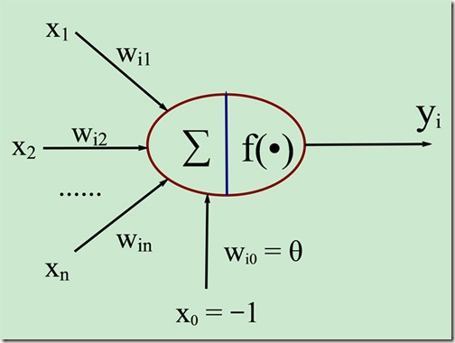
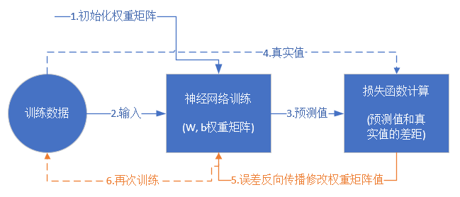

# 微软-仪电人工智能高阶人才培训学习心得之四：301课程-《深度学习》《神经网络》
## 作者：刘恒

经过了1个多月的学习，今天微软亚洲研究院秦婷婷老师正式带我们进入了神经网络的学习篇章。

## 神经网络 

### 什么是神经网络
>- 神经网络可以指向两种，一个是生物神经网络，一个是人工神经网络，我们要学习了解的肯定是后者。
>- 人工神经网络（Artificial Neural Networks，简写为ANNs）也简称为神经网络（NNs）或称作连接模型（Connection Model），它是一种模仿动物神经网络行为特征，进行分布式并行信息处理的算法数学模型。这种网络依靠系统的复杂程度，通过调整内部大量节点之间相互连接的关系，从而达到处理信息的目的。
>- 人工神经网络：是一种应用类似于大脑神经突触联接的结构进行信息处理的数学模型。在工程与学术界也常直接简称为“神经网络”或类神经网络。
>
> 神经元的数学/计算模型
>
>- 输入(数据)+权重(w)+偏移(b临界值)+激活函数
>
>重点
>- 一个神经元可以有多个输入
>- 一个神经元只能有一个输出，这个输出可以同时输入给多个神经元
>- 一个神经元的w的数量和输入的数量一致
>- 一个神经元只有一个b
>- w和b有人为的初始值，在训练过程中被不断修改
>- 激活函数不是必须有的，亦即A可以等于Z
>- 一层神经网络中的所有神经元的激活函数必须一致

### 训练流程
>

>神经网络训练的最基本的思想就是：先“蒙”一个结果，我们叫预测结果a，看看这个预测结果和事先标记好的训练集中的真实结果y之间的差距，然后调整策略，再试一次，这一次就不是“蒙”了，而是有依据地向正确的方向靠近。如此反复多次，一直到预测结果和真实结果之间相差无几，亦即|a-y|->0，就结束训练。

>- “蒙”，但不是瞎蒙(随机初始化权重矩阵，可以根据高斯分布或者正态分布等来初始化)
>- 拿一个或一批数据作为输入，带入权重矩阵中计算，再通过激活函数传入下一层，最终得到预测值。
>- 计算损失(均方差公式)
>- 根据一些神奇的数学公式（反向微分）
>- 不断地迭代下去，直到以下一个或几个条件满足就停止训练：损失函数值非常小；迭代了指定的次数；
>- 训练完成后，我们会把这个神经网络中的结构和权重矩阵的值导出来，形成一个计算图（就是矩阵运算加上激活函数）模型，然后嵌入到任何可以识别/调用这个模型的应用程序中，根据输入的值进行运算，输出预测值。

### 主要功能
> 回归/拟合 Regression/fitting
> 分类 Classification

### 为什么需要深度神经网络与深度学习
>- 通常我们把三层以上的网络称为深度神经网络。两层的神经网络虽然强大，但可能只能完成二维空间上的一些拟合与线性分类的事情。如果对于图片、语音、文字序列这些复杂的事情，就需要更复杂的网络来理解和处理。第一个方式是增加每一层中神经元的数量，但这是线性的，不够有效。另外一个方式是增加层的数量，每一层都处理不同的事情。

>- [卷积神经网络 CNN (Convolutional Neural Networks)](https://yq.aliyun.com/articles/637953)
>- [循环神经网络 RNN (Recurrent Neural Networks)](https://www.jianshu.com/p/87aa03352eb9)

## 三大概念

### 反向传播，梯度下降，损失函数

> 这三个概念是前后紧密相连的，讲到一个，肯定会牵涉到另外一个。

#### 反向传播
> 反向传播把损失值反向传给神经网络的每一层，让每一层都根据损失值反向调整权重

#### 梯度下降

>- 在自然界中，梯度下降的最好例子，就是泉水下山的过程：
>- 水受重力影响，会在当前位置，沿着最陡峭的方向流动，有时会形成瀑布（梯度下降）
>- 水流下山的路径不是唯一的，在同一个地点，有可能有多个位置具有同样的陡峭程度，而造成了分流（可以得到多个解）
>- 遇到坑洼地区，有可能形成湖泊，而终止下山过程（不能得到全局最优解，而是局部最优解）

>梯度下降的数学公式：

$$\theta_{n+1} = \theta_{n} - \eta \cdot \nabla J(\theta) \tag{1}$$

>其中：

$\theta_{n+1}$：下一个值
$\theta_n$：当前值
$-$：梯度的反向
$\eta$：学习率或步长，控制每一步走的距离，不要太快以免错过了最佳景点，不要太慢以免时间太长
$\nabla$：梯度，函数当前位置的最快上升点
$J(\theta)$：函数

>梯度下降的三要素
>- 当前点,方向和步长

>为什么说是“梯度下降”？
>- “梯度下降”包含了两层含义：
>- 1.梯度：函数当前位置的最快上升点
>- 2.下降：与导数相反的方向，用数学语言描述就是那个减号

#### 损失函数

> 损失就是所有样本的误差的总和

>- 数学公式

$$损失 = \sum^m_{i=1}误差_i$$

>作用:计算神经网络每次迭代的前向计算结果与真实值的差距，从而指导下一步的训练向正确的方向进行

>计算步骤
>- 用随机值初始化前向计算公式的参数
>- 代入样本，计算输出的预测值
>- 用损失函数计算预测值和标签值（真实值）的误差
>- 根据损失函数的导数，沿梯度最小方向将误差回传，修正前向计算公式中的各个权重值
>- goto 2, 直到损失函数值达到一个满意的值就停止迭代

>神经网络中常用的损失函数
>- 均方差函数，主要用于回归。详见3.1-均方差损失函数
>- 交叉熵函数，主要用于分类。详见3.2-交叉熵损失函数。

>教材中有[三个通熟易懂的例子](https://github.com/microsoft/ai-edu/blob/master/B-%E6%95%99%E5%AD%A6%E6%A1%88%E4%BE%8B%E4%B8%8E%E5%AE%9E%E8%B7%B5/B6-%E7%A5%9E%E7%BB%8F%E7%BD%91%E7%BB%9C%E5%9F%BA%E6%9C%AC%E5%8E%9F%E7%90%86%E7%AE%80%E6%98%8E%E6%95%99%E7%A8%8B/Step1%20-%20BasicKnowledge/02.0-%E5%8F%8D%E5%90%91%E4%BC%A0%E6%92%AD%E4%B8%8E%E6%A2%AF%E5%BA%A6%E4%B8%8B%E9%99%8D.md)描述了三者之间的关系

>1.猜数
>- 目的：猜到乙心中的数字
>- 初始化：甲猜5
>- 前向计算：甲每次猜的新数字
>- 损失函数：乙在根据甲猜的数来和自己心中想的数做比较
>- 反向传播：乙告诉甲“太小了”、“有点儿大”
>- 梯度下降：甲根据乙的反馈中的含义自行调整下一轮的猜测值

>2.黑盒子
>- 目的：猜到一个输入值，使得黑盒子的输出是4
>- 初始化：输入1
>- 前向计算：黑盒子内部的数学逻辑
>- 损失函数：在输出端，用输出值减4
>- 反向传播：告诉猜数的人差值，包括正负号和值
>- 梯度下降：在输入端，根据正负号和值，确定下一次的猜测值，goto前向计算

>3.打靶
>- 目的：打中靶心
>- 初始化：随便打一枪，能上靶就行，但是要记住当时的步枪的姿态
>- 前向计算：让子弹飞一会儿，击中靶子
>- 损失函数：环数，偏离角度
>- 反向传播：把靶子拉回来看
>- 梯度下降：根据本次的偏差，调整步枪的射击角度，goto前向计算

>通俗的总结
>- 初始化
>- 在正向计算完成后
>- 损失函数为我们提供了计算损失的方法
>- 梯度下降是在损失函数基础上向着损失最小的点靠近而指引了网络权重调整的方向
>- 反向传播把损失值反向传给神经网络的每一层，让每一层都根据损失值反向调整权重
>- 再次正向计算

## 反向传播四大公式推导

>著名的反向传播四大公式是：

$$\delta^{L} = \nabla_{a}C \odot \sigma_{'}(Z^L) \tag{80}$$
$$\delta^{l} = ((W^{l + 1})^T\delta^{l+1})\odot\sigma_{'}(Z^l) \tag{81}$$
$$\frac{\partial{C}}{\partial{b_j^l}} = \delta_j^l \tag{82}$$
$$\frac{\partial{C}}{\partial{w_{jk}^{l}}} = a_k^{l-1}\delta_j^l \tag{83}$$

## 线性回归

### 单变量线性回归问题

>- 单层的神经网络，其实就是一个神经元，可以完成一些线性的工作，比如拟合一条直线。
>- 当这个神经元只接收一个输入时，就是单变量线性回归，可以在二维平面上用可视化方法理解。
>- 当接收多个变量输入时，叫做多变量线性回归，此时可视化方法理解就比较困难了，通常我们会用变量两两组对的方式来表现。
>- 当变量多于一个时，两个变量的量纲和数值有可能差别很大，这种情况下，我们通常需要对样本特征数据做归一化

> 线性回归模型，有如下一些概念需要了解：
>- 通常假定随机误差的均值为0，方差为σ^2（σ^2﹥0，σ^2与X的值无关）
>- 若进一步假定随机误差遵从正态分布，就叫做正态线性模型
>- 一般地，若有k个自变量和1个因变量（即公式1中的Y），则因变量的值分为两部分：一部分由自变量影响，即表示为它的函数，函数形式已知且含有未知参数；另一部分由其他的未考虑因素和随机性影响，即随机误差
>- 当函数为参数未知的线性函数时，称为线性回归分析模型
>- 当函数为参数未知的非线性函数时，称为非线性回归分析模型
>- 当自变量个数大于1时称为多元回归
>- 当因变量个数大于1时称为多重回归

> 具体实例[机房问题](https://github.com/microsoft/ai-edu/blob/master/B-%E6%95%99%E5%AD%A6%E6%A1%88%E4%BE%8B%E4%B8%8E%E5%AE%9E%E8%B7%B5/B6-%E7%A5%9E%E7%BB%8F%E7%BD%91%E7%BB%9C%E5%9F%BA%E6%9C%AC%E5%8E%9F%E7%90%86%E7%AE%80%E6%98%8E%E6%95%99%E7%A8%8B/Step2%20-%20LinearRegression/04.0-%E5%8D%95%E5%85%A5%E5%8D%95%E5%87%BA%E5%8D%95%E5%B1%82-%E5%8D%95%E5%8F%98%E9%87%8F%E7%BA%BF%E6%80%A7%E5%9B%9E%E5%BD%92.md)
> 解决方案
1. 最小二乘法
2. 梯度下降法
3. 简单的神经网络法
4. 更通用的神经网络算法

###  多变量线性回归问题

> 具体实例[房价问题](https://github.com/microsoft/ai-edu/blob/master/B-%E6%95%99%E5%AD%A6%E6%A1%88%E4%BE%8B%E4%B8%8E%E5%AE%9E%E8%B7%B5/B6-%E7%A5%9E%E7%BB%8F%E7%BD%91%E7%BB%9C%E5%9F%BA%E6%9C%AC%E5%8E%9F%E7%90%86%E7%AE%80%E6%98%8E%E6%95%99%E7%A8%8B/Step2%20-%20LinearRegression/05.0-%E5%A4%9A%E5%85%A5%E5%8D%95%E5%87%BA%E5%8D%95%E5%B1%82-%E5%A4%9A%E5%8F%98%E9%87%8F%E7%BA%BF%E6%80%A7%E5%9B%9E%E5%BD%92.md)

> 建立多元线性回归模型时，为了保证回归模型具有优良的解释能力和预测效果，应首先注意自变量的选择，其准则是：
>- 1. 自变量对因变量必须有显著的影响，并呈密切的线性相关；
>- 2. 自变量与因变量之间的线性相关必须是真实的，而不是形式上的；
>- 3. 自变量之间应具有一定的互斥性，即自变量之间的相关程度不应高于自变量与因变量之因的相关程度；
>- 4. 自变量应具有完整的统计数据，其预测值容易确定。

> 预测数据的归一化
>- 1. X必须归一化，否则无法训练；
>- 2. Y值不在[0,1]之间时，要做归一化，好处是迭代次数少；
>- 3. 如果Y做了归一化，对得出来的预测结果做关于Y的反归一化

### 整体核心流程图

# 关于微软-仪电人工智能创新院
微软-仪电人工智能创新院将由微软和仪电共同运营和管理，致力于为微软和仪电在人工智能方面的联合研究活动和项目提供支持，为当地企业提供基于微软技术的人工智能研发平台服务和培训服务。

# 关于培训
微软和仪电共同打造的微人工智能高阶人才培训第一期培训班由创新院运营，历时三个月，授课老师包括来自微软和上海仪电的多位专家，内容涵盖人工智能导论、数学基础、深度学习、应用实例等课程，以及关于强化学习、自然语言处理、计算机视觉等热门方向的专题研讨会，希望帮助学员掌握人工智能的理论与实践，培养具备前瞻视野和实践能力的创新型人才。

更多信息，请关注微信公众号
