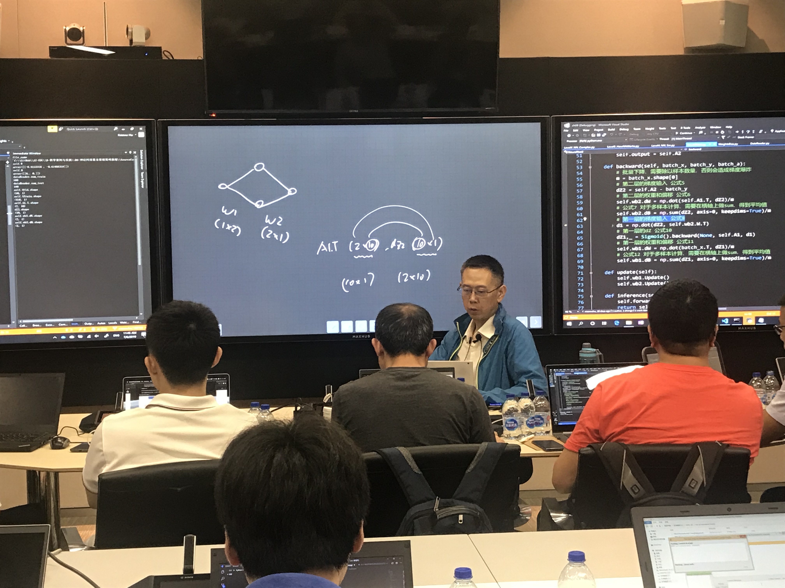
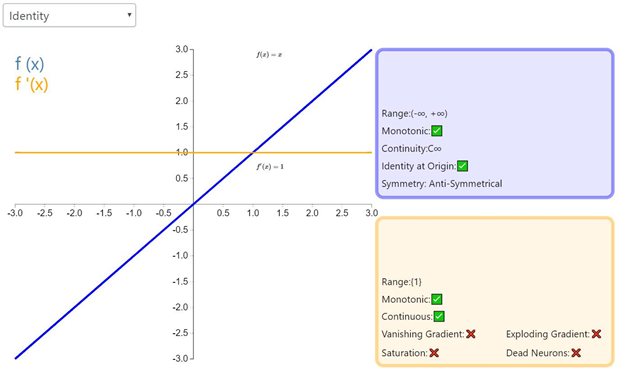
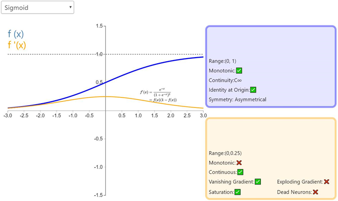
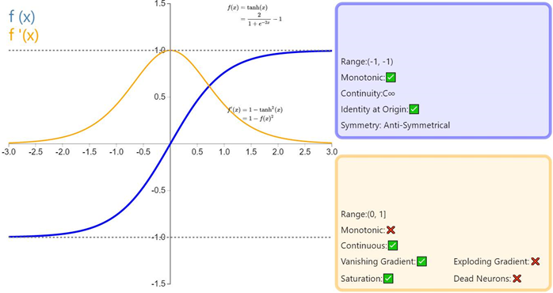
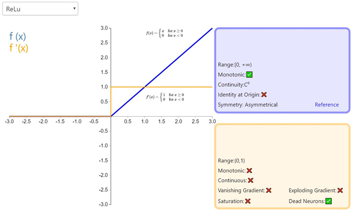
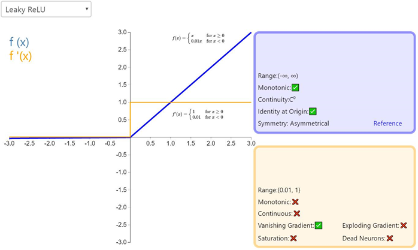
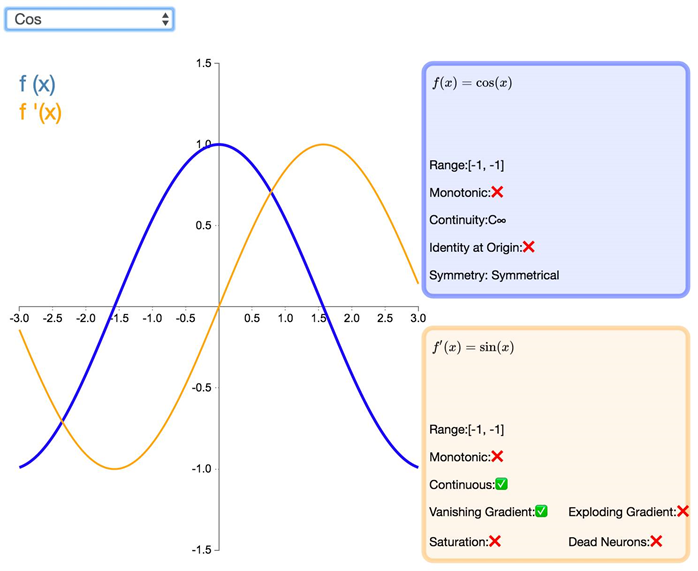
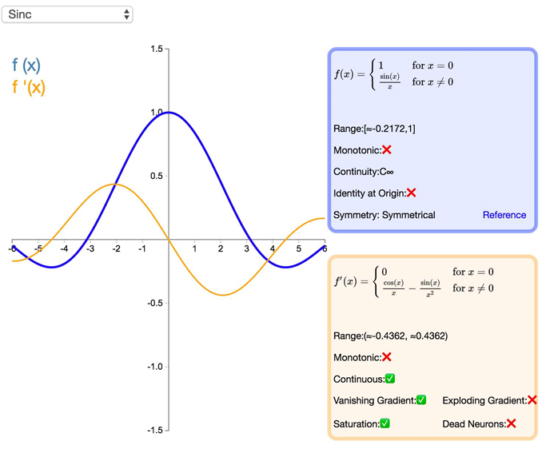

# 微软-仪电人工智能高阶人才培训学习心得之一：301课程-深度学习(4/5)神经网络
# 作者：李少华（上海华鑫股份有限公司）

# 千呼万唤始出来  
上周的课程中，秦老师反复提到晓武老师。本周有幸得见本尊。
晓武老师授课深入浅出介绍了 线性二分类/线性多分类/激活函数/双层神经网络/非线性分类等。
>同学直呼**“晓武老师绝对硬核！”**

*晓武老师老师讲授的绝大部分内容都在讲义中体现出来了。  
下面整理了一些此次授课中我觉得比较重要的概念和一些网络上的补充资料，供大家参考。*
主要是两方面内容：
1. 激活函数
2. 隐藏层数与节点数设置

# 激活函数
激活函数是神经网络的一个重要组成部分。如果不用激活函数（即相当于激活函数为f(x)=x），在这种情况下，网络的每一层的输入都是上一层的线性输出，因此，无论该神经网络有多少层，最终的输出都是输入的线性组合，与没有隐藏层的效果相当，这种情况就是最原始的感知机。  
正因为上面的原因，才需要引入非线性函数作为激活函数，这样深层神经网络才有意义，输出不再是输入的线性组合，就可以逼近任意函数。  
## 各类激活函数的优缺点
绝大多数神经网络借助某种形式的梯度下降进行优化，激活函数需要是可微分（或者至少是几乎完全可微分的）。此外，复杂的激活函数也许产生一些梯度消失或爆炸的问题。因此，神经网络倾向于部署若干个特定的激活函数。  
### Identity

通过激活函数 Identity，节点的输入等于输出。它完美适合于潜在行为是线性（与线性回归相似）的任务。当存在非线性，单独使用该激活函数是不够的，但它依然可以在最终输出节点上作为激活函数用于回归任务。  
### Sigmoid
Sigmoid函数，也就是logistic函数，对于任意输入，它的输出范围都是（0,1）。公式如下：  
$$sigmoid(z)=\frac{1}{1+e^{-z}}$$

Sigmoid的函数图如上所示，很像平滑版的阶跃函数。但是，sigmoid 有很多**好处**，例如：
1. 它是非线性的
2. 不同于二值化输出，sigmoid 可以输入 0 到 1 之间的任意值。对，跟你猜的一样，这可以用来表示概率值。
3. 与 2 相关，sigmoid 的输出值在一个范围内，这意味着它不会输出无穷大的数。
但是，sigmoid 激活函数**并不完美**：  
**梯度消失**。如前面的图片所示，当输入值 z 趋近负无穷时，sigmoid 函数的输出几乎为 0 . 相反，当输入 z 趋近正无穷时，输出值几乎为 1 . 那么这意味着什么？  
在这两个极端情况下，对应的梯度很小，甚至消失了。梯度消失在深度学习中是一个十分重要的问题，我们在深度网络中加了很多层这样的非线性激活函数，这样的话，即使第一层的参数有很大的变化，也不会对输出有太大的影响。换句话讲，就是网络不再学习了，通常训练模型的过程会变得越来越慢，尤其是使用梯度下降算法时。  
sigmoid 的另一个弊端就是实际运用中**指数运算开销太大**。尽管有人说，与矩阵乘法或卷积相比，激活函数在深度网络的计算是非常小的一部分，所以这可能不会成为一个大问题。不过，我认为这值得一提。

### Tanh
Tanh 或双曲正切是另一个深度神经网络中常用的激活函数。类似于 sigmoid 函数，它也将输入转化到良好的输出范围内。具体点说就是对于任意输入，tanh 将会产生一个介于 -1 与 1 之间的值。  
$$tanh(z)=\frac{e^{z} - e^{-z}}{e^{z}+e^{-z}}$$

如前面提及的，tanh 激活函数有点像 sigmoid 函数。非线性且输出在某一范围，此处为 (-1, 1)。不必意外，它也有跟 sigmoid 一样的缺点。从数学表达式就可以看出来，它也有梯度消失的问题，以及也需要进行开销巨大的指数运算。

### ReLU
ReLU 从数学表达式来看，运算十分高效。对于某一输入，当它小于 0 时，输出为 0，否则不变。下面是 ReLU 的函数表达式。Relu(z) = max(0,z)

我们知道 max(0, x) 是一个分段线性函数。之所以说是分段线性。但是在整个定义域上并不满足线性函数的定义。例如f(−1) + f(1) ≠f (0)  
所以 Relu 就是一个非线性激活函数且有良好的数学性质，并且比 sigmoid 和 tanh 都运算得快。除此以外，Relu 还因避免了梯度消失问题而闻名。然而，ReLU 有一个致命缺点，叫「ReLU 坏死」。ReLu 坏死是指网络中的神经元由于无法在正向传播中起作用而永久死亡的现象。  
更确切地说，当神经元在向前传递中激活函数输出为零时，就会出现这个问题，导致它的权值将得到零梯度。因此，当我们进行反向传播时，神经元的权重将永远不会被更新，而特定的神经元将永远不会被激活。  
还有件事值得一提。你可能注意到，不像 sigmoid 和 tanh，Relu 并未限定输出范围。这通常会成为一个很大的问题，它可能在另一个深度学习模型如递归神经网络（RNN）中成为麻烦。具体而言，由 ReLU 生成的无界值可能使 RNN 内的计算在没有合理的权重的情况下发生数值爆炸。因此反向传播期间权重在错误方向上的轻微变化都会在正向传递过程中显著放大激活值，如此一来学习过程可能就非常不稳定。

经典（以及广泛使用的）ReLU 激活函数的变体，带泄露修正线性单元（Leaky ReLU）的输出对负值输入有很小的坡度。由于导数总是不为零，这能减少静默神经元的出现，允许基于梯度的学习（虽然会很慢）。

>ReLU 与 Sigmoid 对比
> 这个模型对比Sigmoid系主要变化有三点：①单侧抑制 ②相对宽阔的兴奋边界 ③稀疏激活性（重点，可以看到红框里前端状态完全没有激活）  
同年，Charles Dugas等人在做正数回归预测论文中偶然使用了Softplus函数，Softplus函数是Logistic-Sigmoid函数原函数。  
按照论文的说法，一开始想要使用一个指数函数（天然正数）作为激活函数来回归，但是到后期梯度实在太大，难以训练，于是加了一个log来减缓上升趋势。  
加了1是为了保证非负性。同年，Charles Dugas等人在NIPS会议论文中又调侃了一句，Softplus可以看作是强制非负校正函数  
偶然的是，同是2001年，ML领域的Softplus/Rectifier激活函数与神经科学领域的提出脑神经元激活频率函数有神似的地方，这促成了新的激活函数的研究。  
**生物神经的稀疏激活性**
在神经科学方面，除了新的激活频率函数之外，神经科学家还发现了神经元的稀疏激活性。  
还是2001年，Attwell等人基于大脑能量消耗的观察学习上，推测神经元编码工作方式具有稀疏性和分布性。  
2003年Lennie等人估测大脑同时被激活的神经元只有1~4%，进一步表明神经元工作的稀疏性。  
从信号方面来看，即神经元同时只对输入信号的少部分选择性响应，大量信号被刻意的屏蔽了，这样可以提高学习的精度，更好更快地提取稀疏特征。  
从这个角度来看，在经验规则的初始化W之后，传统的Sigmoid系函数同时近乎有一半的神经元被激活，这不符合神经科学的研究，而且会给深度网络训练带来巨大问题。  
Softplus照顾到了新模型的前两点，却没有稀疏激活性。因而，校正函数

### Cos
$$f(x)=cos(x)$$

如同正弦函数，余弦激活函数（Cos/Cosine）为神经网络引入了周期性。它的值域为 [-1,1]，且导数处处连续。和 Sinusoid 函数不同，余弦函数为不以零点对称的偶函数。

### Sinc
$$\left\{\begin{matrix}
1 & \ ,x=0 \\ 
\frac{sin(x)}{x} & , x!=0 
\end{matrix}\right.$$

Sinc 函数（全称是 Cardinal Sine）在信号处理中尤为重要，因为它表征了矩形函数的傅立叶变换（Fourier transform）。作为一种激活函数，它的优势在于处处可微和对称的特性，不过它比较容易产生梯度消失的问题。

# 隐藏层数与节点数设置
1. 隐层数
一般认为，增加隐层数可以降低网络误差（也有文献认为不一定能有效降低），提高精度，但也使网络复杂化，从而增加了网络的训练时间和出现“过拟合”的倾向。一般来讲应设计神经网络应优先考虑3层网络（即有1个隐层）。一般地，靠增加隐层节点数来获得较低的误差，其训练效果要比增加隐层数更容易实现。对于没有隐层的神经网络模型，实际上就是一个线性或非线性（取决于输出层采用线性或非线性转换函数型式）回归模型。因此，一般认为，应将不含隐层的网络模型归入回归分析中，技术已很成熟，没有必要在神经网络理论中再讨论之。
2. 隐层节点数
在BP 网络中，隐层节点数的选择非常重要，它不仅对建立的神经网络模型的性能影响很大，而且是训练时出现“过拟合”的直接原因，但是目前理论上还没有一种科学的和普遍的确定方法。 目前多数文献中提出的确定隐层节点数的计算公式都是针对训练样本任意多的情况，而且多数是针对最不利的情况，一般工程实践中很难满足，不宜采用。事实上，各种计算公式得到的隐层节点数有时相差几倍甚至上百倍。为尽可能避免训练时出现“过拟合”现象，保证足够高的网络性能和泛化能力，确定隐层节点数的最基本原则是：在满足精度要求的前提下取尽可能紧凑的结构，即取尽可能少的隐层节点数。研究表明，隐层节点数不仅与输入/输出层的节点数有关，更与需解决的问题的复杂程度和转换函数的型式以及样本数据的特性等因素有关。
在确定隐层节点数时必须满足下列条件：  
**隐层节点数必须小于N-1（其中N为训练样本数）**，否则，网络模型的系统误差与训练样本的特性无关而趋于零，即建立的网络模型没有泛化能力，也没有任何实用价值。同理可推得：输入层的节点数（变量数）必须小于N-1。  
**训练样本数必须多于网络模型的连接权数，一般为2~10倍**，否则，样本必须分成几部分并采用“轮流训练”的方法才可能得到可靠的神经网络模型。 
总之，若隐层节点数太少，网络可能根本不能训练或网络性能很差；若隐层节点数太多，虽然可使网络的系统误差减小，但一方面使网络训练时间延长，另一方面，训练容易陷入局部极小点而得不到最优点，也是训练时出现“过拟合”的内在原因。因此，合理隐层节点数应在综合考虑网络结构复杂程度和误差大小的情况下用节点删除法和扩张法确定。
3. 神经网络隐藏层节点数设置—经验公式
$$m:隐藏层节点数$$
$$n:输入层节点数$$
$$l:输出层节点数$$
$$\alpha :1-10之间的常数$$
$$m = \sqrt{n+l}+\alpha $$
$$m = {log_2}n$$
$$m = \sqrt{n * l}$$

# 参考资料
感谢高博提供的参考资料。  
1. [CS231N](http://cs231n.github.io/neural-networks-1/#arch)

# 其他正常内容

#关于微软-仪电人工智能创新院
微软-仪电人工智能创新院将由微软和仪电共同运营和管理，致力于为微软和仪电在人工智能方面的联合研究活动和项目提供支持，为当地企业提供基于微软技术的人工智能研发平台服务和培训服务。

# 关于培训
微软和仪电共同打造的微人工智能高阶人才培训第一期培训班由创新院运营，历时三个月，授课老师包括来自微软和上海仪电的多位专家，内容涵盖人工智能导论、数学基础、深度学习、应用实例等课程，以及关于强化学习、自然语言处理、计算机视觉等热门方向的专题研讨会，希望帮助学员掌握人工智能的理论与实践，培养具备前瞻视野和实践能力的创新型人才。

更多信息，请关注微信公众号

