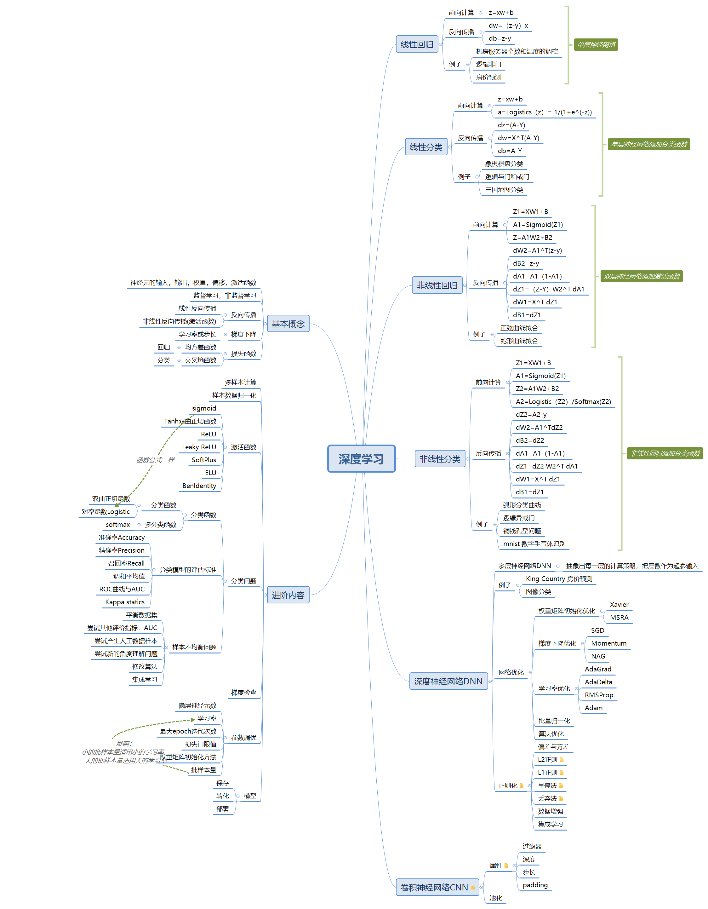

# 微软-仪电人工智能高阶人才培训学习心得之九：

## 作者：王洋

这次的课程是深度学习课程的最后一次课程。在这次课程中，本次培训教材的作者，晓武老师，给我们的深度学习课程做了一个收尾。在本次课程中，晓武老师给我们讲解了非线性分类网络，深度神经网络，卷积神经网络。除此以外，多才多艺的晓武老师还给我们讲解了乐器学习的基础知识，深受好评。

我本次的心得体会回顾了整个AI培训班深度学习课程的教材，整理了一份思维导图，以及附上晓武老师的乐器学习见解。

## 深度学习

## 乐器学习

### 乐器的分类

- 打击
- 吹
- 键盘
- 弹拨
- 弦

在乐器分类的基础上，乐器的学习难度是逐步递增的，传说打击乐学一个1个月就可以上台了，而小提琴可能要学十年。而乐器的音量也是逐步递减的，这个很容易理解，毕竟架子鼓的音量无人能及。

晓武老师花了两个星期就学会了键盘，回想自己小时候学电子琴的惨痛经历真是自愧不如，败在了和旋上。

## 总结

在这次的课程心得中，我完整的梳理了一下整个深度学习课程的教材，这个梳理的过程自己也收获很多。多总结，多收获。

最后非常感谢晓武老师和婷婷老师这一个多月的教导，也非常感谢我们的校长和助教团队，非常辛勤的为我们这个小班级作出的贡献！

再次感谢所有人！

# 关于微软-仪电人工智能创新院

微软-仪电人工智能创新院将由微软和仪电共同运营和管理，致力于为微软和仪电在人工智能方面的联合研究活动和项目提供支持，为当地企业提供基于微软技术的人工智能研发平台服务和培训服务。

# 关于培训

微软和仪电共同打造的微人工智能高阶人才培训第一期培训班由创新院运营，历时三个月，授课老师包括来自微软和上海仪电的多位专家，内容涵盖人工智能导论、数学基础、深度学习、应用实例等课程，以及关于强化学习、自然语言处理、计算机视觉等热门方向的专题研讨会，希望帮助学员掌握人工智能的理论与实践，培养具备前瞻视野和实践能力的创新型人才。

更多信息，请关注微信公众号
