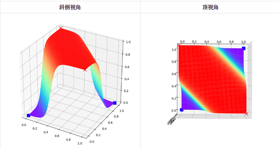

# 微软-仪电人工智能高阶人才培训学习心得之九：一生二、二生三、三生万物

## 作者：刘超

本次课程是“神经网络基本原理简明教程”的最后一次课程。在本次课程中，晓武老师为我们介绍了非线性分类、模型的搭建与识别、深度神经网络等内容。其强调的“一生二、二生三、三生万物”的思想让我印象深刻。

## “一生二”：
在1969年，一本著名的书《Perceptrons》（感知器，Minsky、Papert,1969）证明了无法使用单层网络（当时称为感知器）来表示最基本的异或逻辑功能。而根据数字电路理论任何逻辑都可以由与非门的组合来表达，所以有了与非门就可以实现任意计算。感知机本质上是线性模型，只能做简单的线性分类任务（注：感知机等效为统计机器学习中的逻辑回归模型，可做线性二分类任务）。这导致了人工神经网络研究的第一次寒冬（“AI winter”）。直到10年之后，多层神经网络的研究进展才带来人工神经网络研究的复苏。

课堂上，老师用数学的方法证明了单层神经网络，即使增加了非线性函数，也无法实现异或，而通过增加一层神经网络就可以解决异或问题，而且还具有非常好的非线性分类效果。不过Minsky认为如果将计算层增加到多层会导致计算量过大，也没有有效的学习算法，所以研究更深层的网络是没有价值的。1986年，神经网络研究迎来了转机，Rumelhar和Hinton等人提出了著名的反向传播（Backpropagation，BP）算法，解决了多层神经网络产生的复杂计算量问题，人工神经网络的研究迎来复苏。
我感觉，这个过程应证了”一生二“的道理，”感知机“就是”一“，它的功能局限性，导致了后人通过扩展结构来扩展功能，这就是”一生二“。

## 二生三
课堂上，晓武老师不但传授了我们如何用二层神经网络解决亦或问题，更通过三维空间的可视化来帮助我们来理解神经网络在异或问题的上的工作原理。

从上图中我们立刻就明白了神经网络都做了些什么事情：它通过样本点，推算出了平面上每个坐标点的概率，形成空间曲面，然后拦腰一刀（一个切面），这样神经网络就可以在Z=0.5出画一个平面，完美地分开对角顶点。如果看顶视图，与我们在前面生成的2D区域染色图极为相似，它的红色区域的概率值接近于1，蓝色区域的概率值接近于0，在红蓝之间的颜色，代表了从0到1的渐变值。

平面上分割两类的直线，只是我们的想象：使用0.5为门限值像国界一样把两部分数据分开。但实际上，神经网络的输出是个概率，即，它可以告诉你某个点属于某个类别的概率是多少，我们人为地设定为当概率大于0.5时属于正类，小于0.5时属于负类。在空间曲面中，可以把过渡区也展示出来，让大家更好地理解。
“神经网络基本原理简明教程”最大的特点是不但传授神经网络的知识，而且用图形化的方式解释神经网络在做什么，这个与传统神经网络课程认为神经网络是”不可解释的“形成很大的反差，这样做能使得我们知识掌握更牢固，理解更深刻。

对于更复杂的分类问题，由于样本的复杂性，必须在二层神经网络的基础上再增加一层网络，采用三层神经网络才能完成分类任务。

## 三生万物
课堂上，晓武老师以MNIST手写识别为例，介绍了三层神经网络的原理和实现。晓武老师告诉我们，如果网络能力不够，一般在神经网络的宽度（神经元的个数）和深度（网络层数）上做文章，增加深度比宽度更有效。一般的分类问题，三层神经网络都可以做了，我想这就是所谓的”三生万物“了吧。

最后，晓武老师还教了我们如何调超参，如何做梯度检查，以及自己实现一套深度学习的Miniframework框架要注意的点（例如由于backward和forward函数在双重循环中要调无数次，因此绝对不能有多余的操作）。

## 总结
本次课程让我受益良多，这不但是知识层面上的，更是”方法论“的层面，老师上课时传授的”一生二，二生三，三生万物“的方法论非常精辟，可以说”think big, start small“的中文版，老师还说，在软件工程中，也可以用该思想避免”软件过度设计“，让我惊叹于中国智慧焕发新活力。

最后，非常感谢组织方和晓武老师提供那么好的培训机会和教案，为仪电有那么好的培训和老师点赞！

# 关于微软-仪电人工智能创新院

微软-仪电人工智能创新院将由微软和仪电共同运营和管理，致力于为微软和仪电在人工智能方面的联合研究活动和项目提供支持，为当地企业提供基于微软技术的人工智能研发平台服务和培训服务。

# 关于培训

微软和仪电共同打造的微人工智能高阶人才培训第一期培训班由创新院运营，历时三个月，授课老师包括来自微软和上海仪电的多位专家，内容涵盖人工智能导论、数学基础、深度学习、应用实例等课程，以及关于强化学习、自然语言处理、计算机视觉等热门方向的专题研讨会，希望帮助学员掌握人工智能的理论与实践，培养具备前瞻视野和实践能力的创新型人才。

更多信息，请关注微信公众号

