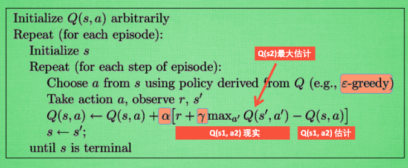

### Q1: RL与其他机器学习的有哪些不同之处 ？

**A:** RL和传统的机器学习(监督学习 Supervised Learning，非监督学习 Unsupervised Learning，半监督学习 Semi-Supervised Learning)既有一定的联系，也存在很大的区别。

总的来说，RL与其他机器学习算法不同的地方在于：

1. 没有监督者，只有一个Reward信号。强化学习一般没有直接的指导信息，Agent 要以不断与 Environment 进行交互，通过试错的方式来获得最佳策略(Policy)。
2. 反馈是延迟的，不是立即生成的。强化学习的指导信息很少，而且往往是在事后（最后一个状态(State)）才给出的。
3. 强化学习是序列学习，时间在强化学习中具有重要的意义。
4. Agent的行为会影响以后所有的决策。

###  Q2: 能否具体介绍一下Q-learning算法？

**A:** Q-learning 算法通过构建和维护一个Q表，Q表中的每一项表示Q(s,a)，来找到一个最优策略，这个策略能够最大化从当前状态开始所有的后继行动的期望收益。请参考以下Q-learning的伪代码：

 Q-learning最重要的部分在于对Q值的更新，从伪代码中我们可以看到，对于Q值的更新ΔQ是两部分的差值乘以系数α。

### Q3: 为什么预训练在NLP中很重要?

**A:** 预训练模型提供了基准模型，这样我们就可以在自己的NLP数据集上使用该预训练模型，而无需从头开始构建模型来解决类似的问题。尽管需要进行一些微调，但这为我们节省了大量的时间和计算资源。这一突破使NLP应用变得简单，尤其是那些没有时间或资源从头开始构建NLP模型的项目。

### Q4: Transformer在编解码中的优势是什么？

**A:** Transformer的网络结构，也依据了encoder-decoder结构，但是没有用RNN，LSTM, GRU和CNN等复杂结构，而是仅仅使用了self-attention。Transformer是第一个用纯attention搭建的模型，做到了并行化，并且每层计算复杂度得到明显降低，提升了计算效率。不仅计算速度更快，在翻译任务上也获得了更好的结果。

### Q5: 交叉熵损失函数在多分类问题当中为什么会有不同形式？

**A:** 多样本的交叉嫡损失函数的形式是：
$$J(w,b) =- \sum_{j=1}^n \sum_{i=1}^m y_{ij} \log a_{ij}\tag{1}$$
典型的对于三分类：
$$J(w,b)=-[(y1*log(a1)+y2*log(a2)+y3*log(a3)]\tag{2}$$
有时候会看到这种形式：
$$J(w,b)=-[(y*log(a)]\tag{3}$$
那么为什么只有一项了，其他项怎么没有了呢？
因为这种形式，一般出现在所给的标签值不是one-hot形式的，比如Y值是$$[2,1,2]$$
其实它是有潜台词的，三个样本，对于第一个样本的索引号为2的值是标签值，而其他的0和1就不是标签值了，按照one-hot的规则，y1=0,y2=0,y3=1, 代入公式1，就简化成了公式3了。
所以还是正常思维,没有毛病，只有缺少了变形前的铺垫。