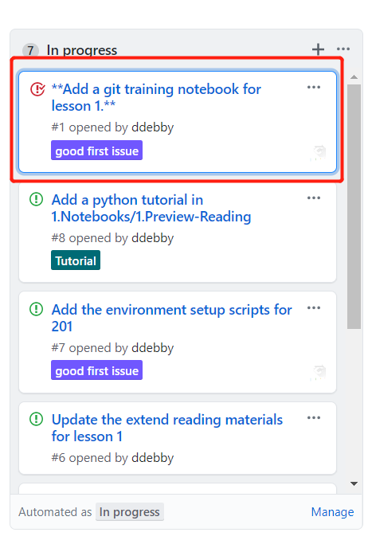
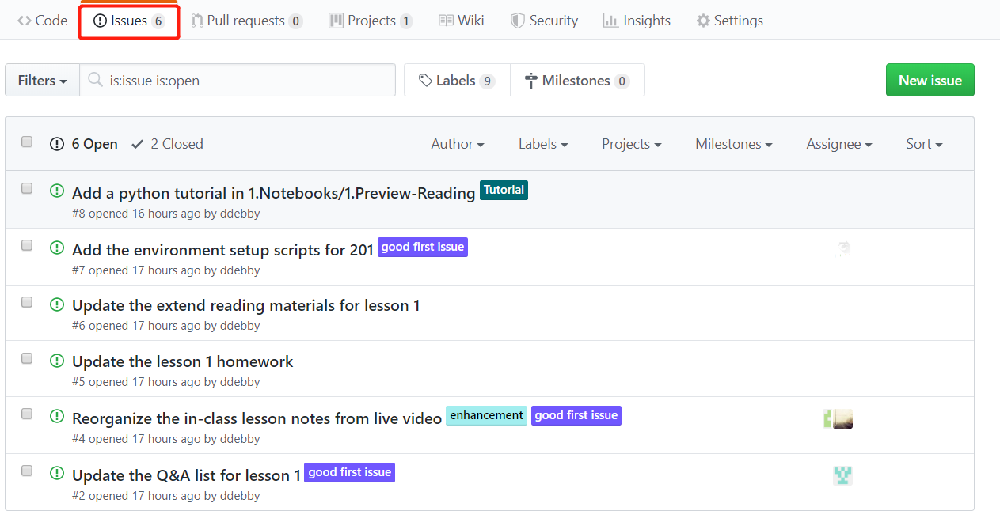
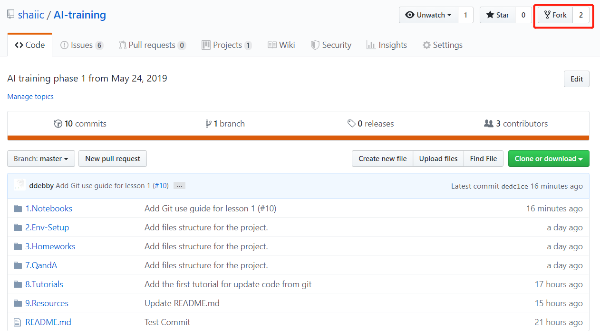
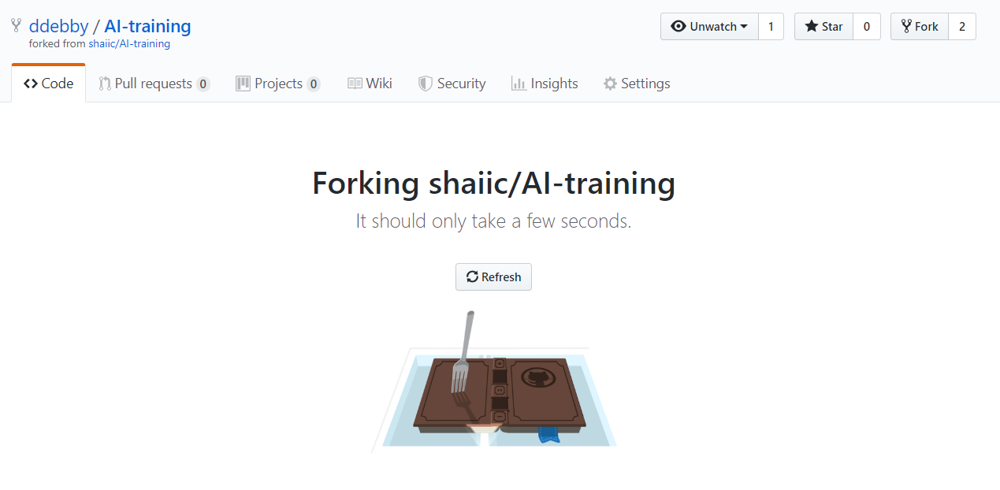
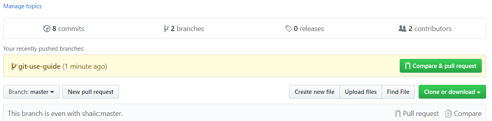
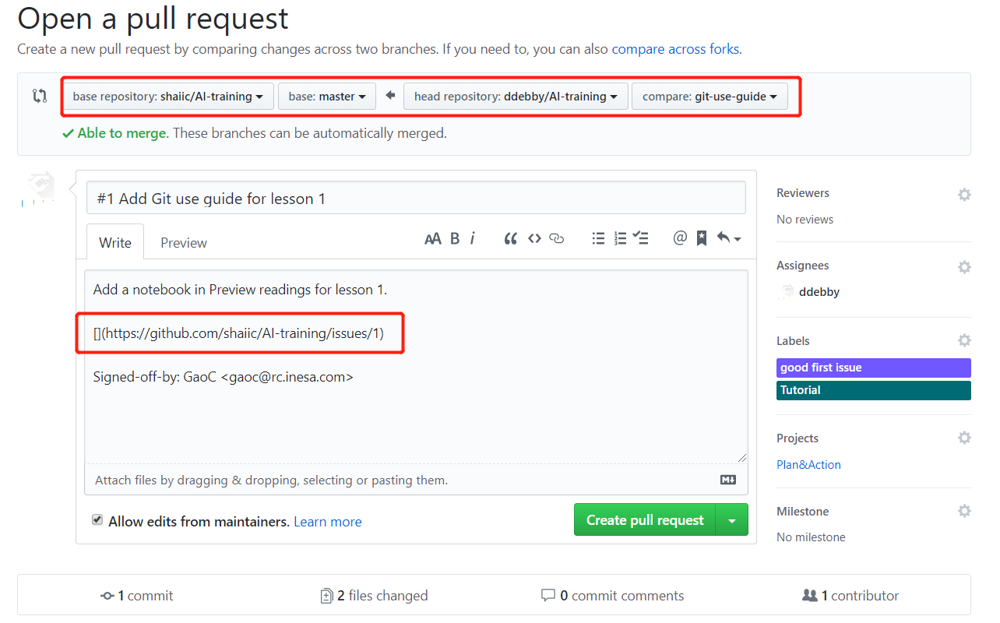
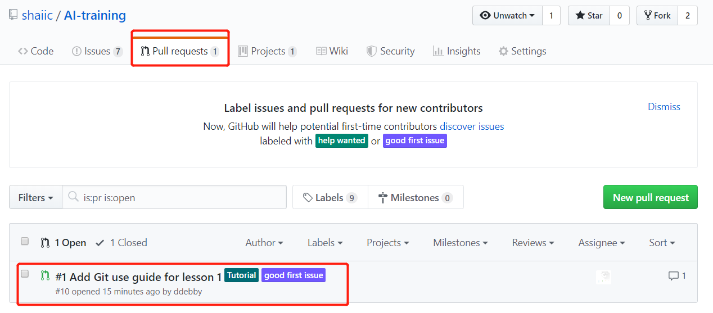
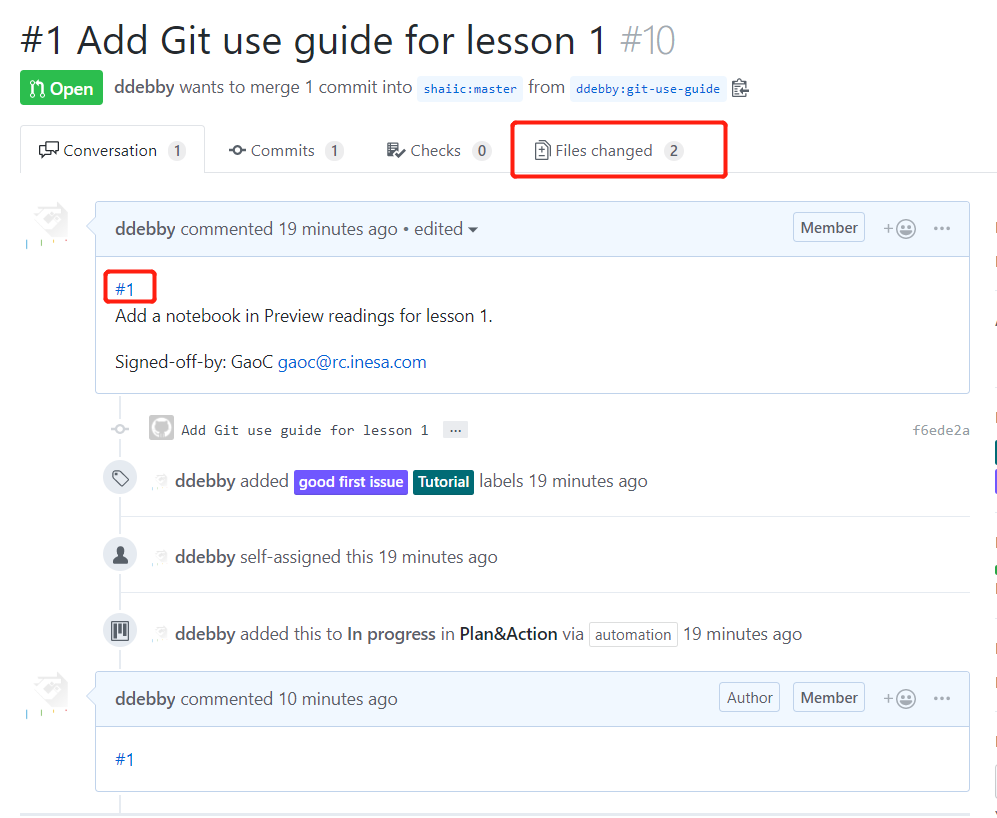
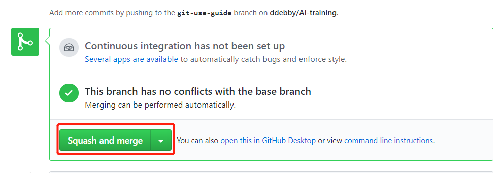
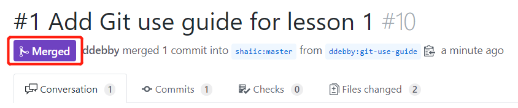

# 如何为项目做贡献

## 1. 查看相关issues和任务

登陆[项目看板](<https://github.com/shaiic/AI-training/projects/1>) 或者[issue页面](<https://github.com/shaiic/AI-training/issues>) 查看任务或者感兴趣的issue，或者有新的功能或feature需要添加，请额外以issue的形式添加并邀请审核。





## 2. Fork项目为自己的仓库

登陆[项目主页](<https://github.com/shaiic/AI-training>),点击右上角的`Fork`按钮，将项目fork为自己的仓库。





## 3. 将代码clone到本地

```bash
git clone <https://github.com/xxxx/xxxx.git>
```

或通过`git pull`指令，拉取最新的代码：

```bash
git pull
```

## 4. 本地代码修改

1) 建议创建一个新的分支进行代码修改：

```bash
git branch new-feature
git checkout new-feature
```

2) 在新的分支修改、更新代码

3）本地提交代码

```bash
# 查看代码状态
git status

# 查看修改内容
git diff

# 本地commit
git commit -s
```

## 5. 提交代码到远程分支

```bash
git push origin new-feature:git-use-guide
```

## 6. 提交Pull Request

可以在pull request提交中将issue id以`#ID`的形式放在内容中





## 7. 更新issue信息

进入[issue页面](<https://github.com/shaiic/AI-training/issues>)更新issue信息，将提交的PR ID作为对该issue的回应，放在comment中。


## 8. 管理员合并RP，关闭issue

> 以下内容仅限于管理员操作









### 关闭 issue


