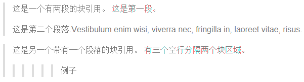
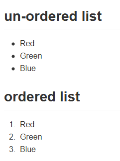
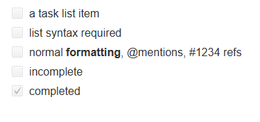

# Markdown入门及使用指南


## 介绍 Overview

**Markdown** 是由 [Daring Fireball](http://daringfireball.net/) 创建的, 原来的准则是 [这里](http://daringfireball.net/projects/markdown/syntax)。但是，它的语法因不同的解析器或编辑器而异。 

请注意，markdown源中的HTML片段将被识别，但不会被解析或呈现。 此外，保存后，原始降价源代码可能会进行少量重新格式化。

💥推荐使用Markdown编辑软件[Typora](https://typora.io/)

## 块体单元 Block Element

### 段落和换行符

段落只是一行或多行连续的文本。 在markdown源代码中，段落由多个空行分隔。 在Typora中，您只需按`Return`即可创建一个新段落。

按`Shift` +`Return`创建一个换行符。 但是，大多数markdown解析器将忽略单行中断，要使其他markdown解析器识别您的换行符，可以在行尾留下两个空格，或插入`<br/>`。

### 标题

Headers use 1-6 hash characters at the start of the line, corresponding to header levels 1-6. For example:

``` markdown
# 这是一级标题

## 这是二级标题

###### 这是六级标题
```


在 Typora, 输入'＃'后跟标题内容，按'Return`键将创建标题。

### 引用文字

Markdown使用电子邮件样式 > 字符进行块引用。 它们表示为：

``` markdown
> 这是一个有两段的块引用。 这是第一段。
>
> 这是第二个段落.Vestibulum enim wisi, viverra nec, fringilla in, laoreet vitae, risus.


> 这是另一个带有一个段落的块引用。 有三个空行分隔两个块区域。
>>>>>>例子
```


在 Typora 中，只需输入'>'后跟引号内容即可生成块引用。 Typora将为您插入正确的“>”或换行符。 通过添加额外级别的“>”允许在引用中再一次引用。

### 列表

输入`* list item 1`将创建一个无序列表，`*`符号可以替换为`+`或`-`。

输入`1. list item 1`将创建一个有序列表，其markdown源代码如下：

``` markdown
## un-ordered list
*   Red
*   Green
*   Blue

## ordered list
1.  Red
2. 	Green
3.	Blue
```


### 任务列表

任务列表是标记为[]或[x]（不完整或完整）的项目的列表。 例如：

``` markdown
- [ ] a task list item
- [ ] list syntax required
- [ ] normal **formatting**, @mentions, #1234 refs
- [ ] incomplete
- [x] completed
```


您可以通过单击项目前面的复选框来更改完整/不完整状态。

### （受控）代码块

使用代码块很简单：输入\`\`\`并按`return`。 在\`\`\`之后添加一个可选的语言标识符，我们将通过语法高亮显示它：

``` gfm
举个例子:

​```
function test() {
  console.log("notice the blank line before this function?");
}
​```

语法高亮:
​```ruby
require 'redcarpet'
markdown = Redcarpet.new("Hello World!")
puts markdown.to_html
​```
```

### 表格

输入`| 第一个标题| 第二个标题|`并按`return`键将创建一个包含两列的表。

创建表格后，焦点在该表格上会弹出表格的工具栏，您可以在其中调整表格的大小，对齐或删除。 您还可以使用上下文菜单来复制和添加/删除列/行。

可以跳过以下描述，因为表格的降价源代码是由Typora自动生成的。

在markdown源代码中，它们看起来：

``` markdown
| First Header  | Second Header |
| ------------- | ------------- |
| Content Cell  | Content Cell  |
| Content Cell  | Content Cell  |
```

您还可以包括内联Markdown，例如链接，粗体，斜体或删除线。

最后，通过在标题行中包含冒号：您可以将文本定义为左对齐，右对齐或居中对齐：

``` markdown
| Left-Aligned  | Center Aligned  | Right Aligned |
| :------------ |:---------------:| -----:|
| col 3 is      | some wordy text | $1600 |
| col 2 is      | centered        |   $12 |
| zebra stripes | are neat        |    $1 |
```

最左侧的冒号表示左对齐的列; 最右侧的冒号表示右对齐的列; 两侧的冒号表示中心对齐的列。

### 注释 Footnotes

``` markdown
您可以像这样创建注释[^footnote].

[^footnote]: Here is the *text* of the **footnote**.
```

你可以创建一个像这样的[^footnote].

[^footnote]: Here is the *text* of the **footnote**.

鼠标在'注释'上标中查看注释的内容。

### 分割线

在空白行输入`***`或`---`并按`return`将绘制一条水平线。

------

### 目录 Table of Contents (TOC)

输入`[toc]`然后按`Return`键将创建一个“目录”部分，从一个人的书写中提取所有标题，其内容将自动更新。

### 图表（序列 Sequence，流程图 Flowchart和Mermaid)

Typora 支持 [sequence](https://bramp.github.io/js-sequence-diagrams/), [flowchart](http://flowchart.js.org/) and [mermaid](https://knsv.github.io/mermaid/#mermaid),从首选项面板启用此功能后。

有关详细信息，请查看这个 [文档](http://support.typora.io/Draw-Diagrams-With-Markdown/)。

## Span 元素

Span类型将在您输入后立即解析和呈现。 在这些span元素的中间移动光标会将这些元素扩展为markdown源。 下面将解释这些span元素的语法。

### 链接 Links

Markdown支持两种类型的链接：内联（inline）和引用（reference）。

在这两种样式中，链接文本由[方括号]分隔。

要创建内联链接，请在链接文本的结束方括号后立即使用一组常规括号。 在括号内，将URL指向要指向的URL，以及链接的可选标题，用引号括起来。 举个例子：

``` markdown
This is [an example](http://example.com/ "Title") inline link.

[This link](http://example.net/) has no title attribute.
```

将会产生:

This is [an example](http://example.com/"Title") inline link. (`<p>This is <a href="http://example.com/" title="Title">`)

[This link](http://example.net/) has no title attribute. (`<p><a href="http://example.net/">This link</a> has no`)

#### 内部链接

**您可以将超链接设置为标题**，这将创建一个书签，允许您在单击后跳转到该部分。 例如：

命令（在Windows上：Ctrl）+单击[这个链接](#block-elements)将跳转到标题`Block Elements`。 要查看如何编写，请移动光标或单击该链接并按下“⌘”键将元素展开为源代码。

#### 参考链接 Reference Links 

参考样式链接使用第二组方括号，在其中放置您选择的标签以标识链接：

``` markdown
This is [an example][id] reference-style link.

Then, anywhere in the document, you define your link label like this, on a line by itself:

[id]: http://example.com/  "Optional Title Here"
```

在Typora中，它们将呈现为：

This is [an example][id] reference-style link.

[id]: http://example.com/	"Optional Title Here"

隐式链接名称快捷方式允许您省略链接的名称，在这种情况下，链接文本本身将用作名称。 只需使用一组空的方括号 - 例如，将“Google”一词链接到google.com网站，您只需编写：

``` markdown
[Google][]
And then define the link:

[Google]: http://google.com/
```

在Typora中单击链接将其展开以进行编辑，命令+单击将在Web浏览器中打开超链接。

### URLs

Typora允许您将URL作为链接插入，用`<`bracket`>`包装。

`<i@typora.io>` 成为 <i@typora.io>.

Typora还会自动链接标准网址。 例如: www.google.com.

### 图像

图像与链接类似，但在链接开始之前需要额外的`！`字符。 图像语法如下所示：

``` markdown


```

您可以使用拖放操作从图像文件或浏览器插入图像。 并通过单击图像修改markdown源代码。 如果图像在拖放时与当前编辑文档位于同一目录或子目录中，则将使用相对路径。

有关图像的更多提示，请阅读 <http://support.typora.io//Images/>

### 重点 Emphasis

Markdown将星号（`*`）和下划线（`_`）视为强调的指标。 用一个`*`或`_`包装的文本将用HTML` <em>`标签包装。 例如：

``` markdown
*single asterisks*

_single underscores_
```

输出: 

*single asterisks*

_single underscores_

GFM将忽略单词中的下划线，这通常用在代码和名称中，如下所示：

> wow_great_stuff
>
> do_this_and_do_that_and_another_thing.

要在其它方式用作强调分隔符的位置生成文字星号或下划线，可以反斜杠：

``` markdown
\*this text is surrounded by literal asterisks\*
```

推荐使用`*`符号。

### 加粗

两个 *或_将用HTML“<strong>”标签包装，例如：

``` markdown
**double asterisks**

__double underscores__
```

输出:

**double asterisks**

__double underscores__

推荐使用 `**` 符号。

### 代码

要指示代码范围，请使用反引号引号（`）进行包装。 与预格式化的代码块不同，代码跨度表示正常段落中的代码。 例如：

``` markdown
Use the `printf()` function.
```

将会生成:

Use the `printf()` function.

### 删除线 Strikethrough

GFM添加语法来创建删除线文本，标准Markdown中缺少该文本。

`~~Mistaken text.~~` 会变成 ~~Mistaken text.~~

### 下划线

下划线由原始HTML提供支持。

`<u>Underline</u>` 变成 <u>Underline</u>.

### HTML

Typora无法呈现html片段。 但是typora可以解析和渲染非常有限的HTML片段，作为Markdown的扩展，包括：

- 下划线: `<u>underline</u>`
- 图片: `` (和 `width`, `height` 属性在 HTML 的标签tag里, 和 `width`, `height`, `zoom` 风格 在 `style` 会被引用.)
- 评论: `<!-- This is some comments -->`
- 超链接: `<a href="http://typora.io" target="_blank">link</a>`.

它们的大多数属性，样式或类都将被忽略。但这些HTML将在打印或导出时导出。

## 数学公式

### 基本

- 行内公式

  ```markdown
  $...$
  ```

- 居中显示：

  ```markdown
  $$...$$
  ```

  
  $$
  \mathbf{V}_1 \times \mathbf{V}_2 =  \begin{vmatrix} 
  \mathbf{i} & \mathbf{j} & \mathbf{k} \\
  \frac{\partial X}{\partial u} &  \frac{\partial Y}{\partial u} & 0 \\
  \frac{\partial X}{\partial v} &  \frac{\partial Y}{\partial v} & 0 \\
  \end{vmatrix}
  $$


在markdown源文件中，math块是由'$$'标记包裹的* LaTeX *表达式：

```markdown
$$
\mathbf{V}_1 \times \mathbf{V}_2 =  \begin{vmatrix} 
\mathbf{i} & \mathbf{j} & \mathbf{k} \\
\frac{\partial X}{\partial u} &  \frac{\partial Y}{\partial u} & 0 \\
\frac{\partial X}{\partial v} &  \frac{\partial Y}{\partial v} & 0 \\
\end{vmatrix}
$$
```


### 希腊字母

| 显示 | 命令     | 显示 | 命令   |
| ---- | -------- | ---- | ------ |
| α    | \alpha   | β    | \beta  |
| γ    | \gamma   | δ    | \delta |
| ε    | \epsilon | ζ    | \zeta  |
| η    | \eta     | θ    | \theta |
| ι    | \iota    | κ    | \kappa |
| λ    | \lambda  | μ    | \mu    |
| ν    | \nu      | ξ    | \xi    |
| π    | \pi      | ρ    | \rho   |
| σ    | \sigma   | τ    | \tau   |
| υ    | \upsilon | φ    | \phi   |
| χ    | \chi     | ψ    | \psi   |
| ω    | \omega   |      |        |

> 若大写字母，命令首字母大写即可：$\Omega$,的代码为`\Omega`
>
> 若需要斜体，命令前添加var前缀：$\varOmega$,代码为`\varOmega`

### 修饰符

1. 上下标

   - 上标使用：`^`
   - 下标使用：`_`

   $$
   举例： x_{n} ^2
   $$

2. 矢量

   - `\vec a` : $\vec a​$
   - `\overrightarrow {xy}`: $\overrightarrow {xy}$ 

3. 字体

   - Typewriter： `\mathtt {A}`: $ \mathtt {ABCDEFGHIJKLMNOPQRSTUVWXYZ}$
   - Blackbloard Bold: `\mathbb {A}`: $\mathbb {ABCDEFGHIJKLMNOPQRSTUVWXY}$
   - SansSerif: `\mathsf {A}`: $\mathsf {ABCDEFGHIJKLMNOPQRSTUVWXY}$

4. 分组显示

   - `{...}`

5. 括号

   - `()`   `[]` 
   - `\langle`, `\rangle`: $\langle ... \rangle$

6. 求和、极限与积分

   - 求和： `\sum`  $\sum_{i=1}^n{a_i}$
   - 极限： `\lim_{x\to 0}` $\lim_{x\to 0}$
   - 积分： `\int_0^\infty{x}dx` $\int_0^\infty{x}dx$

7. 分式与根号

   - 分式：`\frac{分子}{分母}` $\frac{分子}{分母}$
   - 根式： `\sqrt[x]{y}` $\sqrt[x]{y}$

8. 特殊函数

   - `\sin x` `\ln x` `\max(A,B,C)`
   - $\sin x$ ,$\ln x$, $max(A,B,C)$

9. 特殊符号

|   显示   |  命令   |     显示     |     命令     |    显示    |    命令    |
| :------: | :-----: | :----------: | :----------: | :--------: | :--------: |
|  $\lt$   |  `\lt`  |    $\cup$    |    `\cup`    |   $\to$    |   `\to`    |
|  $\gt$   |  `\gt`  |    $\cap$    |    `\cap`    | $\forall$  | `\forall`  |
|  $\le$   |  `\le`  | $\setminus$  | `\setminus`  | $\exists$  | `\exists`  |
|  $\ge$   |  `\ge`  |  $\subset$   |  `\subset`   |  $\lnot$   |   `lnot`   |
|  $\neq$  | `\neq`  | $\subseteq$  | `\subseteq`  |  $\nabla$  |  `\nabla`  |
|  $\not$  |  `not`  | $\subsetneq$ | `\subsetneq` | $\partial$ | `\partial` |
| $\times$ | `times` |  $\supset$   |  `\supset`   | $\approx$  | `\approx`  |
|  $\div$  |  `div`  |    $\in$     |    `\in`     |  $\ldots$  |  `\ldots`  |
|  $\pm$   |  `pm`   |   $\notin$   |   `\notin`   | $\bullet$  | `\bullet`  |
| $\cdot$  | `cdot`  | $\emptyset$  | `\emptyset`  |  $\circ$   |  `\circ`   |

10. 空格
    - 小空格： `a\ b`
    - 4空格： `a\quad b`
11. 多行公式

```markdown
$$
sign(x)=
\begin{equation}  
\left\{  
             \begin{array}{lr}  
            +1, &  x \ge 0\\  
             -1, &   x \lt 0 
             \end{array}  
\right.  
\end{equation} 
$$
```

$$
sign(x)=
\begin{equation}  
\left\{  
             \begin{array}{lr}  
            +1, &  x \ge 0\\  
             -1, &   x \lt 0 
             \end{array}  
\right.  
\end{equation}
$$

12. 公式编号

```markdown
$$
\begin{equation} h_\theta (x) = \theta_0 + \theta_1 x_1 + \theta_2 x_2 + \theta_3 x_3 + \cdots + \theta_n x_n = \theta ^T x  \tag{1.a} \end{equation}
$$
```

$$
\begin{equation} h_\theta (x) = \theta_0 + \theta_1 x_1 + \theta_2 x_2 + \theta_3 x_3 + \cdots + \theta_n x_n = \theta ^T x  \tag{1.a} \end{equation}
$$

### 参考

- [MathJax Baisic Tutorial](https://math.meta.stackexchange.com/questions/5020/mathjax-basic-tutorial-and-quick-reference)
- https://www.jianshu.com/p/a0aa94ef8ab2
