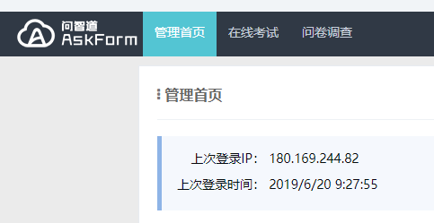
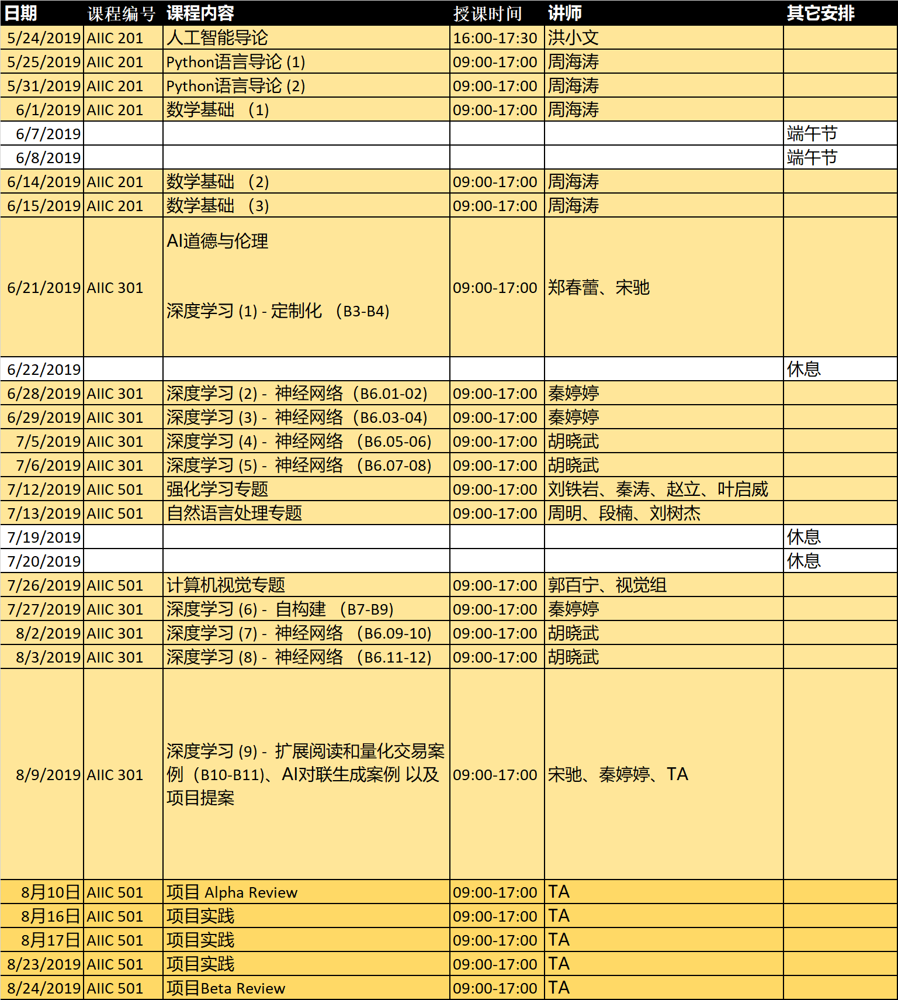
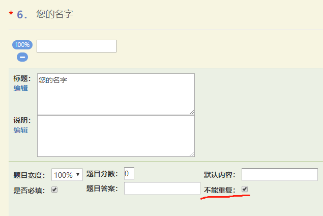
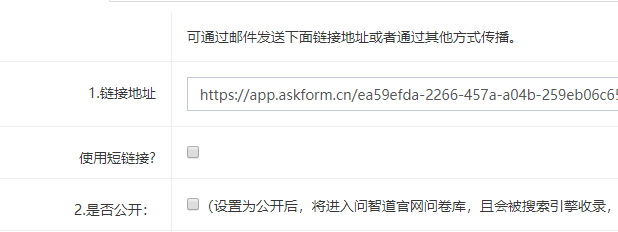
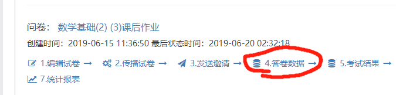
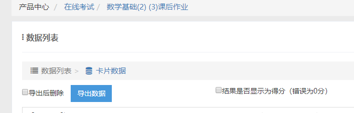

## 关于转录:

转录的内容需要去上课了解哪些是重点，哪些不需要录，视课堂内容决定。

转录的方式选择自己拿手的，本人是使用讯飞输入法的语言转文字。

## 关于答题卷：

1. 首先到<https://www.askform.cn/Login> 这个网页上，账号：15**80(问冯老师) 密码：电脑开机密码

2. 选择在线考试

3. 在试卷的右上角选择创建试卷填写考试名称，名称根据当天课程命名然后选择刚创建的试卷，点击编辑试卷

4. 根据TA发的题目编辑答题卷。（可以看以前的答题卷）

5. 在最后一题“您的名字”里选上不能重复

   

6. 在高级设置中记得修改截止日期，具体日期询问TA 

7. 完成后把链接发给TA，把断链接和公开取消。（可以先创建好试卷把链接先给TA，然后再编辑试卷）

   ## 关于填写成绩：

   1.  在管理在线考试页面，选择要填写试卷的答卷数据，然后选择数据列表。

      

      勾上结果显示为得分，然后数据库拉到最右边可以得到分数。

   3. 把成绩填写到作业提交情况，上传到<https://github.com/shaiic/2019-assignments/tree/master/data>
      关于如何使用github：[https://github.com/shaiic/AI-training/blob/master/8.Tutorials/02.%E5%A6%82%E4%BD%95%E4%B8%BA%E9%A1%B9%E7%9B%AE%E5%81%9A%E8%B4%A1%E7%8C%AE.md](https://github.com/shaiic/AI-training/blob/master/8.Tutorials/02.如何为项目做贡献.md)。

   4. 到<https://github.com/shaiic/2019-assignments/wiki> 填写新的成绩，推荐使用Typora来写Markdown。关于如何使用Markdown：[https://github.com/shaiic/AI-training/blob/master/8.Tutorials/03.%E5%A6%82%E4%BD%95%E4%BD%BF%E7%94%A8Markdown.md](https://github.com/shaiic/AI-training/blob/master/8.Tutorials/03.如何使用Markdown.md)

      小技巧：直接复制Excel的表格到Typora，然后点击Ctrl+/组合键可以显示源码，然后复制源码到wiki。