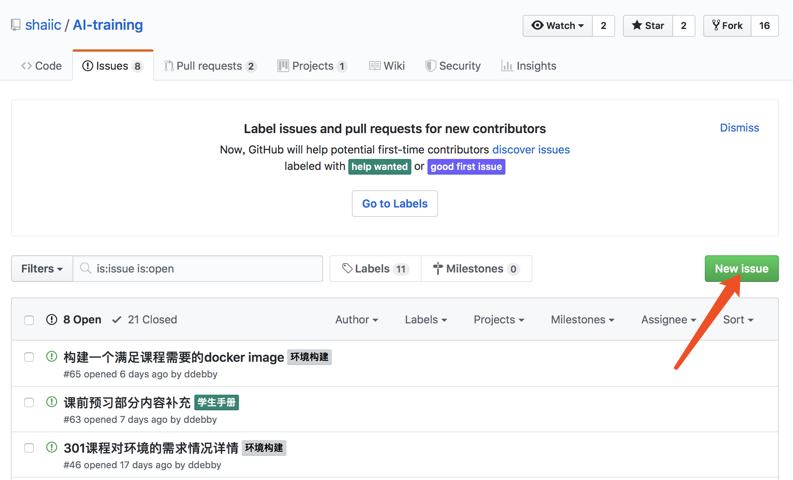

### 什么是issues

Github为开发者提供了许多便于开发的功能，其中，issues功能被用来追踪各种想法，增强功能，任务，bug等。许多的项目通过centeral bug tracker收集用户的反馈，Github通过issues来实现同样的功能。

Issues经常被误解为一个报告软件bug的地方，其实不然。报告软件bug只是Issues众多功能中的一个。项目维护者可以通过Issues来组织需要完成的任务，例如增加新特性或者审计一个已经上线的功能。同时，还可以将Issues关联某些pull request，一旦合并了某个pull request，这个issue会被自动关闭。同时，你可以将issues添加到看板，也可以将看板的任务转化为issue。

### issues使用

可以通过选项卡中的issues选项，点击New issue即可建立一个新的issue。

 

### 如果你是项目的维护者，github还支持你如下的操作：

- 将一个issue分配给参与者
- 为一个issue打上标签
- 将一个issue添加到项目的看板
- 为一个issue关联到某个里程碑 

### GitHub专注于协作，参考和优秀的文本格式，所以一个典型的 GitHub 问题应该像这样：

- 标题和描述概括了这个问题是关于什么的。
- 彩色 Labels（标签）可以帮助你对问题进行分类和过滤（就像电子邮件中的标签一样）。
- Milestone（里程碑）就像一个问题单的容器。这对于将问题单与特定功能或项目阶段（例如 Weekly Sprint 9/5-9/16 或者 Shipping 1.0）进行关联非常有用。
- assignee（责任人）负责在任何指定的时间解决相应的问题
- Comments（评论）允许有权访问仓库的任何人对该问题进行回复。

### Notifications（通知），@mentions（@提及）和 References（参考）

通过使用 Issues 的 @memtions 和 references 功能，你可以通知其他的 GitHub 用户和团队，还可以与其他问题单相互连接。这些功能提供了一种灵活的方式，可以让合适的人帮助你有效地解决问题。并且这些功能非常易于学习和使用。它们在 GitHub 的所有文本字段中均可正常工作 —— 它们是我们的 GitHub Flavored Markdown 文本格式的一部分。

### 为特定代码添加issue

github还支持您为仓库中或者是pull request中的特定代码行添加issue 
要为特定的代码添加一个issue，首先需要找到存储该代码的文件或者是pull request 
* 通过点击代码前面的行数的标号高亮代码（如果要选中多行，则需先选定起始行，再通过shift和左键点击结束行行号即可） 
* 选中后点击左部的下拉菜单，选中open new issue，之后稍加编辑后即可提交 

同样，我们可以通过为一个issue添加代码链接来添加代码 
操作同上，只是在最后的菜单选择中，选中copy permalink，之后粘贴到issue中即可。

最后，上面关于issue的种种功能都需要现在Feature设置中选中issues 

**扩展阅读：**https://help.github.com/en/articles/searching-issues-and-pull-requests