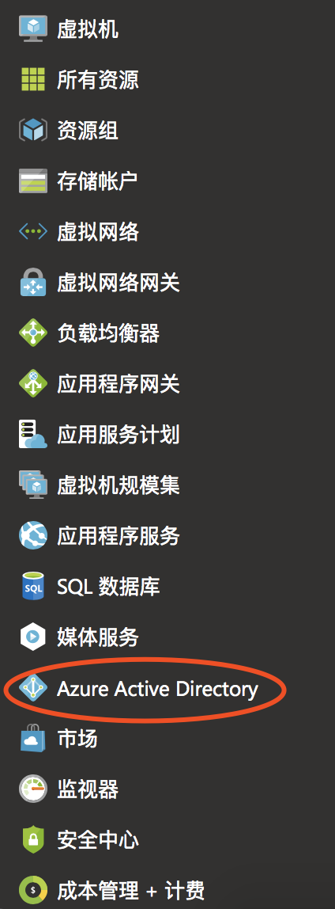
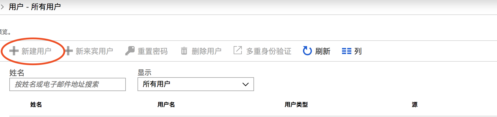
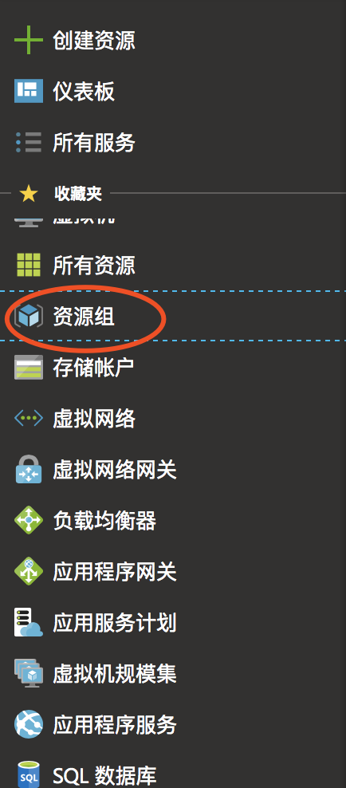
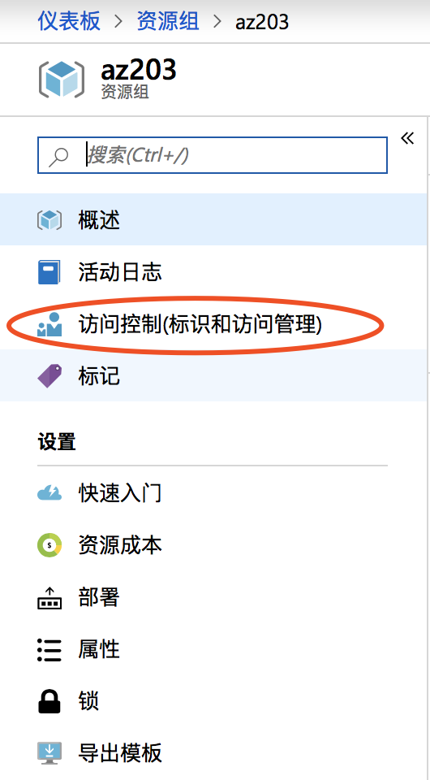
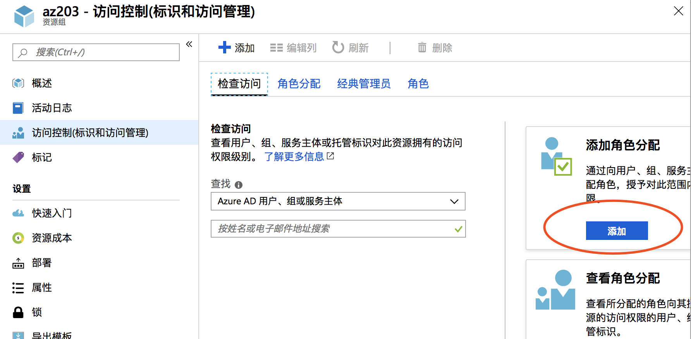
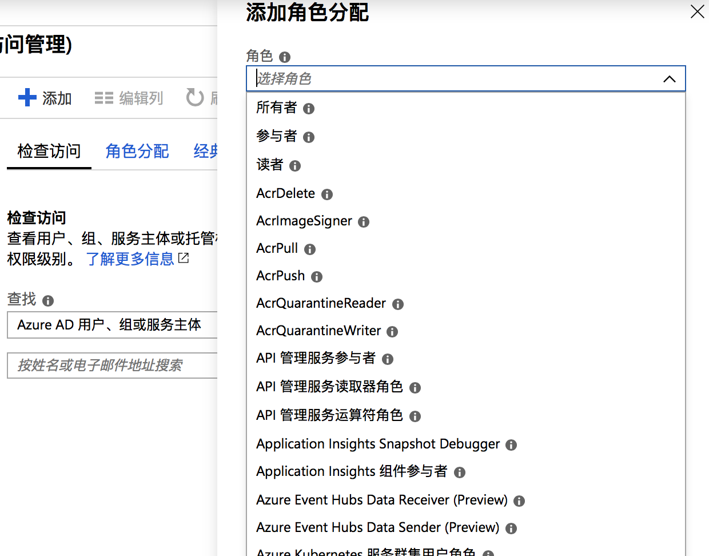
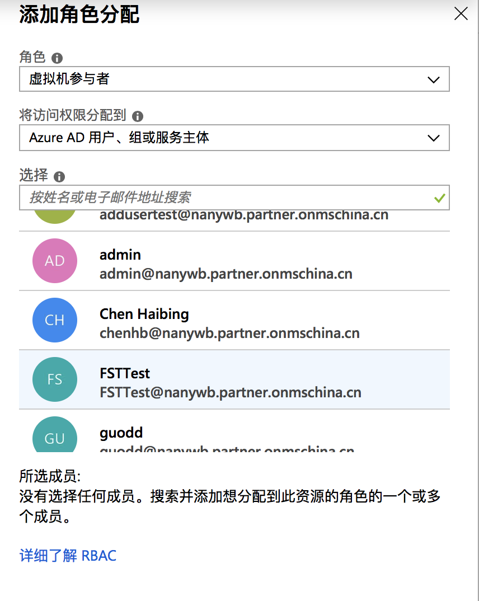
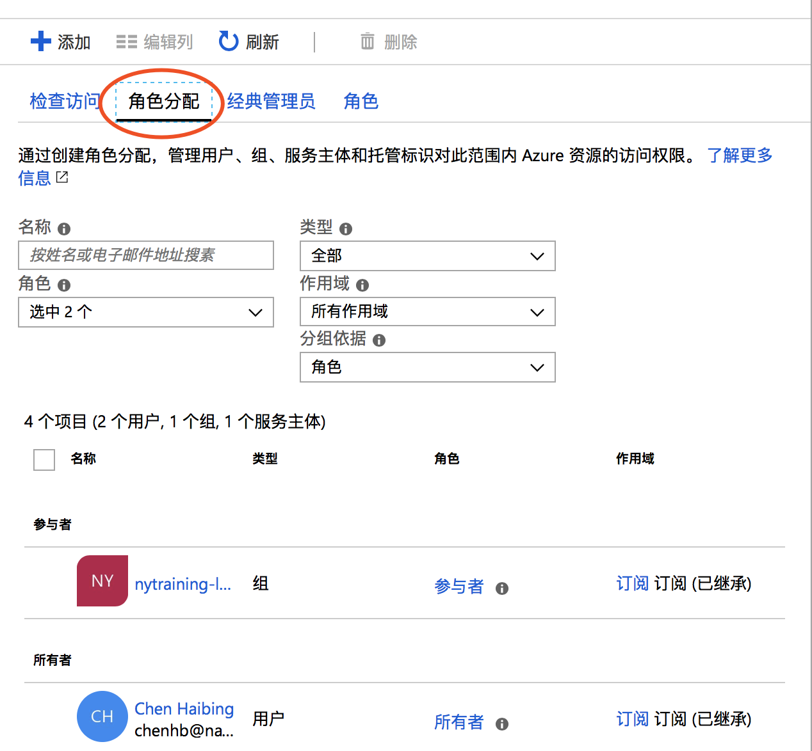

# Azure权限配置

### 创建学员账号

1、进入Azure Active Directory模块

2、点击新建用户，创建学员账号（若为灰色，开通新建用户权限）

3、进入资源组模块，创建资源组

4、进入资源组，设置用户操作权限

5、点击添加角色分配权限

6、点选择方框，选择需要的权限

7、选择需要配置权限的学员账号

8、最后点击角色分配，查看权限是否配置成功

