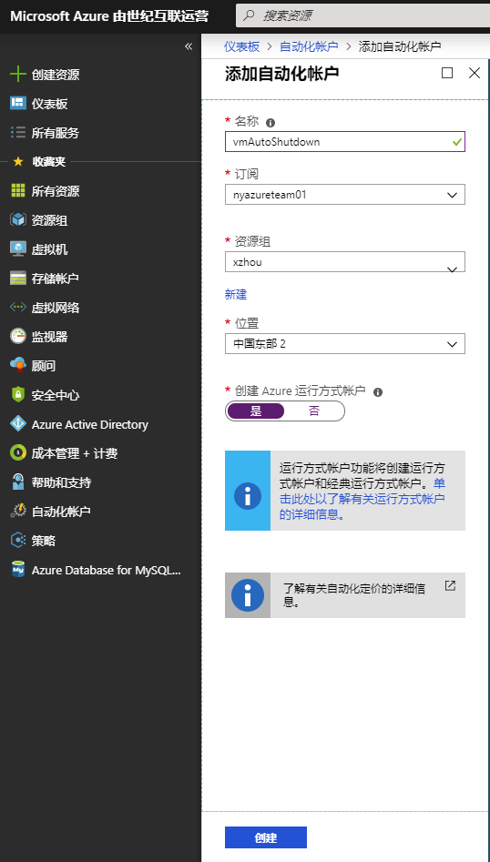
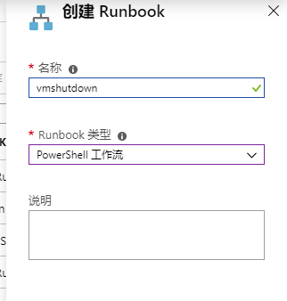
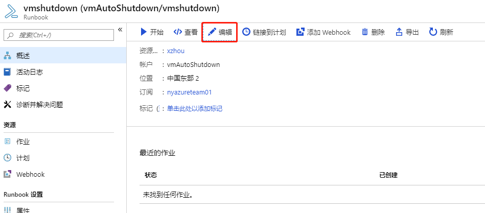
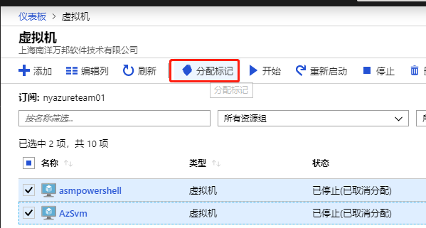
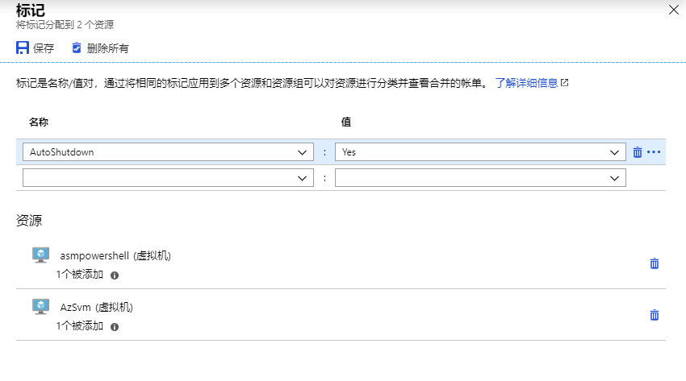
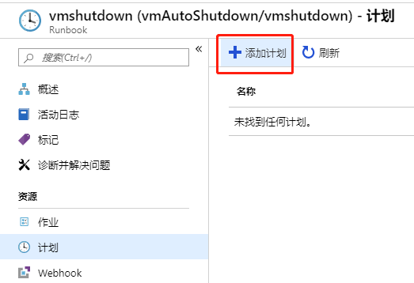
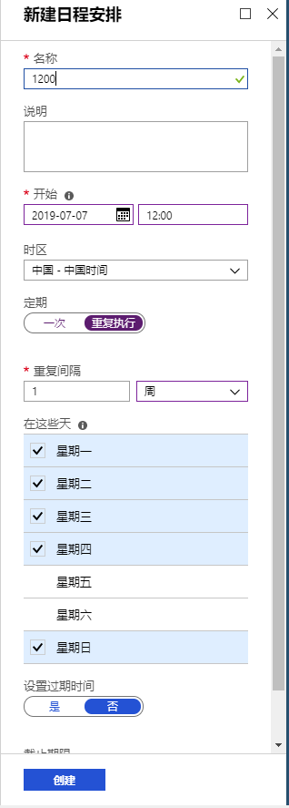
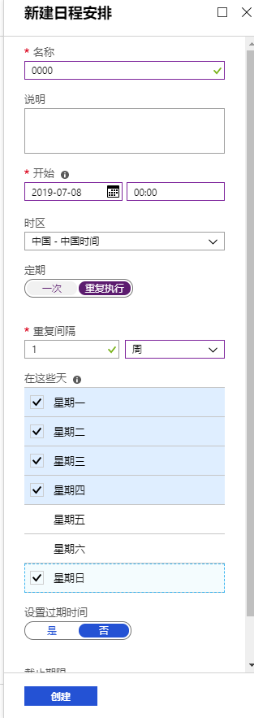

# Azure自动关机方案

## 一、要求功能：

1. 操作需要订阅管理员权限

2. 可以灵活的选择哪些虚拟机需要关闭

3. 可以选择具体的星期几 

## 二、操作步骤：

 1、新建自动化账户

 

2、创建powershell工作流



 

编辑脚本



加入以下内容，点击保存

```
workflow vmshutdown
 
{
 
     $connectionName = "AzureRunAsConnection"
try
{
 
    $servicePrincipalConnection=Get-AutomationConnection -Name $connectionName
 
    "Logging in to Azure..."
    Add-AzureRmAccount `
        -ServicePrincipal `
        -TenantId $servicePrincipalConnection.TenantId `
        -ApplicationId $servicePrincipalConnection.ApplicationId `
        -CertificateThumbprint $servicePrincipalConnection.CertificateThumbprint `
        -EnvironmentName AzureChinaCloud
}
catch {
    if (!$servicePrincipalConnection)
    {
        $ErrorMessage = "Connection $connectionName not found."
        throw $ErrorMessage
    } else{
        Write-Error -Message $_.Exception
        throw $_.Exception
    }
}
 
 
 
 
$subs = Get-AzureRmSubscription
 
 
 
Foreach ($sub in $subs)
 
{
 
 
 
    Select-AzureRmSubscription -SubscriptionId $sub.SubscriptionId -ErrorAction Continue
 
    $VMs = Get-AzureRmVm | Where-Object {$_.Tags.Keys -eq "AutoShutdown" -and $_.Tags.Values -eq "Yes" }
 
 
 
  ForEach -Parallel -ThrottleLimit 10 ($VM in $VMs)
 
  {
 
 
 
  If ($vm.powerstate -eq "VM deallocated")
 
      {Write-Output "$($VM.Name) is already shutdown"}
 
  else
 
   {Write-Output "Stop: $($VM.Name)";Stop-AzureRMVM -Name $VM.Name -ResourceGroupName $VM.ResourceGroupName -force }
 
  }
}
}

```

 

 

3、在所有需要自动关机的虚拟机分配标识



 

4、标记

key:AutoShutdown

value:Yes

5、添加定时计划



6、中午12点



7、晚上0点


 

 